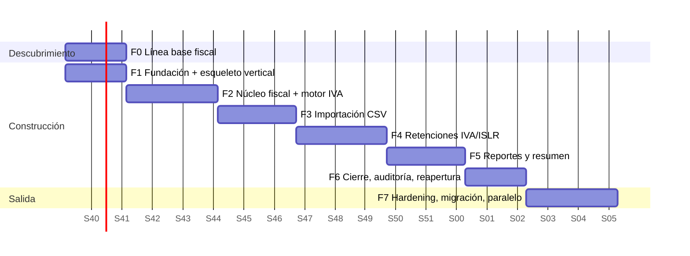

# ROADMAP — ERP-TributarioLite (v1)

> Documento de planificación técnica. Se alimenta de: `cuestionarioClient.md`, `ERP_Tributario__mini__Perplexity.md`, `fuentes_ERP_Tributario_Lite.md` y la guía v2 (9 archivos de documentación viva).
> **Aviso:** este roadmap no re-verifica la normativa. Toda regla fiscal citada (porcentajes, plazos, formatos de numeración) proviene de los documentos de contexto y debe ser congelada y firmada por el contador antes de implementarse (ver Fase 0).

---

## 1. Tesis del sistema (lo que hay que tener claro antes de escribir código)

**ERP-TributarioLite no es un generador de plantillas Excel. Es un sistema de registro de hechos fiscales** desde el cual se *derivan* libros, resúmenes y comprobantes.

```
Fuentes (CSV legacy / CSV máquina fiscal / manual)
        ↓  staging + validación
Documentos fiscales normalizados (compras, ventas, NC/ND, Z)
        ↓  motor tributario (función pura, reglas versionadas por vigencia)
Eventos fiscales (retención IVA, retención ISLR)
        ↓  emisión transaccional con numeración sin huecos
Comprobantes inmutables (snapshot + hash)
        ↓
Libros, Resumen IVA, PDF/Excel  →  Cierre de período (congelado y versionado)
```

**Las cuatro propiedades que definen el éxito** (todo lo demás es negociable):

1. **Reproducibilidad**: cualquier reporte histórico se puede regenerar exactamente como se emitió.
2. **Trazabilidad**: desde cualquier total se baja al documento, a la fila del CSV y al archivo de origen.
3. **Inmutabilidad fiscal**: lo emitido o cerrado no se edita; se anula, sustituye o ajusta.
4. **Aislamiento multiempresa**: una fuga de datos entre empresas es un incidente de severidad máxima.

### Anti-alcance técnico (decisiones de NO construir)

Con 100–200 documentos/mes el problema es de **corrección**, no de escala. Por tanto, explícitamente **no**:

- Microservicios, colas externas (Redis/Kafka), CQRS ni event sourcing.
- Un DSL genérico de reglas ni un motor JSON-logic. Las reglas son **parámetros en tablas (datos) + semántica en código tipado (TS)**; un tipo de regla nuevo requiere código y tests.
- Caché, read-replicas ni optimizaciones prematuras.
- Facturación electrónica, portal de proveedores, correo, APIs en tiempo real, contabilidad financiera (ya excluidos por el cliente).

---

## 2. Supuestos, restricciones y contexto

| Ítem | Valor (fuente) |
|---|---|
| Stack | Next.js (App Router) + Tailwind + PostgreSQL (perfil del equipo) |
| Equipo asumido | 1 dev full-stack + agentes de IA con spec-driven development |
| Volumen | 100–200 facturas/mes; migración inicial similar (cuestionario/Perplexity) |
| Tenancy | Multiempresa desde el día 1; sucursales opcionales |
| Entradas | CSV de software legacy, CSV de máquina fiscal (Z), carga manual |
| Salidas | Libro Compras, Libro Ventas, Resumen IVA, Comprobantes retención IVA e ISLR — PDF y Excel |
| Roles v1 | Admin sistema, Administrativo, Contador, Auditor (Proveedor reservado, sin portal) |
| Fuera de v1 | Factura electrónica, portal proveedores, email, API tiempo real, contabilidad completa, OCR/IA |
| Dependencia crítica | El `.xlsx` de formatos originales (citado en el chat de Perplexity, **no incluido en los archivos que recibí**): es el *golden master* de los reportes |

---

## 3. Hallazgos sobre el contexto (gaps e inconsistencias a resolver en Fase 0)

Estos puntos están en la documentación actual y **cambian el diseño** si se resuelven de una u otra forma. Contrastados con el Cuestionario PDF (Noe Dominguez, 10 secciones):

| # | Hallazgo | Por qué importa | Estado tras cuestionario / Propuesta |
|---|---|---|---|
| G1 | **Período de IVA**: el cuestionario §2 propone "mensual"; Perplexity pide confirmar mensual/quincenal y hay fuentes sobre IVA quincenal. | Afecta `fiscal_periods`, cierre, numeración `AAAAMM…` y todos los reportes. | Dirección parcial: se mantiene `kind` (`monthly`/`biweekly`) y rango explícito desde el inicio; el contador decide el valor por empresa. Sigue abierto. |
| G2 | **Falta la entidad Pago**. La retención de ISLR depende de la fecha de *pago o abono en cuenta*, pero el MVP excluye "cuentas por pagar". | Sin fecha de pago no se puede determinar el momento de retención ni pagos parciales (el cuestionario §2/§4/§5 los pide). | Dirección confirmada: incluir un `payments` **mínimo** (fecha, monto, documento asociado, sin tesorería ni conciliación bancaria). Pendiente momento exacto IVA vs ISLR. |
| G3 | **Retenciones recibidas** (cuando un cliente te retiene a ti): el cuestionario §5 las lista en ventas y el Libro de Ventas tiene columna de IVA retenido. | No son emitidas por ti, pero afectan resumen y crédito fiscal. | Necesidad confirmada. Pendiente diseño: entidad `withholdings_received` (registro + soporte adjunto, sin numeración propia). |
| G4 | **Moneda / tipo de cambio**: ningún documento habla de facturas en moneda extranjera. El cuestionario tampoco lo menciona. | Si hay operaciones en USD, la conversión a VES (y su fecha) determina la base imponible. | Sigue bloqueante. Pregunta faltante a agregar a §10. Mínimo documental: `currency`, `fx_rate`, `fx_rate_date` como campos reservados y cálculo siempre en moneda funcional (ADR-013). |
| G5 | **Proveedores**: el objetivo del MVP en el documento dice que proveedores "consultan comprobantes", pero luego se excluye el portal. El cuestionario solo pide registro como tercero. | Contradicción de alcance. | Resuelta: proveedores = solo tercero registrado, **sin login** en v1. Rol `supplier` reservado para v2. |
| G6 | **Porcentajes fijos vs. parametrizados**: el cuestionario §3 enuncia 75 %/100 % como criterio y exige mantener normativa actualizada por período; Perplexity advierte de no hardcodear. | Riesgo de mantenimiento/cumplimiento. | Aclarado: siempre datos con vigencia; el 75 % es un *seed* de `withholding_rules`, no una constante. Requiere matriz con fuente legal y vigencia. |
| G7 | **Ventas por Z vs. factura individual**. Cuestionario §1/§10 pide confirmar máquinas/puntos de venta por establecimiento. | Distinto modelo de datos y validaciones (rango de facturas, saltos). | Sigue abierto. `sales_documents.kind = invoice \| z_summary` con `range_from/range_to`; modo configurable por empresa/sucursal. |
| G8 | **Redondeo**: por línea, documento o período. El cuestionario no lo menciona. | Cambia totales de centavos → falla conciliación con el legacy. | Sigue bloqueante. ADR obligatorio con contador antes de la F2 (ADR-014). |
| G9 | **Formato de numeración ISLR** no definido (IVA sí: `AAAAMMSSSSSSSS`). Cuestionario §3 dice "estructura autorizada o utilizada", sin detalle. | Bloquea emisión ISLR. | Sigue abierto. Definir con contador con muestra real; serie independiente por empresa. |
| G10 | **Volumen por empresa o total** no aclarado. Cuestionario §10 pide sistemas, formatos, históricos y períodos a migrar, sin cifras. | Determina si hay riesgo real de concurrencia/performance. | Parcial: mantener supuesto 100–200 docs/mes como supuesto; diseñar igual con locks correctos. |
| G11 | **Cuentas bancarias / métodos de pago**: cuestionario §1 los exige sin alcance. | Riesgo de scope creep a tesorería. | Delimitar en documentación: solo catálogo + `fecha_pago/metodo`, sin conciliación bancaria ni CxP completa. |
| G12 | **Calendario fiscal**: cuestionario §2 lo exige sin vencimientos. | Alertas y cierres dependen de fechas de obligación. | Documentar como tabla parametizable, sin hardcodear vencimientos. |

---

## 4. Principios arquitectónicos e invariantes

### 4.1 Invariantes del dominio (se convierten en tests de propiedades)

1. `base_imponible + iva_causado + conceptos_permitidos = total` (tolerancia definida por ADR de redondeo).
2. `iva_retenido ≤ iva_causado` salvo regla explícita que lo autorice.
3. Una NC no puede exceder el saldo disponible del documento afectado (salvo flujo de ajuste autorizado).
4. Comprobante emitido ⇒ no modificable. Número emitido ⇒ **nunca reutilizable**, ni tras anulación.
5. Numeración por (empresa, serie) **consecutiva y sin huecos** bajo concurrencia.
6. Periodo `closed` ⇒ ningún `UPDATE/DELETE` sobre documentos incluidos (se impone en app **y** en DB).
7. Toda regla aplicada a un cálculo queda referenciada (`rule_version_id`) y su parámetro copiado (snapshot).
8. Suma del resumen = suma verificable de documentos (conciliación automática, tolerancia 0).
9. Ninguna consulta cruza `company_id` sin pasar por el contexto de tenant.

### 4.2 Fechas: son siete, no una

`fecha_documento`, `fecha_recepcion`, `fecha_pago`, `fecha_retencion`, `fecha_emision_comprobante`, `fecha_entrega_comprobante`, `fecha_fiscal` (la que determina el período). **La fecha de registro en el sistema nunca sustituye a la fecha fiscal** (criterio del cuestionario, §2).

### 4.3 Estructura del código: monolito modular con fronteras impuestas

```
src/
  modules/
    identity/        # usuarios, sesiones, RBAC
    tenancy/         # empresas, sucursales, membresías, withTenant()
    parties/         # clientes/proveedores, perfiles fiscales
    fiscal-docs/     # compras, ventas, NC/ND, Z, pagos, retenciones recibidas
    tax-engine/      # FUNCIONES PURAS, sin I/O, sin DB → 100% testeable
    imports/         # staging, mapeo, validación, lotes
    withholdings/    # IVA/ISLR, series, certificados
    periods/         # estados, checklist, cierre, reapertura
    reporting/       # libros, resumen, PDF/Excel, versiones
    audit/           # eventos append-only
  app/               # rutas Next.js (solo orquestación y UI)
```

Reglas: `tax-engine` no importa nada de infraestructura; los módulos se hablan por interfaces públicas (`index.ts`); se impone con `dependency-cruiser` o `eslint-plugin-boundaries` en CI. **Todo acceso a DB pasa por `withTenant(ctx, fn)`** (lint prohíbe importar el cliente DB directamente fuera de `modules/*/repo`).

---

## 5. Decisiones clave (ADRs propuestos — registrarlos en `DECISIONS.md` al adoptarlos)

| ADR | Decisión propuesta | Alternativa descartada | Estado |
|---|---|---|---|
| 001 | Monolito modular Next.js; Server Actions para mutaciones de UI, Route Handlers para descargas/uploads | Microservicios / API separada | Proponer |
| 002 | **Multitenancy: esquema compartido + `company_id` + RLS de PostgreSQL** como defensa en profundidad, aplicado vía `SET LOCAL app.company_id` dentro de transacción | BD/esquema por tenant (overkill) · solo filtros en app (frágil) | Proponer |
| 003 | **Dinero: `numeric(18,2)` (y `numeric(18,6)` para tasas/alícuotas) + `decimal.js` en TS; jamás `float`/`number`** | Enteros en céntimos (válido, pero fricciona con alícuotas y redondeo configurable) | Proponer; redondeo bloqueado por G8 |
| 004 | **Reglas tributarias**: parámetros en tablas con `effective_range daterange` + `EXCLUDE USING gist` (no solapamiento); semántica en código TS; cada cálculo guarda `rule_version_id` + snapshot | DSL genérico · constantes en código | Proponer |
| 005 | **Numeración sin huecos**: `document_series` con `UPDATE … SET last=last+1 … RETURNING` dentro de la misma transacción que crea el comprobante | `MAX()+1` · secuencias PG (tienen huecos) · UUID | Proponer |
| 006 | **Inmutabilidad**: estados terminales + `voided`/`replaces_id`; correcciones posteriores al cierre como `fiscal_adjustments` en período abierto | Edición in-place con bitácora | Proponer |
| 007 | **Importación en staging**: CSV → `import_rows` (JSONB crudo + normalizado) → validación → confirmación → documentos definitivos; idempotencia por `sha256(file)` + clave natural | Insert directo por fila | Proponer |
| 008 | **Jobs con `pg-boss`** (cola sobre PostgreSQL) para importaciones grandes y generación de reportes; sin Redis | BullMQ+Redis · todo síncrono | Proponer |
| 009 | **PDF**: HTML/CSS → PDF server-side (Playwright/Chromium en el worker) con plantillas versionadas; **Excel**: `exceljs` rellenando la plantilla original para preservar formato. Cada salida se almacena con `sha256` y `data_snapshot` | `@react-pdf` (aceptable si el layout es simple) | Decidir en F5 con spike |
| 010 | **Auth**: Auth.js o Better Auth con sesiones en DB; autorización `rol × empresa` (tabla `company_user`) + chequeo de permisos por acción en una sola capa | Roles globales | Proponer |
| 011 | **Auditoría append-only**: eventos de dominio escritos en la misma transacción; `REVOKE UPDATE, DELETE` al rol de la app; opcional hash encadenado | Triggers genéricos que capturan todo (ruido sin contexto de negocio) | Proponer |
| 012 | **ORM**: Drizzle (control cercano a SQL, transacciones y `SET LOCAL` explícitos, `numeric` como string) | Prisma (válido, pero RLS/transacciones por request requieren más cuidado) | Proponer |
| 013 | **Moneda/FX** | — | Bloqueado por G4 |
| 014 | **Redondeo** | — | Bloqueado por G8 |

### Fragmentos de referencia (para `DATABASE.md`)

```sql
-- No solapamiento de vigencias por (tipo de regla, concepto, condición)
CREATE EXTENSION IF NOT EXISTS btree_gist;
ALTER TABLE withholding_rules ADD CONSTRAINT no_overlap
  EXCLUDE USING gist (company_scope_key WITH =, rule_kind WITH =, concept_id WITH =,
                      effective_range WITH &&);

-- Duplicados de documentos de compra (excluye anulados)
CREATE UNIQUE INDEX uq_purchase_doc ON purchase_documents
  (company_id, party_id, doc_type, invoice_number, control_number)
  WHERE status <> 'voided';

-- RLS
ALTER TABLE purchase_documents ENABLE ROW LEVEL SECURITY;
CREATE POLICY tenant_isolation ON purchase_documents
  USING (company_id = current_setting('app.company_id')::uuid);
-- el rol de la app NO es owner de las tablas ni tiene BYPASSRLS

-- Emisión con numeración sin huecos (dentro de la TX de emisión)
UPDATE document_series SET last_number = last_number + 1
 WHERE company_id = $1 AND kind = 'iva_withholding' AND period_key = $2
RETURNING last_number;
```

### Contrato del motor tributario (puro)

```ts
type TaxContext = { company: FiscalProfile; counterparty: PartyFiscalProfile;
                    doc: FiscalDocInput; asOf: Date /* fecha fiscal */;
                    rules: RuleSet /* ya filtradas por vigencia */ };

function computeDocumentTaxes(ctx: TaxContext): DocumentTaxResult;
function computeIvaWithholding(ctx: TaxContext): WithholdingResult | NotApplicable<Reason>;
function computeIslrWithholding(ctx: TaxContext & { payment: PaymentInput }): WithholdingResult | NotApplicable<Reason>;
// WithholdingResult incluye: amounts, ruleVersionId, ruleSnapshot, explanation[] (pasos legibles para el contador)
```

`explanation[]` es un requisito de producto: el contador debe *ver* por qué se calculó cada monto.

---

## 6. Plan de ejecución por fases

> Estimaciones en **semanas de trabajo focalizado** para 1 dev + agentes de IA. Rango = incertidumbre realista. Total: **~18–24 semanas** hasta go-live con cierre en paralelo. Las fases F0 y F1 corren solapadas.



> **Decisión de orden (staff call):** no dejar los reportes para el final. En F1 se entrega un **esqueleto vertical** (1 compra manual → Libro de Compras en PDF/Excel, con un solo tenant). Los reportes son el *oráculo* del modelo de datos: si el Libro de Compras no sale bien desde el modelo, hay que enterarse en la semana 2, no en la 14.

### Hitos

| Hito | Criterio | Cuándo |
|---|---|---|
| **M1 — Esqueleto vertical** | Compra manual → Libro de Compras (PDF/Excel) con auth y 1 empresa | Fin F1 |
| **M2 — Libros correctos** | Libros Compras/Ventas de un mes real coinciden línea a línea con el Excel del cliente | Fin F3 |
| **M3 — Retenciones** | Comprobantes IVA/ISLR emitidos, numerados, anulables; test de concurrencia verde | Fin F4 |
| **M4 — Cierre** | Período cerrado, congelado y reproducible | Fin F6 |
| **M5 — Cierre en paralelo** | 1 ciclo completo de período ejecutado en Excel **y** en el sistema, diferencia = 0 (o explicada) | F7 |
| **M6 — Go-live** | Firma del contador + checklist de release | F7 |

---

### F0 — Línea base fiscal y descubrimiento (1–2 sem, en paralelo con F1)

**Objetivo:** convertir el cuestionario del cliente en una **Matriz de Reglas v1 firmada** y resolver G1–G10.

| Bloque | Criterios de aceptación |
|---|---|
| Cuestionario respondido | Cada fila del cuestionario en estado APROBADO / MODIFICAR / VALIDAR / PENDIENTE, con responsable |
| Matriz de reglas v1 | Por regla: fuente legal (providencia/decreto/artículo), vigencia, parámetros, caso de ejemplo numérico; firmada por el contador |
| Conjunto de escenarios dorados | 30–50 casos resueltos a mano por el contador (compra gravada, exenta, NC parcial, retención 75 %/100 %, ISLR con sustraendo, pago parcial, etc.) en un JSON/CSV versionado |
| Muestras reales | ≥ 1 mes de CSV del legacy y de la máquina fiscal (anonimizados si hace falta) + los `.xlsx` de formato original |
| Resolución de G1–G10 | Cada gap cerrado o explícitamente diferido con ADR |
| Entorno legal/operativo | Lista de empresas piloto, sus condiciones fiscales y sucursales/máquinas |

**Salida documental:** `PROJECT.md`, `DOMAIN.md` (glosario y reglas), ADR-013/014 resueltos o diferidos.
**Puerta de salida (gate):** sin matriz v1 y sin escenarios dorados **no se cierra F2**.

---

### F1 — Fundación + esqueleto vertical (2 sem)

| Bloque | Criterios de aceptación |
|---|---|
| Repo y tooling | Monorepo/app, TypeScript estricto, lint + formatter, `dependency-cruiser` con reglas de módulos, commits convencionales, CI (typecheck, lint, tests) |
| Entornos | Sin Docker: PostgreSQL gestionado Neon (PG16), app y worker como procesos directos; `.env.example`; staging reproducible; migraciones versionadas |
| Identidad | Login, sesiones en DB, recuperación de acceso, hash de contraseñas robusto, rate limiting en auth |
| Tenancy | Empresas, sucursales opcionales, `company_user(role)`, `withTenant()`, RLS activada, **tests de fuga entre tenants** |
| RBAC | Matriz rol×recurso×acción inicial en `SECURITY.md` y aplicada en una sola capa |
| Auditoría v0 | Tabla append-only + helper `audit.record()` en la TX |
| **Esqueleto vertical** | Crear 1 compra manual → generar Libro de Compras PDF+Excel (formato provisional) |

**Salida documental:** `ARCHITECTURE.md`, `CONVENTIONS.md`, `DATABASE.md` (borrador), `SECURITY.md` (RBAC v0), ADR-001/002/010/011/012.
**Exit:** M1.

---

### F2 — Núcleo fiscal y motor IVA (3 sem, 2 si F0 está limpia)

| Bloque | Criterios de aceptación |
|---|---|
| Terceros | CRUD con RIF validado (formato preservando valor original), perfil fiscal con historial |
| Períodos | Máquina de estados (`open → under_review → closed → reopened`), `kind` mensual/quincenal según G1 |
| Catálogos tributarios | `tax_rates` y `tax_categories` con vigencia; clasificaciones de compra/venta del Perplexity §2 |
| Documentos de compra | Facturas, NC, ND, importaciones, exentas/sin derecho a crédito; validaciones (duplicados, NC ≤ saldo, base+IVA=total) |
| Documentos de venta | Facturas, Z (`kind=z_summary`), NC/ND, exportaciones, ventas por cuenta de terceros |
| Pagos mínimos (G2) | Registro de pago/abono con fecha y asignación a documentos, pagos parciales |
| Retenciones recibidas (G3) | Registro + soporte + efecto en resumen |
| **Motor IVA** | `computeDocumentTaxes` puro; 100 % de escenarios dorados de IVA verdes; property tests de invariantes 1–3 |
| Adjuntos | Almacenamiento privado, enlaces firmados de corta vida, límite de tamaño y tipo |

**Salida documental:** `DOMAIN.md` completo, `DATABASE.md` (esquema), ADR-003/004/006/014.
**Exit:** motor IVA validado por el contador contra escenarios dorados.

---

### F3 — Importación CSV (2.5 sem)

| Bloque | Criterios de aceptación |
|---|---|
| Staging | `source_files` (sha256, bytes originales conservados), `import_batches`, `import_rows` (crudo + normalizado + errores) |
| Parser robusto | Detección de separador/encoding, decimales coma/punto, fechas múltiples, RIF con/sin guiones, nulos (`0`, vacío, `N/A`, `*`) |
| Perfiles de mapeo | Guardables por fuente y empresa; plantillas CSV descargables |
| Validación | Errores vs. advertencias; duplicados (intra-archivo y contra BD); RIF; totales; alícuota; tercero inexistente |
| Comparación de retenciones | Retención importada vs. recalculada: diferencia **marcada para revisión, nunca sobrescrita** |
| Confirmación | "Importar solo válidas", descarga de rechazadas, re-procesamiento de corregidas |
| Idempotencia | Re-subir el mismo archivo no duplica; trazabilidad `source_file_id + row_number` en cada documento |
| Z | Importador específico con validación de saltos de numeración y de máquina/sucursal |
| Job async | Procesos > N filas corren en `pg-boss` con progreso visible |

**Exit = M2:** libros de un mes real coinciden con el Excel del cliente.
**Nota:** el primer formato real del legacy casi nunca coincide con el "ideal"; reservar buffer de 30 % en esta fase.

---

### F4 — Retenciones IVA e ISLR y comprobantes (3 sem)

| Bloque | Criterios de aceptación |
|---|---|
| Reglas IVA | `withholding_rules` con vigencia y `EXCLUDE`; seeds desde matriz v1; UI de consulta/edición solo contador, con log |
| Reglas ISLR | Catálogo de conceptos, base, %, sustraendo, mínimos, tipo de beneficiario; vigencia y UT parametrizada |
| Cálculo + explicación | `explanation[]` visible antes de emitir |
| Comprobante multi-factura | Un comprobante ↔ N líneas; snapshot completo al emitir |
| **Emisión transaccional** | Bloqueo → número consecutivo → snapshot → PDF → hash → estado `issued`, todo atómico; fallo ⇒ no se consume número |
| Anulación / sustitución | Anula sin liberar número; sustituto con `replaces_id`; motivo obligatorio |
| Control de plazos | Fecha máxima de entrega por período (parametrizable) con alertas |
| PDF/Excel | Plantillas fieles al formato del cliente; QR/hash interno opcional |
| **Test de concurrencia** | 50–100 emisiones paralelas: 0 duplicados, 0 huecos |

**Salida documental:** `API.md` (acciones de emisión), `SECURITY.md` (permisos de emisión/anulación), ADR-005/009.
**Exit = M3.**

---

### F5 — Libros y Resumen de IVA (2.5 sem)

| Bloque | Criterios de aceptación |
|---|---|
| Libro de Compras | Columnas = plantilla original; totales y cortes por clasificación/alícuota |
| Libro de Ventas | Idem, soportando modo factura y modo Z |
| Resumen IVA | Débitos, créditos, exentas, exportaciones, importaciones, ajustes, excedente anterior, retenciones aplicadas/no aplicadas, cuota del período |
| Drill-down | Cada total navega a los documentos que lo componen |
| Conciliación | Reporte automático libros ↔ resumen ↔ comprobantes (tolerancia 0) |
| Versionado | `report_versions` con `data_snapshot`, `sha256`, usuario, fecha; regenerable |
| Regresión visual | Snapshots de PDF y comparación celda-a-celda de Excel vs. golden master |

**Exit:** el contador reproduce a mano el resumen de un mes real y coincide.

---

### F6 — Cierre, auditoría y reapertura (2 sem)

| Bloque | Criterios de aceptación |
|---|---|
| Checklist de cierre | Automatizado (filas pendientes, duplicados, RIF inválidos, NC sin afectado, retenciones conciliadas, libros generados) |
| Cierre | Congela documentos y reportes; `closure_hash` sobre ids+versiones; responsable/fecha/motivo |
| Bloqueo a dos niveles | Validación en app **y** trigger/constraint en DB que rechaza mutaciones en período cerrado |
| Reapertura | Flujo solicitud → autorización por rol → nueva versión; historial visible |
| Ajustes | `fiscal_adjustments` hacia período abierto, con referencia al original |
| Vista del auditor | Línea de tiempo por documento: origen CSV/fila, validaciones, regla aplicada, comprobante, cierre |
| Export de bitácora | CSV/PDF filtrable |

**Exit = M4.**

---

### F7 — Hardening, migración y operación en paralelo (3 sem)

| Bloque | Criterios de aceptación |
|---|---|
| Migración inicial | Import del histórico (~100–200 docs) por los mismos pipelines; reporte de reconciliación contra Excel |
| **Cierre en paralelo (M5)** | Un período completo en Excel y en el sistema; diferencias = 0 o justificadas por escrito |
| Seguridad | Revisión de checklist, pruebas de autorización por rol × empresa, headers/CSP/CORS/HSTS, rate limits, dependencias auditadas |
| Backups y DR | Backup diario + WAL, copia fuera del servidor, **restore drill documentado** (RPO ≤ 24 h objetivo mínimo; ideal ≤ 1 h) |
| Observabilidad | Logs estructurados sin PII/secretos, Sentry, healthchecks, alertas de jobs fallidos y de backup |
| Performance sanity | Libros de un año con 3 empresas en < pocos segundos; sin N+1 |
| Documentación operativa | Runbooks (restore, reapertura, rotación de secretos, actualización de reglas), manual de usuario por rol |
| UAT y capacitación | Sesión con cada rol; defectos críticos = 0 |
| Go-live | Checklist firmado por contador + responsable del cliente (M6) |

---

## 7. Estrategia de pruebas (nivel de confianza requerido para software fiscal)

| Capa | Qué | Herramienta sugerida |
|---|---|---|
| Unitarias del motor | Escenarios dorados del contador como fixtures (`/fixtures/tax-scenarios/*.json`) | Vitest |
| Propiedades | Invariantes 1–3 con entradas generadas (base, alícuotas, retenciones ≤ IVA, NC ≤ saldo) | fast-check |
| Integración DB | Migraciones, constraints, `EXCLUDE`, RLS y triggers de período cerrado contra PostgreSQL real en Neon dev; sin Docker/Testcontainers | Vitest + Neon dev |
| **Fuga multitenant** | Usuario de empresa A intenta leer/escribir/exportar datos de B por cada endpoint | Suite automatizada obligatoria en CI |
| **Concurrencia** | 100 emisiones paralelas: sin duplicados ni huecos; cierre vs. edición simultánea | Script con workers paralelos |
| Importación | Corpus de CSV reales y adversariales (encodings, decimales, BOM, filas rotas) | Vitest + fixtures |
| Reportes | Comparación celda-a-celda con golden master; snapshots PDF (texto + visual de páginas clave) | exceljs + pdf-parse + Playwright |
| E2E | Import → validar → emitir → cerrar → descargar, por rol | Playwright |
| Reproducibilidad | Regenerar un reporte cerrado ⇒ `sha256` de datos idéntico | Test de regresión |

**Regla de CI:** cobertura no es la métrica; lo es el **porcentaje de escenarios dorados verdes** (objetivo 100 %) y cero regresiones en fuga de tenants/concurrencia.

---

## 8. Seguridad y cumplimiento (se vuelca a `SECURITY.md`)

- Secretos solo en variables de entorno; claves distintas por entorno; rotación documentada.
- Validación de inputs con Zod en **servidor** (el cliente es conveniencia); sanitización para XSS y para nombres de archivo subidos.
- Uploads: validar tipo por contenido (no solo extensión), límite de tamaño, almacenamiento fuera del webroot, descarga por URL firmada.
- **CSV injection** (celdas que empiezan con `= + - @`) al exportar a Excel/CSV: neutralizar.
- Rate limiting en login, importación y emisión; bloqueo progresivo.
- Logs sin PII ni tokens; datos sensibles (RIF, direcciones) tratados como PII interna.
- Backups cifrados; acceso a producción con MFA; principio de mínimo privilegio en el rol de DB de la app.
- Matriz RBAC inicial (a refinar):

| Acción | Admin sist. | Administrativo | Contador | Auditor |
|---|---|---|---|---|
| Gestionar usuarios/empresas | ✅ | — | — | — |
| Importar CSV / crear documentos | — | ✅ | ✅ | — |
| Editar reglas tributarias | — | — | ✅ | — |
| Emitir/anular comprobantes | — | (¿?) | ✅ | — |
| Cerrar / reabrir período | — | — | ✅ / ✅ (+motivo) | — |
| Ver reportes y bitácora | ✅ | ✅ | ✅ | ✅ (solo lectura) |

*(¿? = decisión con el cliente: si el administrativo puede emitir o solo preparar.)*

---

## 9. Registro de riesgos

| # | Riesgo | Prob. | Impacto | Mitigación |
|---|---|---|---|---|
| R1 | Reglas fiscales mal interpretadas | Media | **Crítico** | Matriz firmada por contador, escenarios dorados, `explanation[]`, cierre en paralelo |
| R2 | Cambio normativo durante el proyecto | Alta | Alto | Reglas como datos con vigencia; proceso documentado de actualización; alertas de revisión periódica |
| R3 | Formatos CSV del legacy inconsistentes | Alta | Medio | Staging + mapeos por perfil + corpus real desde F0; buffer en F3 |
| R4 | Fuga entre empresas | Baja | **Crítico** | RLS + `withTenant` + suite de fuga en CI + revisión manual pre-go-live |
| R5 | Duplicados/huecos en numeración | Baja | Crítico | Numeración transaccional + test de concurrencia |
| R6 | Scope creep (contabilidad, e-factura) | Alta | Alto | Anti-alcance explícito; todo cambio de alcance = ADR + re-estimación |
| R7 | Contador poco disponible para validar | Media | Alto | Agenda fija semanal; escenarios dorados como entregable con fecha; gate F0/F2 |
| R8 | Solo-dev: bus factor y fatiga | Media | Medio | Documentación viva (guía v2), runbooks, automatización de CI/backup |
| R9 | Pérdida de datos (hardware/conectividad) | Media | Alto | Backups fuera del servidor + restore drill; elegir hosting con la infraestructura en cuenta |
| R10 | Moneda extranjera no contemplada | Media | Alto | Resolver G4 en F0; campos FX desde el esquema inicial |
| R11 | Fidelidad de PDF/Excel frente al formato "oficial" del cliente | Media | Medio | Golden master en F1 y spike de generación en F1/F5 |
| R12 | Interpretar el sistema como "declara solo ante el SENIAT" | Media | Alto | Posicionar como sistema de apoyo tributario-contable; texto legal en UI y manual |

---

## 10. Mapeo a la guía v2 (documentación viva)

| Archivo | Se llena en | Contenido semilla |
|---|---|---|
| `PROJECT.md` | F0 | §1, §2 de este roadmap |
| `ARCHITECTURE.md` | F1 | §4, diagrama de flujo §1 |
| `DOMAIN.md` | F0 → F2 | Glosario (débito/crédito fiscal, agente, comprobante…), 7 fechas, estados, casos límite |
| `DATABASE.md` | F1 → F2 | Entidades del Perplexity + G2/G3/G7 + fragmentos §5 |
| `API.md` | Por bloque, F2–F6 | Acciones de importación, emisión, cierre |
| `SECURITY.md` | F1 → F7 | §8 + matriz RBAC viva |
| `CONVENTIONS.md` | F1 → tras cada auditoría | Estructura §4.3, reglas de módulos, naming |
| `DECISIONS.md` | Continuo | ADR-001…014 de §5 |
| `TODO.md` | Continuo | Bloques de F0–F7 con sus criterios de aceptación |

**Contexto mínimo por sesión con agente:** `PROJECT.md` + `ARCHITECTURE.md` + `TODO.md`; sumar `DOMAIN.md` siempre que se toque el motor tributario y `DATABASE.md` al tocar el esquema.

---

## 11. Preguntas bloqueantes para el cliente/contador (resumen de F0)

1. ¿Período de IVA mensual, quincenal o ambos, por empresa? Cuestionario §2 propone mensual, confirmar si alguna empresa es quincenal/especial. (G1)
2. ¿Hay operaciones en moneda extranjera? ¿Con qué tasa y fecha de conversión (fecha factura vs. pago)? No mencionado en cuestionario, se agrega. (G4)
3. ¿Redondeo por línea, documento o período? ¿Tolerancia aceptada vs. Excel legacy? No mencionado en cuestionario, se agrega. (G8)
4. ¿Momento exacto de retención de IVA e ISLR (factura, recepción, pago, abono en cuenta)? Cuestionario §2/§4 pide distinguir fechas, falta fijar regla por impuesto. (G2)
5. ¿Formato de numeración de comprobantes ISLR con muestra real y política de series por sucursal? Cuestionario §3 vago en este punto. (G9)
6. ¿Quién puede emitir y anular comprobantes: solo el contador o también el administrativo? ¿Alcance de cuentas/métodos de pago solo como catálogo sin tesorería? (G11)
7. ¿El Libro de Ventas se alimenta de facturas individuales, de Z, o de ambos por sucursal? (G7)
8. ¿Las retenciones que vienen en el CSV se aceptan tal cual o se recalculan? ¿Qué pasa si difieren? Cuestionario §6: marcar sin sobrescribir.
9. ¿Existen compras de uso mixto / prorrata en los casos reales del cliente? ¿Calendario fiscal con vencimientos parametizables? (G12)
10. ¿Puedo disponer de los `.xlsx` de formatos originales y de un mes real de CSV del legacy y de la máquina fiscal?

---

## 12. Definición de "terminado" para v1

- M1–M6 cumplidos y firmados.
- 100 % de escenarios dorados verdes; 0 fugas de tenant; 0 duplicados/huecos bajo concurrencia.
- Un período cerrado es reproducible bit a bit (datos) y nadie puede alterarlo sin dejar rastro.
- Restore de backup probado y documentado.
- Contador y auditor pueden, por sí solos, responder "¿de dónde salió este número?" en ≤ 3 clics.
- Runbooks y manual por rol entregados.

## 13. Horizonte v2 (diseñado para no bloquearlo, no para construirlo)

1. Factura electrónica (`sales_documents.source_type = electronically_issued` ya previsto).
2. Portal de proveedores (rol `supplier` ya reservado en el modelo de autorización).
3. Envío de comprobantes por correo (la cola `pg-boss` ya existe).
4. Integraciones API con legacy/máquina fiscal (los perfiles de importación se convierten en adaptadores).
5. OCR asistido con revisión humana (entra por el mismo staging que el CSV).
6. Calendario fiscal y alertas de obligaciones.

---

## 14. Próximos 5 pasos inmediatos

1. Crear el repo con los 9 archivos de la guía v2 y copiar este roadmap a `TODO.md` como bloques F0–F7.
2. Enviar al cliente/contador el cuestionario **más** la lista de la §11 y pedir los archivos faltantes (xlsx, CSV reales).
3. Acordar con el contador una sesión semanal fija y la fecha de entrega de los escenarios dorados.
4. Levantar el esqueleto (F1): Neon/PostgreSQL gestionado + procesos directos + auth + tenancy + test de fuga; no usar Docker.
5. Hacer el spike PDF/Excel con el Libro de Compras real antes de comprometer ADR-009.
