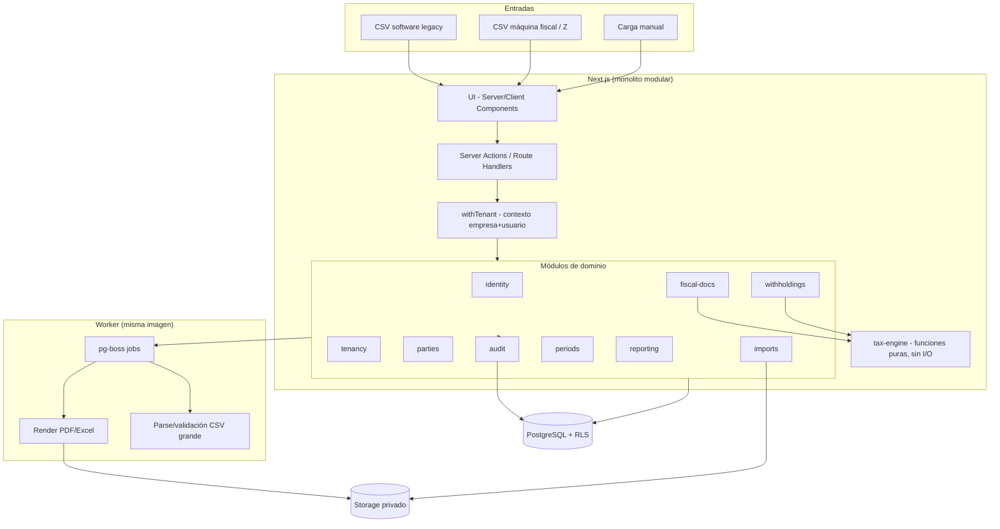
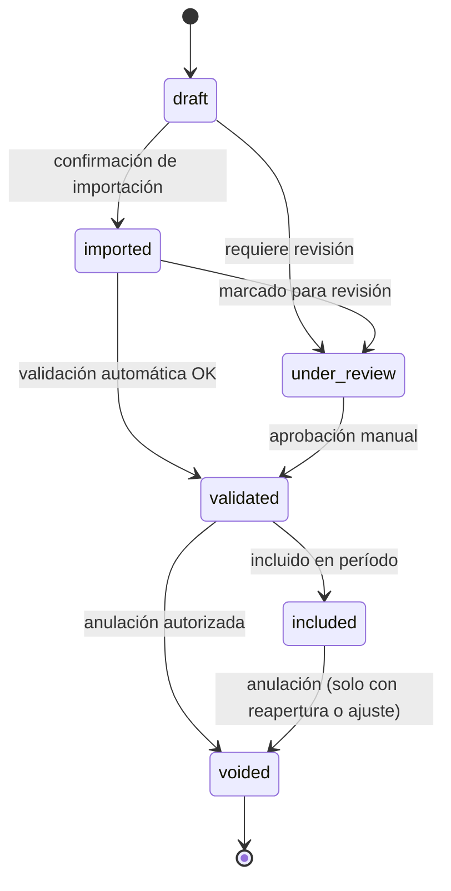
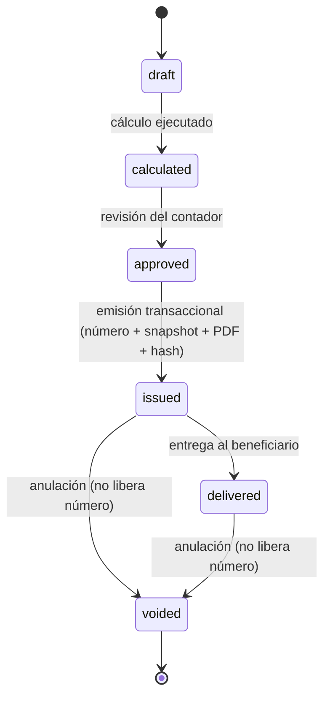
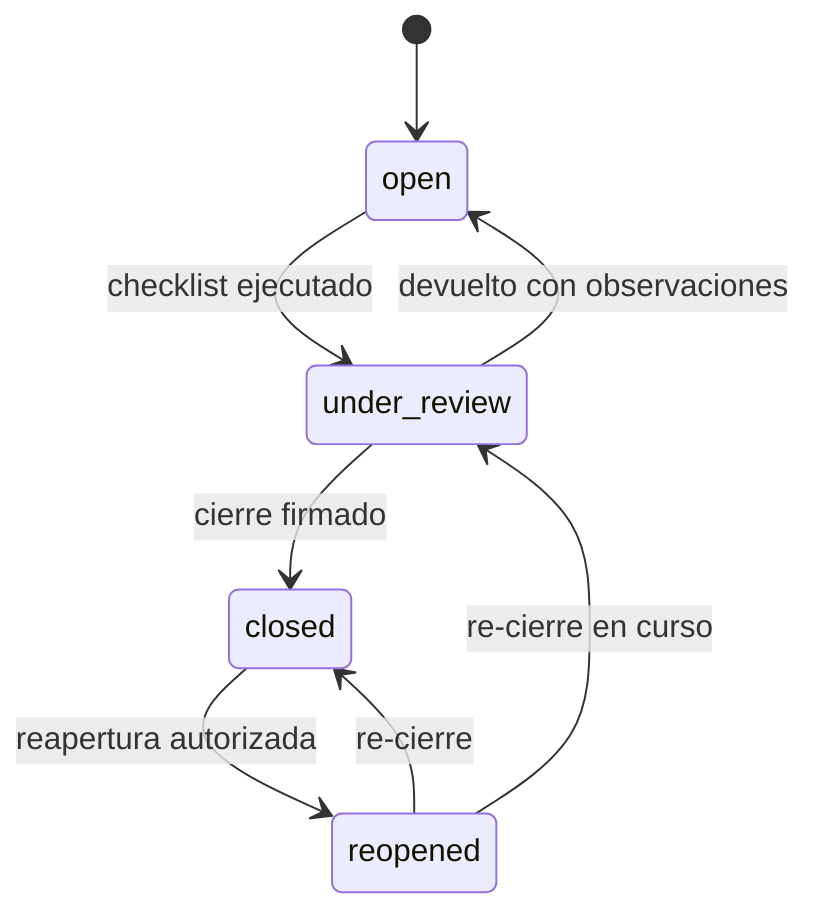
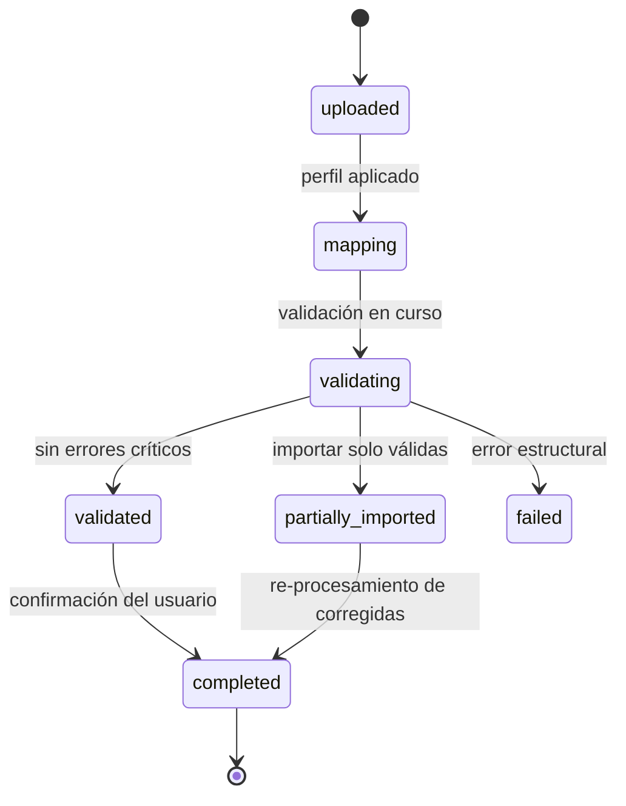
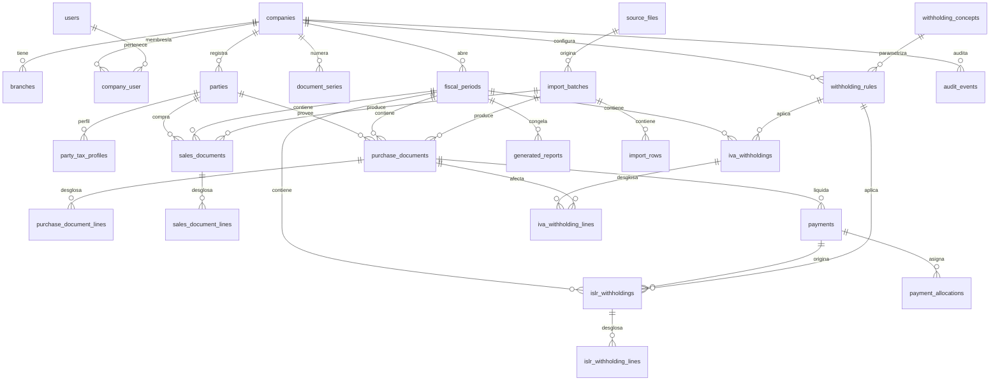

# docsAll — Documento unico consolidado de docs/

> Generado: 2026-10-01 · Fuente de verdad: docs/ · Este archivo es DERIVADO (copia de lectura). No editar a mano: regenerar desde docs/. Orden: README, PROJECT, ARCHITECTURE, DOMAIN, DATABASE, API, SECURITY, CONVENTIONS, DECISIONS, TODO, CHANGELOG, anexos/*, assets/*, runbooks/*.
>
> Regla AGENTS.md: si no esta en docs/, no existe. blueprint/all/docsAll.md no es autoridad operativa.

## Indice de fuentes incluidas

1. docs/README.md
2. docs/PROJECT.md
3. docs/ARCHITECTURE.md
4. docs/DOMAIN.md
5. docs/DATABASE.md
6. docs/API.md
7. docs/SECURITY.md
8. docs/CONVENTIONS.md
9. docs/DECISIONS.md
10. docs/TODO.md
11. docs/CHANGELOG.md
12. docs/anexos/paquete-contador.md
13. docs/anexos/matriz-reglas-v1.md
14. docs/anexos/escenarios-dorados.md
15. docs/anexos/checklist-F0.md
16. docs/anexos/decision-abonos-G2-contador.md
17. docs/assets/trazabilidad.md
18. docs/runbooks/actualizacion-reglas.md
19. docs/runbooks/reapertura.md
20. docs/runbooks/restore.md
21. docs/runbooks/rotacion-secretos.md

---

<!-- BEGIN docs/README.md -->

# docs/ — ERP-TributarioLite

> **Estado:** v0.1 propuesta · Actualizado: 2026-10-01 · F1–F7 tienen implementación parcial/mayoritaria según `TODO.md`; reglas fiscales y salida a producción siguen bloqueadas por validación F0.
> Dueño: equipo + contador. Fuente operativa: `docs/`; `blueprint/` y el cuestionario son material de referencia histórica/levantamiento, no aprobación de reglas.

## Mapa

| Archivo | Responde | Leer cuando |
|---|---|---|
| `PROJECT.md` | ¿Qué y para quién? | Siempre primero |
| `ARCHITECTURE.md` | ¿Cómo se conectan piezas? | Decisiones stack/flujos |
| `DOMAIN.md` | Idioma ubicuo, invariantes, estados | Tocas motor/cálculos |
| `DATABASE.md` | Tablas, constraints, RLS, Zod | Tocas schema |
| `API.md` | Server Actions + Handlers | Tocas emisión/import/cierre |
| `SECURITY.md` | RBAC, RLS, secretos, límites | Tocas auth/datos sensibles |
| `CONVENTIONS.md` | Estilo, estructura, tests | Escribes código |
| `DECISIONS.md` | ADR-001–021 (incluye propuestas abiertas y ADR-021 control G2) | Dudas entre alternativas |
| `TODO.md` | Estado F0–F7 y bloqueos | Planificas/retomas |
| `CHANGELOG.md` | Qué cambió por fecha | Auditoría docs |
| `anexos/` | Matriz, dorados, checklist F0 y hoja de decisión G2 | Sesión con contador |

## Lectura por rol

- Dev nuevo/IA: `PROJECT + ARCHITECTURE + TODO` mínimo; +`DOMAIN` si motor, +`DATABASE` si schema, +`API/SECURITY` si endpoint sensible.
- Contador: `PROJECT + DOMAIN (glosario/7 fechas) + anexos/matriz-reglas-v1 + anexos/checklist-F0`.
- Auditor: `SECURITY + TODO + DECISIONS`.

## Diagramas

Mermaid en `ARCHITECTURE.md` (componentes/flujo) y `DATABASE.md` (ERD). Exportados para no técnicos en `assets/` (PNG + `trazabilidad.md`). Plantilla XLSX recibida; su validación como golden master sigue pendiente (ver `TODO.md`).

## Proceso

1. Al iniciar sesión IA: pasa contexto mínimo arriba.
2. Al cerrar: actualiza `TODO.md` + `CHANGELOG.md`, crea ADR si cambió rumbo.
3. Nunca marques ✅ sin checklist `TODO.md`. Bloqueantes G4/G8/G9 no se resuelven en código.

<!-- END docs/README.md -->

---

<!-- BEGIN docs/PROJECT.md -->

# PROJECT.md — ERP-TributarioLite

> **Estado:** v0.1 propuesta · **Actualizado:** 2026-09-30 · **Dueño:** equipo + contador cliente · **Fuentes:** `blueprint/ROADMAP`, cuestionario PDF Noe Dominguez, `DOMAIN.md`
> Ver también: `README.md`, `ARCHITECTURE.md`, `DOMAIN.md`, `TODO.md` (F0–F7).

## Elevator Pitch

Sistema web multiempresa que registra compras, ventas, pagos y retenciones una sola vez y deriva libros de IVA, resumen y comprobantes IVA/ISLR en PDF/Excel, para empresas venezolanas que hoy operan en Excel + software legacy + máquina fiscal.

## Problema

- **¿Quién lo sufre?** Administrativos, contadores y auditores de 1–N empresas (grupo o escritorio contable), 100–200 docs/mes.
- **¿Cómo hoy?** Transcripción manual en 5 plantillas Excel, CSV del legacy y Z de máquina fiscal, fórmulas frágiles (`#REF!` visto).
- **¿Por qué no alcanza?** Duplicación libros↔comprobantes↔resumen, errores base/IVA/retenido, sin trazabilidad (quién/cuándo/fila CSV), numeración sin control, NC/ND y cierres frágiles.

## Usuarios objetivo

| Rol | Necesidad principal | Nivel técnico |
|---|---|---|
| Administrativo | Importar CSV, registrar/corregir, preparar | Medio-bajo |
| Contador | Validar, configurar reglas, emitir, cerrar | Medio-alto fiscal |
| Auditor | Trazar total→documento→CSV, leer bitácora | Medio |
| Admin sistema | Usuarios/empresas/permisos | Alto |

Proveedor sin login v1 (solo tercero registrado).

## Propuesta de valor

Fuente única de verdad fiscal: hecho → motor puro versionado (`rule_version_id` + `explanation[]`) → comprobante inmutable numerado sin huecos → libro/resumen reproducible + cierre congelado con `closure_hash`.

## Alcance v1 (dentro)

Empresas/sucursales opcionales, terceros+RIF dual, compras/ventas/NC/ND/Z/pagos mínimos/pagos parciales, retenciones recibidas (registro), importación CSV con staging, retenciones IVA/ISLR multi-factura, libros + resumen + conciliación + drill-down, cierre/reapertura controlada, auditoría append-only, PDF/Excel.

## Fuera de v1 (explícito)

Factura electrónica, portal proveedores, correo, API tiempo real legacy/Z/SENIAT, contabilidad completa (diario/mayor/balance), nómina, inventario, OCR/IA. Diseño reservado (`source_type`, rol `supplier`, cola pg-boss) sin construir.

## Métricas de éxito (M1–M6)

M1 esqueleto vertical, M2 mes real = Excel, M3 0 huecos concurrencia, M4 cierre reproducible, M5 paralelo Excel vs sistema =0, M6 firma contador. 100% dorados verdes, 0 fugas tenant, restore probado, respuesta “¿de dónde salió?” ≤3 clics.

## Contexto / restricciones

Venezuela: normativa cambiante (providencias 2025, Decreto 1.808), IVA mensual/quincenal por empresa (G1), conectividad/eléctrico irregular → deploy simple sin Docker (Neon + procesos directos) + backup externo cifrado + restore drill. Sin dependencia realtime externa v1. Reglas solo válidas con matriz firmada contador.

## Referencias

`blueprint/cuestionarioClient.md`, `blueprint/ERP Tributario (mini) Perplexity.md`, `blueprint/fuentes ERP Tributario Lite.md`, `blueprint/ROADMAP-ERP-TributarioLite.md` §1–§2, cuestionario PDF (10 secciones), plantilla XLSX recibida y pendiente de validación como golden master.

<!-- END docs/PROJECT.md -->

---

<!-- BEGIN docs/ARCHITECTURE.md -->

# ARCHITECTURE.md — ERP-TributarioLite

> Se llena en el Paso 02, junto con DOMAIN.md, DATABASE.md y CONVENTIONS.md. Describe el "cómo se conectan las piezas", no el detalle de cada endpoint (eso va en API.md).
> Estado: **v0.1 (propuesta)**. Las decisiones marcadas con ADR están pendientes de registrarse en `DECISIONS.md` al aceptarse. Lo marcado ⏳ depende de una respuesta del cliente/contador (ver `ROADMAP-ERP-TributarioLite.md`, §3 y §11).

## Principio rector

El sistema **registra hechos económicos y fiscales**; los libros, resúmenes y comprobantes son **salidas derivadas**, nunca fuentes de datos. CSV, software legacy y máquina fiscal son únicamente canales de entrada.

Cuatro propiedades que la arquitectura debe garantizar (en orden de prioridad ante un conflicto):

1. **Aislamiento multiempresa** — ningún dato cruza empresas sin pasar por el contexto de tenant.
2. **Inmutabilidad fiscal** — lo emitido o cerrado no se edita: se anula, sustituye o ajusta.
3. **Reproducibilidad** — cualquier reporte histórico puede regenerarse exactamente como se emitió.
4. **Trazabilidad** — desde cualquier total se llega al documento, a la fila del CSV y al archivo de origen.

## Stack tecnológico

| Capa | Tecnología | Motivo de la elección (ver DECISIONS.md si hubo alternativas) |
|---|---|---|
| Frontend | Next.js 16.x (App Router) + React 19.x + Tailwind CSS 4.x | Stack del equipo; Server Components reducen JS en cliente; un solo repo/lenguaje (ADR-001) |
| Backend / API | Next.js Server Actions (mutaciones de UI) + Route Handlers (descargas, uploads) | Monolito modular; sin API separada en v1 (ADR-001) |
| Base de datos | PostgreSQL ≥ 16 | `numeric` exacto, `daterange` + `EXCLUDE` para vigencias, RLS, transacciones robustas (ADR-002/003/004) |
| ORM / queries | Drizzle (+ SQL explícito donde haga falta) | Control de transacciones y `SET LOCAL` por request; `numeric` como string (ADR-012) |
| Auth | Auth.js o Better Auth, sesiones en DB *(elegir en F1)* | Sesiones revocables; autorización `rol × empresa` propia (ADR-010) |
| Jobs en segundo plano | `pg-boss` (cola sobre PostgreSQL) | Sin Redis; suficiente para 100–200 docs/mes (ADR-008) |
| Validación | Zod (cliente + **servidor**) | Esquemas compartidos; el servidor es la autoridad |
| Aritmética monetaria | `decimal.js` | Nunca `number`/`float` para dinero (ADR-003) |
| PDF | HTML/CSS → PDF server-side (Playwright/Chromium en el worker) ⏳ | Fidelidad a formatos del cliente; spike en F1/F5 (ADR-009) |
| Excel | `exceljs` rellenando la plantilla original | Conserva formato del cliente (ADR-009) |
| Almacenamiento de archivos | Sistema de archivos privado o S3-compatible ⏳ | CSV originales, soportes, PDFs/Excel emitidos; URLs firmadas |
| Hosting / Deploy | Sin Docker: Postgres gestionado (Neon) + app/worker como procesos directos (VPS o plataforma Node) | Decisión 2026-09-30 (ADR-015). Sin dependencia realtime externa v1 |
| Observabilidad | Logs estructurados (pino) + Sentry + healthchecks | Sin PII/secretos en logs |
| Testing | Vitest, fast-check, PostgreSQL real en Neon dev, Playwright | Ver §Calidad |

## Diagrama de componentes



## Módulos y fronteras

Monolito modular con dependencias impuestas por herramienta (`dependency-cruiser` / `eslint-plugin-boundaries`) en CI.

| Módulo | Responsabilidad | Puede depender de |
|---|---|---|
| `identity` | Usuarios, sesiones, recuperación de acceso | — |
| `tenancy` | Empresas, sucursales, membresías `company_user(role)`, `withTenant()` | `identity` |
| `parties` | Clientes/proveedores, perfiles fiscales con historial | `tenancy` |
| `fiscal-docs` | Compras, ventas, NC/ND, reportes Z, pagos, retenciones recibidas | `parties`, `periods`, `tax-engine` |
| `tax-engine` | **Funciones puras**: cálculo de IVA, retenciones IVA/ISLR, `explanation[]` | *(nada: sin DB, sin red, sin reloj)* |
| `imports` | Staging, mapeo, validación, lotes, idempotencia | `fiscal-docs`, `parties` |
| `withholdings` | Reglas, emisión, series, certificados, anulación/sustitución | `fiscal-docs`, `tax-engine`, `reporting` |
| `periods` | Máquina de estados, checklist, cierre, reapertura, ajustes | `fiscal-docs`, `reporting` |
| `reporting` | Libros, resumen IVA, PDF/Excel, versiones de reporte | `fiscal-docs`, `withholdings` (solo lectura) |
| `audit` | Eventos append-only | transversal (se invoca, no invoca) |

Reglas:
- Los módulos se comunican solo por su `index.ts` público.
- `tax-engine` no importa infraestructura; recibe todo por parámetros (incluida la fecha fiscal `asOf` y el conjunto de reglas ya filtrado por vigencia).
- **Todo acceso a DB pasa por `withTenant(ctx, fn)`**; una regla de lint prohíbe importar el cliente DB fuera de `modules/*/repo`.

## Componentes clave

### Frontend
- **Estructura de carpetas:** ver `CONVENTIONS.md`. Rutas bajo `app/(auth)` y `app/(app)/[companyId]/...`; la empresa activa viaja en la URL (evita operar sobre la empresa equivocada).
- **Manejo de estado:** servidor primero (Server Components + revalidación). Estado de cliente solo para UI local (filtros, asistentes de importación). Sin estado global de negocio en cliente.
- **Formularios / validación en cliente:** React Hook Form + Zod con los mismos esquemas que el servidor; el cálculo mostrado al usuario (base, IVA, retenciones, pago neto) se obtiene llamando al motor, no re-implementándolo en el cliente.
- **Contexto permanente en cabecera:** Empresa · Sucursal · Período · Rol · Estado del período.

### Auth (Autenticación y autorización)
- **Estrategia:** sesiones en base de datos (cookie `HttpOnly`, `Secure`, `SameSite=Lax`); expiración y revocación por usuario. MFA recomendado para roles Contador y Admin (⏳ decidir alcance v1).
- **Dónde vive la sesión:** tabla de sesiones en PostgreSQL.
- **Autorización:** `rol × empresa` (`company_user`), evaluada en **una sola capa** (`authorize(ctx, action, resource)`), más RLS como defensa en profundidad. Roles v1: Admin del sistema, Administrativo, Contador, Auditor. El rol Proveedor existe en el modelo pero **sin login** en v1.
- Ver matriz de roles y permisos completa en `SECURITY.md`.

### Multitenancy
- Esquema compartido; toda tabla operativa lleva `company_id` (y `branch_id` nullable, `fiscal_period_id` cuando aplique).
- `withTenant(ctx, fn)` abre una transacción, ejecuta `SET LOCAL app.company_id = …` y `SET LOCAL app.user_id = …`, y solo entonces corre `fn`. `SET LOCAL` (no `SET`) para ser seguro con *connection pooling*.
- RLS activa en todas las tablas operativas; el rol de la app **no es owner** ni tiene `BYPASSRLS`. Migraciones corren con un rol distinto.
- Suite automatizada de **fuga entre tenants** obligatoria en CI.

### API
- **Estilo:** Server Actions tipadas para mutaciones de UI; Route Handlers para subida de CSV, descarga de PDF/Excel y health. No hay API pública en v1.
- **Convención de rutas:** `/api/companies/[companyId]/...` para handlers; acciones agrupadas por módulo.
- **Contrato de errores:** `{ error: { code, message, details? } }`; códigos de dominio estables (p. ej. `PERIOD_CLOSED`, `DUPLICATE_DOCUMENT`, `SERIES_EXHAUSTED`).
- **Idempotencia:** importaciones por `sha256(archivo)` + clave natural; emisión de comprobantes con clave de idempotencia por solicitud.
- Detalle de endpoints → `API.md`.

### Database
- **Motor:** PostgreSQL ≥ 16 (extensiones: `btree_gist`, `pgcrypto`/`uuid`).
- **Convenciones:** UUID internos; numeraciones fiscales en columnas propias; dinero `numeric(18,2)`, tasas `numeric(18,6)`; fechas fiscales como `date`, instantes como `timestamptz` (UTC). Zona de negocio `America/Caracas` solo en presentación.
- **Integridad en la base, no solo en la app:** `UNIQUE` parcial para duplicados de documentos, `EXCLUDE USING gist` para no solapar vigencias de reglas, `CHECK` de estados, trigger que rechaza mutaciones sobre períodos cerrados, `REVOKE UPDATE, DELETE` sobre `audit_events`.
- **Migraciones:** versionadas en repo, hacia adelante; toda migración se prueba contra un dump anonimizado antes de producción.
- Esquema detallado → `DATABASE.md`.

### Motor tributario (`tax-engine`)
- Reglas = **datos con vigencia** (tablas) + **semántica en código** tipado. Sin DSL genérico (ADR-004).
- Cada resultado devuelve montos, `ruleVersionId`, `ruleSnapshot` y `explanation[]` (pasos legibles para el contador).
- Un cálculo reproducido con la misma entrada y las mismas reglas da el mismo resultado byte a byte (determinismo: sin `Date.now()`, sin aleatoriedad, redondeo explícito ⏳ ADR-014).

### Importación (pipeline en staging)
```
Archivo → source_files (bytes originales + sha256)
       → import_batches → import_rows (crudo JSONB + normalizado + errores)
       → validación (errores / advertencias / duplicados)
       → confirmación del usuario
       → documentos definitivos (TX atómica; trazabilidad source_file_id + row_number)
```
- Archivos pequeños: síncrono. Archivos grandes: job `pg-boss` con progreso.
- Las diferencias entre retención importada y recalculada se **marcan**, nunca se sobrescriben.

### Emisión de comprobantes
Una sola transacción de base de datos:
1. Bloqueo de la operación y verificación de estado/período.
2. Reserva del número: `UPDATE document_series … RETURNING` (consecutivo, sin huecos — ADR-005).
3. Snapshot completo de datos + regla aplicada.
4. Render PDF/Excel → `sha256` → almacenamiento.
5. Estado `issued`, evento de auditoría.

Si falla cualquier paso, **no se consume el número**. Un comprobante emitido nunca se edita: se anula (el número queda consumido) o se sustituye con `replaces_id`.

### Períodos y cierre
- Estados: `open → under_review → closed → reopened`.
- Cierre: checklist automatizado → congelamiento → versión de reportes → `closure_hash` (sobre ids + versiones de documentos).
- Post-cierre, las correcciones entran como `fiscal_adjustments` en un período abierto, referenciando el original. Reapertura: solicitud → autorización por rol → nueva versión, con motivo y responsable.

### Reportes
- Libros, Resumen IVA y comprobantes se **generan desde documentos**; `report_versions` guarda `data_snapshot`, `sha256`, usuario y fecha.
- Regenerar un reporte cerrado debe producir el mismo `data_snapshot`.
- Golden master: formatos `.xlsx` originales del cliente (comparación celda a celda en CI).

### Auditoría
- Eventos de dominio escritos **en la misma transacción** que el cambio (quién, cuándo, empresa, entidad, valores previos/nuevos, motivo, origen técnico).
- Append-only a nivel de permisos de DB; hash encadenado opcional (⏳ decidir en F6).

### UI/UX
- **Sistema de diseño / librería de componentes:** Tailwind + componentes propios/shadcn-ui (⏳ confirmar); tablas densas y filtrables como patrón principal.
- **Patrones obligatorios:** cabecera con Empresa/Período/Rol siempre visible; previsualización del cálculo antes de guardar; drill-down desde cada total al documento; errores de importación por fila.
- **Accesibilidad:** contraste AA, navegación por teclado en tablas y formularios, etiquetas y mensajes de error asociados a los campos.
- **Idioma/formato:** es-VE; importes con coma decimal en presentación y punto en almacenamiento/transporte.

## Flujo de datos típico

**Compra con retención (de punta a punta):**

1. El Administrativo sube un CSV del legacy → se guarda el archivo original y se crea el lote.
2. El parser normaliza (separador, decimales, fechas, RIF) → `import_rows`; la validación marca errores/duplicados.
3. El usuario confirma → se crean `purchase_documents` con trazabilidad al archivo y fila.
4. El módulo `fiscal-docs` invoca a `tax-engine.computeDocumentTaxes` y guarda el resultado con su regla aplicada.
5. `withholdings` calcula retención IVA/ISLR (`computeIvaWithholding` / `computeIslrWithholding`) y la deja en estado `calculated` con su `explanation[]`.
6. El Contador revisa y emite: transacción de emisión (número, snapshot, PDF, hash, auditoría).
7. Al cerrar el período, `reporting` congela Libro de Compras, Libro de Ventas y Resumen; `periods` calcula el `closure_hash`.
8. El Auditor consulta la línea de tiempo del documento: archivo/fila de origen → regla → comprobante → cierre.

## Entornos y variables de entorno

| Variable | Entorno | Descripción | ¿Sensible? |
|---|---|---|---|
| `NODE_ENV` | dev / staging / prod | Modo de ejecución | No |
| `APP_URL` | dev / staging / prod | URL base (enlaces, cookies) | No |
| `DATABASE_URL` | dev / staging / prod | Conexión del rol de la **app** (sin owner, sin BYPASSRLS) | Sí |
| `DATABASE_MIGRATION_URL` | staging / prod | Conexión del rol de migraciones | Sí |
| `AUTH_SECRET` | dev / staging / prod | Firma/cifrado de sesiones | Sí |
| `FILE_SIGNING_SECRET` | dev / staging / prod | Firma de URLs de descarga temporales | Sí |
| `STORAGE_DRIVER` | dev / staging / prod | `fs` o `s3` | No |
| `STORAGE_PATH` / `S3_*` | staging / prod | Ruta o credenciales del almacenamiento | Sí (S3_*) |
| `MAX_UPLOAD_MB` | dev / staging / prod | Límite de tamaño de archivos | No |
| `PGBOSS_SCHEMA` | dev / staging / prod | Esquema de la cola de jobs | No |
| `SENTRY_DSN` | staging / prod | Reporte de errores | Sí |
| `LOG_LEVEL` | dev / staging / prod | Nivel de log | No |
| `BACKUP_*` | prod | Destino y credenciales de backups fuera del servidor | Sí |

Reglas: `.env` fuera del repo; `.env.example` sin valores reales; claves distintas por entorno; rotación documentada en `SECURITY.md`.

## Despliegue y operación

```
Proxy (Caddy/Nginx, TLS) → app (Next.js) ┐
                           worker (pg-boss, PDF) ├→ PostgreSQL
                                                  └→ Storage privado
```
- Docker no se usa en desarrollo, CI, staging ni producción. App y worker se ejecutan como procesos directos desde el mismo repo (VPS o plataforma Node) → PostgreSQL gestionado + storage privado.
- Backups: `pg_dump` diario + WAL (PITR) y copia **fuera del servidor**, cifrada; **restore drill** periódico y documentado. Objetivo: RPO ≤ 24 h como mínimo, ideal ≤ 1 h; RTO a definir con el cliente.
- Entornos: `dev` local, `staging` reproducible, `prod`. Datos reales nunca en dev sin anonimizar.
- Observabilidad: healthcheck `/api/health`, alertas de jobs fallidos y de backup no ejecutado.

## Calidad como parte de la arquitectura

| Garantía | Mecanismo |
|---|---|
| Corrección fiscal | Escenarios dorados del contador como fixtures + property tests (fast-check) sobre el motor |
| Aislamiento multitenant | Suite de fuga en CI; RLS |
| Numeración | Test de concurrencia (50–100 emisiones paralelas: 0 duplicados, 0 huecos) |
| Reproducibilidad | Test que regenera un reporte cerrado y compara `sha256` |
| Fidelidad de reportes | Comparación celda a celda con golden master; snapshots PDF |
| Fronteras de módulos | `dependency-cruiser` en CI |

## Restricciones de infraestructura conocidas

- Escala pequeña (100–200 documentos/mes): no hay requisitos de alto rendimiento; la prioridad es **corrección y auditabilidad**.
- Contexto operativo venezolano: conectividad y suministro eléctrico pueden ser irregulares → backups fuera del servidor, restauración probada y una sola unidad desplegable simple. ⏳ Proveedor de hosting por definir.
- Dependencias externas en tiempo real: **ninguna** en v1 (sin APIs del legacy, máquina fiscal ni SENIAT).
- Fuera de alcance v1 (arquitectura preparada, no implementada): factura electrónica (`sales_documents.source_type`), portal de proveedores (rol reservado), correo (la cola ya existe), API en tiempo real (perfiles de importación → adaptadores), OCR (entraría por el mismo staging).

## Decisiones pendientes que afectan esta arquitectura

| Tema | Bloquea | Origen |
|---|---|---|
| Moneda extranjera y tipo de cambio | Cliente indica moneda base bolívares, referencia USD y tasa oficial BCV; faltan fecha/tipo de tasa y diferencias para cerrar campos FX/cálculo | Gap G4 / ADR-013 |
| Política de redondeo | Cliente indica “8 cifras decimales significativas”; faltan método, etapa y precisión monetaria final | Gap G8 / ADR-014 |
| Período mensual vs. quincenal | `fiscal_periods`, cierre, prefijo de numeración | Gap G1 |
| Momento de retención IVA/ISLR | Migraciones 0011/0012 aplicadas en Neon dev; `unset` compara ambos criterios y permite solo convergencia, pero falta validar asiento/fecha y cálculo por porción | Gap G2 / ADR-017/021 |
| Formato de numeración ISLR | Serie y emisión ISLR | Gap G9 |
| Motor de PDF (Chromium vs. alternativa) | Imagen del worker y fidelidad de formatos | ADR-009 (spike) |

---
Ver también: `README.md`, `PROJECT.md`, `DOMAIN.md` (idioma ubicuo), `DATABASE.md` (schema), `API.md` (contrato), `SECURITY.md`, `DECISIONS.md` (ADR-001–021; 018–020 propuestas), `TODO.md`, `CHANGELOG.md`.

<!-- END docs/ARCHITECTURE.md -->

---

<!-- BEGIN docs/DOMAIN.md -->

# DOMAIN.md — ERP-TributarioLite

> Se llena en el Paso 02 (F0 → F2 según el roadmap). Este es el **idioma ubicuo** del proyecto: los términos y reglas de negocio que todos —tú, el equipo, el contador del cliente y cualquier agente de IA— deben usar exactamente igual. Si un término no está aquí, no existe para efectos de diseño.
>
> **Fuente de verdad legal:** este documento describe el *modelo mental* del sistema, no la normativa. Toda regla fiscal citada (porcentajes, plazos, formatos de numeración, sustraendos) proviene de la Matriz de Reglas v1 firmada por el contador (F0) y debe vivir como dato versionado en `withholding_rules` / `tax_rules`, nunca como constante en código.

---

## Glosario de dominio

Términos ordenados por área. La columna "Sinónimos a evitar" es **vinculante**: si un desarrollador, un test o un prompt a la IA usa un sinónimo, se considera deuda de vocabulario.

### Sujetos y perfiles

| Término | Definición | Sinónimos a evitar |
|---|---|---|
| **Empresa** | Persona jurídica con RIF propio, condición fiscal propia y libros propios. Es la unidad de aislamiento de datos (tenant). | "compañía", "negocio", "cliente" (ambigua: `cliente` es un tercero, no la empresa) |
| **Sucursal / Establecimiento** | División operativa dentro de una empresa. Puede tener numeración, caja o máquina fiscal propias. Opcional en v1. | "sede", "local", "tienda" |
| **Tercero** | Persona natural o jurídica que se relaciona comercialmente con la empresa. Puede ser cliente, proveedor, o ambos. | "contacto", "entidad" |
| **Proveedor** | Tercero del cual la empresa compra bienes o servicios. | "suplidor" |
| **Cliente** | Tercero al cual la empresa vende bienes o servicios. | "comprador" |
| **Beneficiario** | Tercero a quien se le practica una retención. En IVA suele coincidir con el proveedor; en ISLR el término es más preciso porque la retención puede no originarse en una compra formal. | "retenido" |
| **Agente de retención** | Empresa legalmente obligada o designada para practicar retenciones de IVA o ISLR. Es una **condición** de la empresa, no un rol de usuario. | "retenedor" |
| **Contribuyente especial** | Condición fiscal de una empresa, con fecha de inicio. No confundir con agente de retención. | — |
| **Perfil fiscal** | Conjunto de condiciones tributarias de una empresa o tercero (contribuyente, agente, exento, residente/no residente, tipo de persona). Tiene historial: los cambios no sobreescriben, agregan vigencia. | "datos fiscales" |

### Impuestos y cálculos

| Término | Definición | Sinónimos a evitar |
|---|---|---|
| **IVA** | Impuesto al Valor Agregado. Se cobra en venta (débito) y se soporta en compra (crédito). | "VAT" (solo en código) |
| **ISLR** | Impuesto Sobre la Renta. En este sistema solo se maneja en su faceta de **retención** sobre pagos. No se calcula la renta neta del ejercicio. | "income tax", "renta" |
| **Alícuota** | Porcentaje de IVA aplicable a una base imponible. Varía por vigencia y tipo de operación. | "tasa", "rate" (en UI), "porcentaje" (ambigua con % de retención) |
| **Base imponible** | Monto sobre el cual se calcula un impuesto. En IVA suele ser el subtotal gravado; en ISLR depende del concepto. | "subtotal" (solo si es literal el subtotal del documento), "monto base" |
| **Débito fiscal** | IVA cobrado por la empresa en sus ventas. Se **origina** en ventas. | "IVA por pagar", "IVA trasladado" |
| **Crédito fiscal** | IVA soportado por la empresa en compras que dan derecho a crédito. Se **origina** en compras. | "IVA pagado", "IVA acreditable" |
| **IVA causado** | IVA generado por una operación específica, antes de cualquier retención. Es el punto de partida del cálculo de retención de IVA. | "IVA de la factura" |
| **IVA retenido** | Porción del IVA causado que el agente retiene al proveedor. Es un **evento tributario**, no una columna editable. | "IVA descontado" |
| **ISLR retenido** | Monto retenido sobre una base sujeta, aplicando un porcentaje y restando un sustraendo. | "ISLR descontado" |
| **Sustraendo** | Monto fijo que se resta de la base × porcentaje en ISLR. Puede ser cero. | "deducción", "rebaja" |
| **Concepto de pago** | Categoría que determina qué regla de ISLR aplica (honorarios, comisiones, alquileres, publicidad, transporte, etc.). Es una entidad con vigencia, no un enum. | "tipo de servicio", "categoría" |
| **Período fiscal** | Intervalo sobre el cual se consolidan libros y se determina el IVA. Puede ser mensual o quincenal (`kind`), y su rango es explícito. | "mes", "quincena" (como sinónimo de período) |
| **Excedente** | Crédito fiscal de un período anterior que no pudo aplicarse y se traslada. | "saldo a favor", "remanente" |

### Documentos fiscales

| Término | Definición | Sinónimos a evitar |
|---|---|---|
| **Documento fiscal** | Registro normalizado de una operación con relevancia tributaria. Tiene tipo, fecha fiscal, base, impuesto, total, y trazabilidad a su origen. Es el **hecho** desde el cual se derivan libros y comprobantes. | "transacción", "movimiento", "registro" (ambiguo con audit events) |
| **Factura** | Documento que soporta una compra o venta gravada. Tiene número de factura y número de control. | "invoice" (solo en código), "recibo" |
| **Número de control** | Identificador fiscal adicional de una factura venezolana. Se preserva el formato original aunque se normalice para búsqueda. | "control", "N° control" |
| **Nota de crédito (NC)** | Documento que **disminuye** el monto o revierte parcial/totalmente una factura previa. Requiere documento afectado. | "credit note", "devolución" (la devolución es física; la NC es documental) |
| **Nota de débito (ND)** | Documento que **incrementa** el monto de una operación previa. Requiere documento afectado. | "debit note", "cargo adicional" |
| **Reporte Z** | Resumen diario emitido por una máquina fiscal. Consolida un rango de facturas. No es una factura individual. | "cierre Z", "Z" (ambiguo con el reporte Z como objeto vs. su número) |
| **Documento afectado** | El documento original que una NC o ND modifica. Sin él, una NC/ND es inválida. | "factura original", "documento padre" |
| **Importación** | Régimen aduanero bajo el cual ingresan bienes. Tiene tratamiento fiscal propio (a veces gravado, a veces exento). | "compra internacional" |
| **Exportación** | Venta al exterior. Alícuota 0 % y tratamiento específico en el resumen. | "venta internacional" |
| **Venta por cuenta de terceros** | Operación donde la empresa actúa como intermediario y no como vendedor real. Se registra con clasificación propia. | "consignación" |

### Retenciones y comprobantes

| Término | Definición | Sinónimos a evitar |
|---|---|---|
| **Retención** | Evento tributario por el cual el agente descuenta un monto al beneficiario y lo entera al fisco. Tiene existencia propia, no es una columna de una factura. | "descuento" (el descuento es comercial; la retención es fiscal) |
| **Evento de liquidación** | Pago o abono en cuenta con fecha, monto y asignaciones a documentos; registrar el evento no implica por sí solo emitir una retención. | "movimiento" |
| **Comprobante de retención** | Documento fiscal emitido por el agente que prueba que se practicó una retención. Tiene numeración propia, snapshot inmutable y estado documental. | "certificado", "constancia" |
| **Comprobante de IVA** | Comprobante de retención de IVA. Numeración `AAAAMMSSSSSSSS`. | "retensión IVA" (informal) |
| **Comprobante de ISLR** | Comprobante de retención de ISLR. Numeración por definir con contador (G9). | "retensión ISLR" (informal) |
| **Snapshot** | Copia inmutable de los datos del comprobante al momento de emitirlo. Incluye regla aplicada, parámetros, partes, líneas, totales. | "copia", "respaldo" |
| **Rule version / rule_version_id** | Referencia a la versión específica de la regla tributaria aplicada en un cálculo. Todo cálculo guarda su `rule_version_id` y el snapshot de los parámetros usados. | "regla aplicada" (informal) |
| **Explanation** | Arreglo legible de pasos que muestran cómo se calculó un monto. Requisito de producto: el contador debe *ver* por qué se retuvo cada cifra. | "detalle", "log de cálculo" |

### Libros y reportes

| Término | Definición | Sinónimos a evitar |
|---|---|---|
| **Libro de Compras** | Reporte fiscal cronológico de las compras del período. Se **deriva** de los documentos de compra. No es una tabla. | "libro de compras IVA" (redundante) |
| **Libro de Ventas** | Reporte fiscal cronológico de las ventas del período. Se **deriva** de los documentos de venta y/o reportes Z, según el modo configurado por empresa. | "libro de ventas IVA" (redundante) |
| **Resumen de IVA** | Consolidación del período: débitos, créditos, exentas, exportaciones, ajustes, excedente anterior, retenciones aplicadas, cuota del período. | "declaración", "formulario 72" (es un *insumo* para la declaración, no la declaración) |
| **Conciliación** | Reporte que verifica que libros ↔ resumen ↔ comprobantes cuadren con tolerancia 0. | "cuadre", "reconciliación" |
| **Report version** | Versión congelada de un reporte emitido, con `data_snapshot`, `sha256`, usuario y fecha. Regenerable de forma reproducible. | "snapshot de reporte" |
| **Golden master** | Salida de referencia emitida por el cliente/contador (Excel original o PDF firmado) contra la cual se compara el sistema. | "muestra", "ejemplo" |

### Numeración y series

| Término | Definición | Sinónimos a evitar |
|---|---|---|
| **Serie** | Cauce de numeración independiente, identificado por `(company_id, kind, period_key)`. Ej: comprobantes IVA de la empresa A en septiembre 2026. | "talonario", "rango" |
| **Numeración sin huecos** | Propiedad de las series de comprobantes: los números emitidos son consecutivos y **ningún número se reutiliza**, ni siquiera tras anulación. | "numeración consecutiva" (es lo mismo, se prefiere la primera) |
| **Anulación** | Estado terminal de un documento que lo invalida sin liberar su número. | "cancelación" (ambigua con cancelación de pago) |
| **Sustitución** | Emisión de un nuevo comprobante que reemplaza a uno anulado, referenciándolo con `replaces_id`. | "reemisión" |

### Fechas (crítico: son distintas, no una)

| Término | Definición |
|---|---|
| **fecha_documento** | Fecha de emisión de la factura/NC/ND según el documento físico. |
| **fecha_recepcion** | Fecha en que la empresa recibió el documento (relevante para compras). |
| **fecha_pago** | Fecha efectiva en que se pagó el importe. No representa por sí sola un abono contable anterior. |
| **fecha_abono_en_cuenta** | Fecha en que el importe se acreditó en la contabilidad o registros del pagador. Requiere captura explícita si ocurre antes del pago. |
| **fecha_retencion** | Fecha en que nace el deber de retener conforme a la regla aplicable. Para IVA e ISLR, pago o abono en cuenta, lo que ocurra primero; puede ser distinta de la fecha de emisión/entrega del comprobante. |
| **fecha_emision_comprobante** | Fecha en que se emitió el comprobante de retención. |
| **fecha_entrega_comprobante** | Fecha en que se entregó el comprobante al beneficiario. |
| **fecha_fiscal** | La que determina el **período fiscal** al que pertenece la operación. No siempre coincide con la fecha_documento. |

**Regla de oro:** la fecha de registro en el sistema **nunca** sustituye a la fecha fiscal. Si un documento de agosto se registra en septiembre, su fecha fiscal sigue siendo agosto y así debe reportarse (ver caso límite "operaciones de períodos anteriores").

### Términos internos del sistema

| Término | Definición |
|---|---|
| **Tenant** | La empresa activa en el contexto de una request. El acceso a DB siempre pasa por `withTenant(ctx, fn)`. |
| **Staging** | Zona intermedia donde aterrizan las filas de un CSV antes de convertirse en documentos definitivos. |
| **Import batch** | Conjunto de filas cargadas en una sola operación de importación, con idempotencia por `sha256(file)` + clave natural. |
| **Source file** | Archivo original cargado, conservado íntegro como evidencia. |
| **Audit event** | Registro append-only de un hecho de dominio, escrito en la misma transacción que lo produjo. |
| **Fiscal adjustment** | Ajuste hacia un período abierto que corrige algo de un período cerrado, referenciando el original. |
| **Closure hash** | Hash calculado al cerrar un período sobre ids + versiones de los reportes, para detectar alteraciones posteriores. |

---

## Entidades principales

### Empresa (`companies`)

- **Descripción:** tenant del sistema. Unidad de aislamiento de datos y de configuración fiscal.
- **Atributos clave:** `id`, `rif`, `razon_social`, `domicilio_fiscal`, `condicion_iva`, `contribuyente_especial_desde`, `agente_retencion_iva`, `agente_retencion_islr`, `period_kind` (`monthly`/`biweekly`), `status`.
- **Reglas de negocio:**
  - Toda consulta operativa debe filtrar por `company_id`.
  - La condición de agente de retención es independiente por tipo de impuesto (IVA, ISLR).
  - El `period_kind` es por empresa (G1) y determina cómo se construyen sus `fiscal_periods`.
  - Los cambios de condición fiscal se registran con vigencia; no se sobreescriben.
- **Relaciones:** 1:N con `branches`, `fiscal_periods`, `document_series`, `withholding_rules`, `parties`, `purchase_documents`, `sales_documents`, `iva_withholdings`, `islr_withholdings`.

### Sucursal (`branches`)

- **Descripción:** división operativa opcional. Puede tener numeración o máquina fiscal propias.
- **Atributos clave:** `id`, `company_id`, `codigo`, `nombre`, `direccion`, `status`.
- **Reglas de negocio:**
  - Opcional en v1: una empresa puede operar sin sucursales explícitas.
  - Si existe, los documentos pueden referenciarla; la numeración puede ser por sucursal.
- **Relaciones:** N:1 con `companies`; 1:N con `document_series` (si aplica), `sales_documents` (vía máquina fiscal).

### Perfil fiscal de tercero (`party_tax_profiles`)

- **Descripción:** condiciones tributarias de un tercero, con historial de vigencia.
- **Atributos clave:** `party_id`, `tipo_persona` (natural/jurídica), `residente`, `condicion_iva`, `sujeto_retencion_iva`, `sujeto_retencion_islr`, `conceptos_islr_aplicables`, `vigencia`.
- **Reglas de negocio:**
  - Determina si una operación está sujeta a retención (IVA o ISLR).
  - Un mismo tercero puede ser cliente y proveedor; los perfiles son por rol.
  - El RIF se valida estructuralmente y se preserva el valor original además del normalizado.

### Período fiscal (`fiscal_periods`)

- **Descripción:** intervalo sobre el cual se consolidan libros y se determina el IVA.
- **Atributos clave:** `id`, `company_id`, `kind` (`monthly`/`biweekly`), `range` (`daterange`), `status` (`open`/`under_review`/`closed`/`reopened`), `closed_by`, `closed_at`, `closure_hash`, `reopen_reason`.
- **Reglas de negocio:**
  - El `kind` es por empresa; no se mezclan mensuales y quincenales en la misma empresa.
  - Un período `closed` **no admite** `UPDATE`/`DELETE` sobre documentos incluidos. Se impone en app **y** en DB (trigger/constraint).
  - La reapertura requiere autorización por rol y deja registro (responsable, fecha, motivo).
  - Al cerrar, se calcula `closure_hash` sobre ids + versiones de los reportes.
- **Relaciones:** N:1 con `companies`; 1:N con `purchase_documents`, `sales_documents`, `iva_withholdings`, `islr_withholdings`, `generated_reports`.

### Tercero (`parties`)

- **Descripción:** persona natural o jurídica que se relaciona comercialmente con la empresa.
- **Atributos clave:** `id`, `company_id`, `rif`, `rif_original`, `razon_social`, `direccion_fiscal`, `status`.
- **Reglas de negocio:**
  - El RIF se valida estructuralmente; se preserva el valor original (con guiones, mayúsculas) y se guarda un normalizado para búsqueda.
  - Un tercero puede ser cliente y proveedor simultáneamente; el rol se determina por la operación, no por el maestro.
  - Un tercero inactivo no puede asociarse a nuevos documentos.
- **Relaciones:** N:1 con `companies`; 1:N con `party_tax_profiles`, `purchase_documents`, `sales_documents`.

### Documento de compra (`purchase_documents`)

- **Descripción:** hecho fiscal de una compra. Incluye facturas, NC, ND, importaciones y compras exentas/sin derecho a crédito.
- **Atributos clave:** `id`, `company_id`, `branch_id` (nullable), `fiscal_period_id`, `kind` (`invoice`/`credit_note`/`debit_note`/`import`/`exempt`/...), `party_id`, `doc_number`, `control_number`, `fecha_documento`, `fecha_recepcion`, `fecha_fiscal`, `base_imponible`, `iva_causado`, `total`, `currency`, `fx_rate`, `fx_rate_date`, `status`, `voided_at`, `replaces_id`, `source_file_id`, `source_row_number`, `import_batch_id`.
- **Reglas de negocio:**
  - **Invariante 1:** `base_imponible + iva_causado + conceptos_permitidos = total` (tolerancia según ADR de redondeo).
  - **Invariante 3:** una NC no puede exceder el saldo disponible del documento afectado (salvo flujo autorizado de ajuste).
  - Unicidad (excluyendo anulados): `(company_id, party_id, doc_type, invoice_number, control_number)`.
  - Toda NC/ND requiere `documento_afectado_id` no nulo.
  - La `fecha_fiscal` determina el período; no se sobrescribe por la fecha de registro.
  - Si está en un período `closed`, no admite mutación.
  - Puede tener clasificación fiscal múltiple (gravada/exenta/no sujeta) por línea.
- **Relaciones:** N:1 con `companies`, `parties`, `fiscal_periods`; 1:N con `purchase_document_lines`, `payments`, `iva_withholdings`, `islr_withholdings`; N:1 con `source_files` (si importado).

### Documento de venta (`sales_documents`)

- **Descripción:** hecho fiscal de una venta. Incluye facturas, reportes Z (`kind=z_summary`), NC, ND, exportaciones, ventas por cuenta de terceros.
- **Atributos clave:** análogos a `purchase_documents` más `kind` (`invoice`/`z_summary`/`credit_note`/`debit_note`/`export`/`third_party`), `range_from`, `range_to` (para Z), `source_type` (`imported`/`manual`/`electronically_issued`), `machine_id`, `branch_id`.
- **Reglas de negocio:**
  - **Invariante 1** igual que en compras.
  - El modo de alimentación del Libro de Ventas (factura individual vs. Z) es **configurable por empresa/sucursal** (G7). No se mezclan ambos modos en el mismo período para la misma sucursal.
  - Un Z tiene `range_from`/`range_to`; las validaciones de saltos de numeración se aplican sobre el rango.
  - `source_type = electronically_issued` está reservado para v2; en v1 solo `imported` y `manual`.
- **Relaciones:** N:1 con `companies`, `parties`, `fiscal_periods`, `branches`; 1:N con `sales_document_lines`, `withholdings_received`; N:1 con `z_reports` (si aplica).

### Evento de liquidación (`payments`, nombre físico legacy)

- **Descripción:** evento de liquidación registrado como pago (`payment`) o abono en cuenta (`account_credit`). No es tesorería ni conciliación bancaria. La tabla física mantiene temporalmente el nombre histórico `payments` para preservar datos y emitir una migración aditiva.
- **Atributos clave:** `id`, `company_id`, `party_id`, `event_type`, fecha del evento, monto, moneda, método (solo pago), referencia de origen, indicador `inferred`, `status`; las asignaciones viven en `payment_allocations`.
- **Reglas de negocio:**
  - Para la retención de IVA e ISLR, el momento es el pago o abono en cuenta, lo que ocurra primero (Providencia SNAT/2025/000054, art. 13; Decreto 1.808, art. 1). `fecha_pago` sola no basta si el abono contable ocurrió antes.
  - El usuario registra el evento y lo asigna a una o varias compras; no se infiere automáticamente un abono desde una factura/CSV ni se genera retención por guardar/asignar.
  - La suma asignada no puede exceder el evento ni el total ya asignado a la compra. El beneficiario del evento debe coincidir con el proveedor.
  - `companies.abono_criterion` controla la operación: `unset` es el default; mientras siga así, solo se emite un pago si la comparación de ambos criterios converge estrictamente. Los casos divergentes y abonos sin asignación verificable se bloquean. Un criterio explícito requiere motivo/auditoría y no equivale a aprobación legal.
  - La previsualización compara fecha/período, regla/sustraendo, base y monto. No determina por sí sola atribución de base por porción ni resuelve el sustraendo en pagos parciales. IVA aún no consume eventos y la emisión fiscal continúa incompleta hasta validación F0.
  - Para no alterar retroactivamente el disparador de un comprobante ISLR vigente, no se registra ni asigna un evento para ese beneficiario con fecha igual/anterior a una retención emitida, salvo que se anule primero y se revise el caso.
  - No se elimina un evento con retenciones emitidas asociadas; se anula con trazabilidad.
- **Relaciones:** N:1 con `companies`, `parties`; 1:N con `payment_allocations`; 1:N con `islr_withholdings` para eventos de pago.

### Retención de IVA (`iva_withholdings`)

- **Descripción:** evento tributario de retención de IVA sobre una o varias facturas de compra.
- **Atributos clave:** `id`, `company_id`, `beneficiary_id` (proveedor), `fiscal_period_id`, `status` (`draft`/`calculated`/`approved`/`issued`/`delivered`/`voided`), `certificate_number` (`AAAAMMSSSSSSSS`), `fecha_emision`, `fecha_entrega`, `rule_version_id`, `rule_snapshot`, `total_retained`, `issued_by`, `voided_at`, `void_reason`, `replaces_id`, `pdf_sha256`.
- **Reglas de negocio:**
  - **Invariante 2:** `iva_retenido ≤ iva_causado` salvo regla explícita que lo autorice.
  - **Invariante 4:** una vez `issued`, no es modificable. Se anula o sustituye.
  - **Invariante 5:** numeración por `(company_id, kind='iva_withholding', period_key)` consecutiva y sin huecos, bajo concurrencia.
  - **Invariante 7:** todo cálculo guarda `rule_version_id` y snapshot de parámetros.
  - Un comprobante puede incluir **N líneas** (N facturas).
  - Un fallo durante la emisión no consume número (transaccionalidad).
- **Relaciones:** N:1 con `companies`, `parties` (beneficiario), `fiscal_periods`, `withholding_rules` (vía `rule_version_id`); 1:N con `iva_withholding_lines`; N:M con `purchase_documents` vía líneas.

### Retención de ISLR (`islr_withholdings`)

- **Descripción:** evento tributario de retención de ISLR sobre uno o varios pagos, con concepto de pago.
- **Atributos clave:** análogos a `iva_withholdings` más `concepto_id`, `base_sujeta`, `porcentaje`, `sustraendo`, `payment_id`.
- **Reglas de negocio:**
  - El cálculo depende del concepto de pago, tipo de beneficiario y vigencia.
  - La fecha de retención es la del pago o abono en cuenta, lo que ocurra primero; el esquema debe conservar el evento disparador y su fecha efectiva.
  - Numeración por definir con contador (G9); serie independiente por empresa.
  - Aplica **Invariante 4** (inmutabilidad al emitir) y **Invariante 7** (rule_version_id + snapshot).
- **Relaciones:** N:1 con `companies`, `parties`, `fiscal_periods`, `payments`, `withholding_concepts`; 1:N con `islr_withholding_lines`.

### Regla de retención (`withholding_rules`)

- **Descripción:** parámetro versionado por vigencia. Puede ser de IVA o ISLR.
- **Atributos clave:** `id`, `company_scope_key`, `rule_kind` (`iva`/`islr`), `concept_id` (nullable para IVA), `effective_range` (`daterange`), `porcentaje`, `sustraendo`, `base_formula_kind`, `conditions` (JSONB), `status`.
- **Reglas de negocio:**
  - **No solapamiento** de vigencias por `(company_scope_key, rule_kind, concept_id, effective_range)` vía `EXCLUDE USING gist`.
  - La semántica del cálculo vive en código TS; la regla solo aporta parámetros.
  - El 75 % de IVA es un **seed**, no una constante.
  - Un tipo nuevo de regla requiere código y tests; no es un DSL genérico.
- **Relaciones:** 1:N con `iva_withholdings` / `islr_withholdings` vía `rule_version_id`.

### Serie documental (`document_series`)

- **Descripción:** cauce de numeración por `(company_id, kind, period_key)`.
- **Atributos clave:** `company_id`, `kind`, `period_key`, `last_number`, `prefix`, `status`.
- **Reglas de negocio:**
  - **Invariante 5:** numeración sin huecos, emitida con `UPDATE … SET last = last + 1 … RETURNING` dentro de la misma transacción que crea el comprobante.
  - Prohibido `MAX()+1` o secuencias PG (tienen huecos).
  - Un número emitido **nunca** se reutiliza, ni tras anulación.
- **Relaciones:** N:1 con `companies`.

### Evento de auditoría (`audit_events`)

- **Descripción:** registro append-only de un hecho de dominio, escrito en la misma transacción que lo produjo.
- **Atributos clave:** `id`, `company_id`, `actor_user_id`, `action`, `entity_type`, `entity_id`, `before` (JSONB), `after` (JSONB), `reason`, `occurred_at`, `tx_id`.
- **Reglas de negocio:**
  - `REVOKE UPDATE, DELETE` al rol de la app.
  - Un evento sin contexto de negocio es ruido; no se capturan triggers genéricos.
  - Opcional: hash encadenado para detección de manipulación.
- **Relaciones:** N:1 con `companies`, `users`.

### Reporte generado (`generated_reports` + `report_versions`)

- **Descripción:** salida emitida (Libro de Compras, Libro de Ventas, Resumen, etc.) con versión congelada.
- **Atributos clave:** `id`, `company_id`, `fiscal_period_id`, `kind`, `version`, `data_snapshot`, `sha256`, `generated_by`, `generated_at`, `format` (`pdf`/`xlsx`).
- **Reglas de negocio:**
  - **Invariante 8:** la suma del resumen = suma verificable de documentos (conciliación automática, tolerancia 0).
  - **Reproducibilidad:** regenerar un reporte cerrado debe producir el mismo `sha256` de datos.
  - Un reporte emitido en período cerrado no se edita; se regenera como nueva versión si hubo reapertura.
- **Relaciones:** N:1 con `companies`, `fiscal_periods`.

---

## Reglas de negocio globales

Estas reglas aplican transversalmente. Varias se convierten en **tests de propiedades** (ver §7 del roadmap).

1. **Tenant único por request.** Ninguna consulta cruza `company_id` sin pasar por `withTenant(ctx, fn)`. El cliente DB no se importa fuera de `modules/*/repo`. Se impone con lint.
2. **Dinero con `numeric(18,2)`; tasas y alícuotas con `numeric(18,6)`; nunca `float`.** En TS se usa `decimal.js`; los `numeric` llegan como string desde el driver.
3. **Reglas tributarias son datos con vigencia + semántica en código.** Cada cálculo guarda `rule_version_id` y snapshot de parámetros.
4. **Inmutabilidad fiscal.** Lo emitido o cerrado no se edita: se anula, sustituye o ajusta.
5. **Numeración sin huecos bajo concurrencia.** El número se reserva en la misma transacción que crea el comprobante; un fallo no consume número.
6. **Reproducibilidad.** Cualquier reporte histórico se regenera exactamente como se emitió.
7. **Trazabilidad.** Desde cualquier total se baja al documento, a la fila del CSV y al archivo de origen.
8. **Aislamiento multiempresa.** Una fuga de datos entre empresas es un incidente de severidad máxima. RLS + `withTenant` + suite de fuga en CI.
9. **La fecha de registro nunca sustituye a la fecha fiscal.**
10. **Toda decisión con alternativas reales se registra como ADR** en `DECISIONS.md` en el momento, no después de memoria.
11. **Toda regla fiscal citada proviene de la Matriz de Reglas v1 firmada por el contador.** Este documento no re-verifica normativa.

---

## Estados y transiciones

### Documento fiscal



**Regla:** `included` en período `closed` es terminal salvo reapertura autorizada o `fiscal_adjustment` hacia período abierto.

### Retención (IVA / ISLR)



**Regla:** `issued` es inmutable. Cambios posteriores ⇒ anulación + sustitución (`replaces_id`).

### Período fiscal



**Regla:** `closed` bloquea mutaciones en app **y** en DB. `reopened` requiere motivo y responsable.

### Importación



---

## Casos límite conocidos

Estos son escenarios que el negocio ya sabe que ocurren y que el modelo debe contemplar explícitamente. Cada uno debe tener al menos un test.

### Documentos y fechas

| Caso | Tratamiento |
|---|---|
| Documento de agosto registrado en septiembre | La `fecha_fiscal` sigue siendo agosto. Se reporta en el período de agosto; se registra el retraso en audit. |
| Factura recibida después del cierre | Entra al período abierto con `fiscal_adjustment` hacia el período original si es necesario, referenciando el original. |
| NC que excede el saldo de la factura original | Se rechaza, salvo flujo autorizado de ajuste que genera una nueva versión del documento afectado con trazabilidad. |
| NC parcial aplicada a factura con IVA y exenta | La NC debe declarar a qué línea afecta y con qué clasificación fiscal. |
| Dos facturas con mismo número y control, mismo proveedor | Se detecta por índice único; se marca para revisión; no se sobrescribe automáticamente. |
| Reporte Z con salto de numeración | Se importa con advertencia; queda marcado para revisión del contador; no se bloquea el resto del lote. |
| Factura en moneda extranjera (G4) | Cliente informa moneda base en bolívares, USD como referencia y tasa oficial del BCV. Requiere `currency`, `fx_rate`, `fx_rate_date`; falta validar fecha/tipo de tasa y tratamiento de diferencias. El cálculo en moneda funcional permanece bloqueado por G4. |

### Retenciones

| Caso | Tratamiento |
|---|---|
| IVA retenido > IVA causado | Rechazado por invariante 2, salvo regla explícita que lo autorice (documentar como ADR si aplica). |
| Pago parcial de una factura con retención de ISLR | El pago tiene su propia retención; el saldo pendiente se retiene al pagarse. |
| Factura con partidas gravadas y exentas | La retención de IVA se calcula solo sobre el IVA causado de la parte gravada. |
| Un comprobante cubre N facturas | Modelo multi-línea; el snapshot incluye todas las líneas y sus reglas. |
| Anulación de comprobante ya entregado | Se anula sin liberar número; se emite sustituto con `replaces_id`; se registra motivo. |
| Retención importada difiere del cálculo del sistema | Se **marca para revisión**, nunca se sobrescribe. El contador decide cuál prevalece. |
| ISLR con sustraendo mayor a base × % | Resultado es 0 (no negativo), según fórmula `max(0, base × % − sustraendo)`. |

### Períodos y cierres

| Caso | Tratamiento |
|---|---|
| Edición de documento en período cerrado | Rechazada en app y en DB. Requiere reapertura autorizada o ajuste hacia período abierto. |
| Reapertura de período ya cerrado y con reportes emitidos | Se versionan los reportes; el `closure_hash` anterior se conserva; la nueva versión tiene su propio hash. |
| Dos usuarios emitiendo comprobantes simultáneamente en el mismo período | El lock transaccional de la serie garantiza 0 duplicados y 0 huecos (test de concurrencia). |
| Cierre de período con filas de importación pendientes | El checklist lo detecta y bloquea el cierre hasta resolver. |
| Cierre de período con retenciones emitidas no conciliadas con compras | El checklist lo detecta; el contador decide si es bloqueante o requiere justificación escrita. |

### Multiempresa y seguridad

| Caso | Tratamiento |
|---|---|
| Usuario de empresa A intenta leer/escribir/exportar datos de empresa B | Rechazado por RLS + `withTenant`. Suite de fuga en CI cubre cada endpoint. |
| Contador con acceso a N empresas cambia de empresa activa | El contexto se reconstruye; no hay caché de sesión que cruce tenants. |
| Sucursal con máquina fiscal propia | La numeración de comprobantes puede ser por sucursal; se modela como serie con `branch_id`. |
| Empresa sin sucursales | `branch_id` es nullable; la operación funciona igual. |

### Redondeo (G8 — bloqueante)

| Caso | Tratamiento |
|---|---|
| Redondeo por línea vs. por documento vs. por período | Pendiente de ADR con contador (ADR-014). Hasta entonces, F2 no cierra. |
| Diferencia de centavos entre sistema y Excel legacy | Se reporta en la conciliación con tolerancia definida por ADR de redondeo; no se "ajusta" silenciosamente. |

---

## Anexo: invariantes → tests

| Invariante | Test |
|---|---|
| 1. `base + iva + conceptos = total` | Unitario del motor + property test |
| 2. `iva_retenido ≤ iva_causado` | Unitario + property test |
| 3. NC ≤ saldo del documento afectado | Unitario + integración DB |
| 4. Comprobante emitido inmutable | Integración DB (constraint) + test de endpoint |
| 5. Numeración sin huecos bajo concurrencia | Test con 50–100 workers paralelos |
| 6. Período cerrado inmutable | Integración DB (trigger) + endpoint |
| 7. Todo cálculo referencia `rule_version_id` | Unitario del motor + schema constraint |
| 8. Resumen = suma de documentos (tolerancia 0) | Integración + test de regresión |
| 9. Ninguna consulta cruza `company_id` sin `withTenant` | Lint + suite de fuga en CI |

---
> Idioma ubicuo vinculante: si un término no está aquí, no existe para diseño. Ver también: `README.md`, `PROJECT.md`, `ARCHITECTURE.md`, `DATABASE.md`, `API.md`, `TODO.md`, `CHANGELOG.md`.

<!-- END docs/DOMAIN.md -->

---

<!-- BEGIN docs/DATABASE.md -->

# DATABASE.md — ERP-TributarioLite

> Se llena en el Paso 02 (F1 → F2). Borrador en F1, refinado en F2 a medida que el motor tributario se construye. Todo cambio de esquema en producción se anota también como ADR en `DECISIONS.md`.
>
> **Regla de oro:** el esquema materializa los invariantes de `DOMAIN.md`. Si una constraint no puede expresarse en DB, se compensa con test de integración — pero la DB es la última línea de defensa, no la primera.

---

## Motor y convenciones

| Ítem | Decisión | ADR |
|---|---|---|
| Motor | **PostgreSQL 16+** | — |
| ORM / query builder | **Drizzle** (control cercano a SQL, `SET LOCAL` explícito, `numeric` como string) | ADR-012 |
| Multi-tenancy | **Esquema compartido + `company_id` + RLS** como defensa en profundidad | ADR-002 |
| Tipos de dinero | `numeric(18,2)`; tasas/alícuotas `numeric(18,6)`; **nunca `float`/`number`** | ADR-003 |
| Identificadores internos | `uuid` v7 (ordenable temporalmente) | — |
| Numeraciones fiscales | `text` (formato `AAAAMMSSSSSSSS` para IVA; ISLR pendiente G9) | ADR-005 |
| Nombres de tablas | `snake_case`, plural (`purchase_documents`) | — |
| Nombres de columnas | `snake_case` (`fecha_fiscal`, `company_id`) | — |
| Timestamps | `timestamptz` siempre; `created_at`, `updated_at` en toda tabla operativa | — |
| Soft delete | **No.** Se usa `status` + `voided_at`. Un documento anulado sigue existiendo. | ADR-006 |
| Migraciones | Drizzle Kit (`drizzle-kit generate` + `migrate`) versionadas en `/drizzle`; nombres `NNNN_descripcion.sql`; rollback documentado por migración | — |
| Extensiones requeridas | `btree_gist`, `pgcrypto`, `citext` (para RIF normalizado) | — |

### Regla de acceso a datos

Todo acceso a DB pasa por `withTenant(ctx, fn)`:

```ts
// modules/tenancy/with-tenant.ts
export async function withTenant<T>(
  ctx: TenantContext,
  fn: (tx: DrizzleTx) => Promise<T>
): Promise<T> {
  return db.transaction(async (tx) => {
    await tx.execute(sql`SET LOCAL app.company_id = ${ctx.companyId}`);
    await tx.execute(sql`SET LOCAL app.user_id = ${ctx.userId}`);
    return fn(tx);
  });
}
```

- `eslint-plugin-boundaries` prohíbe importar el cliente DB fuera de `modules/*/repo`.
- El rol de la app **no es owner** de las tablas y **no tiene `BYPASSRLS`**.
- `SET LOCAL` es por transacción, no por sesión (evita fugas por connection pool).

---

## Diagrama entidad-relación



---

## Esquema de tablas

Organizado por módulo según `ARCHITECTURE.md` §4.3. En **toda tabla operativa** se asumen las columnas transversales:

```sql
id          uuid PRIMARY KEY DEFAULT gen_random_uuid(),
company_id  uuid NOT NULL REFERENCES companies(id),
created_at  timestamptz NOT NULL DEFAULT now(),
updated_at  timestamptz NOT NULL DEFAULT now(),
created_by  uuid NOT NULL REFERENCES users(id),
updated_by  uuid NOT NULL REFERENCES users(id)
```

y el índice de tenant:

```sql
CREATE INDEX idx_<tabla>_company ON <tabla> (company_id);
```

---

### Módulo `identity`

#### `users`

| Columna | Tipo | Restricciones | Descripción |
|---|---|---|---|
| id | uuid | PK | |
| email | citext | UNIQUE NOT NULL | Login |
| password_hash | text | NOT NULL | Argon2id |
| name | text | NOT NULL | |
| status | text | NOT NULL, CHECK IN ('active','disabled') | |
| last_login_at | timestamptz | NULL | |
| created_at | timestamptz | NOT NULL DEFAULT now() | |
| updated_at | timestamptz | NOT NULL DEFAULT now() | |

**Índices:** `UNIQUE (email)`.

**Notas:** los usuarios son globales; su acceso a empresas vive en `company_user`.

#### `company_user`

| Columna | Tipo | Restricciones | Descripción |
|---|---|---|---|
| company_id | uuid | FK companies, PK compuesta | |
| user_id | uuid | FK users, PK compuesta | |
| role | text | NOT NULL, CHECK IN ('admin','administrativo','contador','auditor','supplier') | Matriz completa en SECURITY.md |
| status | text | NOT NULL DEFAULT 'active' | |
| created_at | timestamptz | NOT NULL DEFAULT now() | |

**Índices:** `PRIMARY KEY (company_id, user_id)`, `INDEX (user_id)`.

**Notas:** el rol `supplier` existe reservado para v2 (portal de proveedores), sin login en v1.

---

### Módulo `tenancy`

#### `companies`

| Columna | Tipo | Restricciones | Descripción |
|---|---|---|---|
| id | uuid | PK | |
| rif | citext | UNIQUE NOT NULL | Normalizado |
| rif_original | text | NOT NULL | Valor tal como se ingresó |
| razon_social | text | NOT NULL | |
| domicilio_fiscal | text | | |
| condicion_iva | text | NOT NULL, CHECK IN ('ordinario','especial','exento','no_contribuyente') | |
| contribuyente_especial_desde | date | NULL | |
| agente_retencion_iva | boolean | NOT NULL DEFAULT false | |
| agente_retencion_islr | boolean | NOT NULL DEFAULT false | |
| period_kind | text | NOT NULL, CHECK IN ('monthly','biweekly') | G1 |
| currency_functional | text | NOT NULL DEFAULT 'VES' | G4 |
| abono_criterion | text | NOT NULL DEFAULT 'unset', CHECK IN ('unset','payment_only','account_credit_or_payment') | G2; `unset` falla cerrado |
| status | text | NOT NULL DEFAULT 'active' | |

**Notas:**
- `period_kind` es por empresa (G1). No se mezclan mensuales y quincenales.
- `currency_functional` es la moneda en la que se reportan los libros (G4). Las operaciones en otra moneda se convierten a esta.
- `abono_criterion` guarda el criterio operativo G2 por empresa. La migración 0012 agrega el default conservador `unset`; el cambio explícito requiere motivo y auditoría. No representa aprobación fiscal firmada.
- El RIF se guarda dos veces: `rif` (normalizado, para unicidad y búsqueda) y `rif_original` (para preservar el valor ingresado, requisito del dominio).

#### `branches`

| Columna | Tipo | Restricciones | Descripción |
|---|---|---|---|
| id | uuid | PK | |
| company_id | uuid | FK companies | |
| codigo | text | NOT NULL | |
| nombre | text | NOT NULL | |
| direccion | text | | |
| status | text | NOT NULL DEFAULT 'active' | |

**Índices:** `UNIQUE (company_id, codigo)`.

---

### Módulo `parties`

#### `parties`

| Columna | Tipo | Restricciones | Descripción |
|---|---|---|---|
| id | uuid | PK | |
| company_id | uuid | FK companies | |
| rif | citext | NOT NULL | Normalizado |
| rif_original | text | NOT NULL | Valor ingresado |
| razon_social | text | NOT NULL | |
| direccion_fiscal | text | | |
| status | text | NOT NULL DEFAULT 'active' | |

**Índices:** `UNIQUE (company_id, rif) WHERE status = 'active'`.

**Notas:** un tercero puede ser cliente y proveedor; el rol se determina por la operación, no por el maestro.

#### `party_tax_profiles`

| Columna | Tipo | Restricciones | Descripción |
|---|---|---|---|
| id | uuid | PK | |
| company_id | uuid | FK companies | |
| party_id | uuid | FK parties | |
| tipo_persona | text | NOT NULL, CHECK IN ('natural','juridica') | |
| residente | boolean | NOT NULL DEFAULT true | |
| condicion_iva | text | | |
| sujeto_retencion_iva | boolean | NOT NULL DEFAULT false | |
| sujeto_retencion_islr | boolean | NOT NULL DEFAULT false | |
| effective_range | daterange | NOT NULL | Vigencia |
| created_at | timestamptz | NOT NULL DEFAULT now() | |

**Índices:**
- `INDEX (party_id)`
- `EXCLUDE USING gist (party_id WITH =, effective_range WITH &&)` — no solapamiento de vigencias.

**Notas:** los cambios de condición fiscal no se sobreescriben; se cierra la vigencia y se abre una nueva.

#### `withholding_concepts`

Catálogo de conceptos de ISLR (honorarios, comisiones, alquileres, publicidad, transporte, etc.).

| Columna | Tipo | Restricciones | Descripción |
|---|---|---|---|
| id | uuid | PK | |
| company_id | uuid | FK companies (NULL = global seed) | |
| codigo | text | NOT NULL | |
| nombre | text | NOT NULL | |
| base_formula_kind | text | NOT NULL | `total_con_iva` / `subtotal` / `monto_pagado` / ... |
| status | text | NOT NULL DEFAULT 'active' | |

**Índices:** `UNIQUE (company_id, codigo)`.

---

### Módulo `periods`

#### `fiscal_periods`

| Columna | Tipo | Restricciones | Descripción |
|---|---|---|---|
| id | uuid | PK | |
| company_id | uuid | FK companies | |
| kind | text | NOT NULL, CHECK IN ('monthly','biweekly') | G1 |
| range | daterange | NOT NULL | Rango explícito |
| status | text | NOT NULL DEFAULT 'open', CHECK IN ('open','under_review','closed','reopened') | |
| closed_by | uuid | FK users NULL | |
| closed_at | timestamptz | NULL | |
| closure_hash | text | NULL | Hash de ids + versiones |
| reopen_reason | text | NULL | |
| reopened_by | uuid | FK users NULL | |
| reopened_at | timestamptz | NULL | |

**Índices:**
- `UNIQUE (company_id, kind, range)` — evita períodos duplicados.
- `INDEX (company_id, status)`.

**Reglas en DB:**
```sql
-- Un período cerrado no admite mutaciones sobre documentos incluidos
CREATE OR REPLACE FUNCTION prevent_closed_period_mutation()
RETURNS trigger AS $$
BEGIN
  IF EXISTS (
    SELECT 1 FROM fiscal_periods
    WHERE id = COALESCE(NEW.fiscal_period_id, OLD.fiscal_period_id)
      AND status = 'closed'
  ) THEN
    RAISE EXCEPTION 'No se puede modificar un documento en período cerrado';
  END IF;
  RETURN COALESCE(NEW, OLD);
END;
$$ LANGUAGE plpgsql;

CREATE TRIGGER trg_purchase_docs_closed
  BEFORE UPDATE OR DELETE ON purchase_documents
  FOR EACH ROW EXECUTE FUNCTION prevent_closed_period_mutation();
-- (repetir en sales_documents, iva_withholdings, islr_withholdings)
```

---

### Módulo `fiscal-docs`

#### `purchase_documents`

| Columna | Tipo | Restricciones | Descripción |
|---|---|---|---|
| id | uuid | PK | |
| company_id | uuid | FK companies | |
| branch_id | uuid | FK branches NULL | |
| fiscal_period_id | uuid | FK fiscal_periods | |
| kind | text | NOT NULL, CHECK IN ('invoice','credit_note','debit_note','import','exempt','no_credit') | |
| party_id | uuid | FK parties | |
| doc_number | text | NOT NULL | N° factura |
| control_number | text | NOT NULL | N° control |
| affected_document_id | uuid | FK purchase_documents NULL | Obligatorio para NC/ND |
| fecha_documento | date | NOT NULL | |
| fecha_recepcion | date | | |
| fecha_fiscal | date | NOT NULL | Determina el período |
| base_imponible | numeric(18,2) | NOT NULL | |
| iva_causado | numeric(18,2) | NOT NULL DEFAULT 0 | |
| total | numeric(18,2) | NOT NULL | |
| currency | text | NOT NULL DEFAULT 'VES' | G4 |
| fx_rate | numeric(18,6) | NULL | G4 |
| fx_rate_date | date | NULL | G4 |
| status | text | NOT NULL DEFAULT 'draft', CHECK IN ('draft','imported','under_review','validated','included','voided') | |
| voided_at | timestamptz | NULL | |
| void_reason | text | NULL | |
| replaces_id | uuid | FK purchase_documents NULL | |
| source_file_id | uuid | FK source_files NULL | Trazabilidad |
| source_row_number | int | NULL | |
| import_batch_id | uuid | FK import_batches NULL | |
| attachments_count | int | NOT NULL DEFAULT 0 | Contador denormalizado |

**Índices:**
- `INDEX (company_id, fiscal_period_id, status)`
- `INDEX (company_id, party_id, fecha_fiscal)`
- `UNIQUE (company_id, party_id, kind, doc_number, control_number) WHERE status <> 'voided'`
- `INDEX (affected_document_id) WHERE affected_document_id IS NOT NULL`
- `INDEX (import_batch_id) WHERE import_batch_id IS NOT NULL`

**Constraints:**
```sql
-- Invariante 1: base + iva = total (con tolerancia definida por ADR de redondeo)
-- Se aplica como CHECK con tolerancia; el ADR-014 define el valor exacto
ALTER TABLE purchase_documents
  ADD CONSTRAINT chk_total_consistency
  CHECK (abs(base_imponible + iva_causado - total) <= 0.01);

-- Invariante 3: NC ≤ saldo del documento afectado
-- Se impone en app + trigger, porque requiere consulta
CREATE OR REPLACE FUNCTION check_credit_note_limit()
RETURNS trigger AS $$
DECLARE
  v_original_total numeric;
  v_sum_notes numeric;
BEGIN
  IF NEW.kind <> 'credit_note' THEN RETURN NEW; END IF;
  SELECT total INTO v_original_total
    FROM purchase_documents WHERE id = NEW.affected_document_id;
  SELECT COALESCE(SUM(total), 0) INTO v_sum_notes
    FROM purchase_documents
   WHERE affected_document_id = NEW.affected_document_id
     AND kind = 'credit_note' AND status <> 'voided'
     AND id <> COALESCE(NEW.id, '00000000-0000-0000-0000-000000000000'::uuid);
  IF (v_sum_notes + NEW.total) > v_original_total THEN
    RAISE EXCEPTION 'NC excede saldo del documento afectado';
  END IF;
  RETURN NEW;
END;
$$ LANGUAGE plpgsql;

CREATE TRIGGER trg_purchase_nc_limit
  BEFORE INSERT OR UPDATE ON purchase_documents
  FOR EACH ROW EXECUTE FUNCTION check_credit_note_limit();
```

**Notas:**
- `fecha_fiscal` **nunca** se sobrescribe por la fecha de registro.
- `currency`/`fx_rate`/`fx_rate_date` están presentes desde el inicio aunque G4 no esté resuelto (para no migrar después).

#### `purchase_document_lines`

| Columna | Tipo | Restricciones | Descripción |
|---|---|---|---|
| id | uuid | PK | |
| company_id | uuid | FK companies | |
| document_id | uuid | FK purchase_documents | |
| line_number | int | NOT NULL | |
| tax_category | text | NOT NULL | `general`/`reduced`/`additional`/`exempt`/`no_subject`/`no_credit` |
| tax_rate | numeric(18,6) | NULL | Alícuota aplicada |
| base | numeric(18,2) | NOT NULL | |
| iva | numeric(18,2) | NOT NULL DEFAULT 0 | |
| description | text | | |

**Índices:** `UNIQUE (document_id, line_number)`, `INDEX (company_id)`.

#### `sales_documents`

Análogo a `purchase_documents`, con diferencias:

| Columna | Tipo | Restricciones | Descripción |
|---|---|---|---|
| kind | text | CHECK IN ('invoice','z_summary','credit_note','debit_note','export','third_party') | G7 |
| range_from | text | NULL | Solo para `z_summary` |
| range_to | text | NULL | Solo para `z_summary` |
| source_type | text | NOT NULL DEFAULT 'manual', CHECK IN ('imported','manual','electronically_issued') | v2 reservado |
| machine_id | uuid | FK fiscal_machines NULL | |
| z_report_id | uuid | FK z_reports NULL | |

**Índices:**
- `UNIQUE (company_id, party_id, kind, doc_number, control_number) WHERE status <> 'voided' AND kind <> 'z_summary'`
- `INDEX (company_id, fiscal_period_id, source_type)`

**Notas:** para `z_summary`, `doc_number`/`control_number` pueden ser sintéticos (`Z-<fecha>-<machine_id>`); el `range_from`/`range_to` es la identidad fiscal real.

#### `sales_document_lines`

Análogo a `purchase_document_lines`.

#### `fiscal_machines`

| Columna | Tipo | Restricciones | Descripción |
|---|---|---|---|
| id | uuid | PK | |
| company_id | uuid | FK companies | |
| branch_id | uuid | FK branches NULL | |
| serial | text | NOT NULL | N° de máquina fiscal |
| status | text | NOT NULL DEFAULT 'active' | |

**Índices:** `UNIQUE (company_id, serial)`.

#### `z_reports`

| Columna | Tipo | Restricciones | Descripción |
|---|---|---|---|
| id | uuid | PK | |
| company_id | uuid | FK companies | |
| machine_id | uuid | FK fiscal_machines | |
| fiscal_period_id | uuid | FK fiscal_periods | |
| fecha | date | NOT NULL | |
| z_number | text | NOT NULL | |
| range_from | text | NOT NULL | |
| range_to | text | NOT NULL | |
| ventas_gravadas | numeric(18,2) | NOT NULL | |
| ventas_exentas | numeric(18,2) | NOT NULL DEFAULT 0 | |
| iva | numeric(18,2) | NOT NULL DEFAULT 0 | |
| total | numeric(18,2) | NOT NULL | |
| source_file_id | uuid | FK source_files NULL | |

**Índices:** `UNIQUE (company_id, machine_id, z_number)`, `INDEX (company_id, fiscal_period_id)`.

**Notas:** el modo de alimentación del Libro de Ventas (factura individual vs. Z) es por empresa/sucursal; el `EXCLUDE` de convivencia se valida en app (no puede haber facturas individuales y Z para la misma sucursal en el mismo período).

#### `payments` (eventos de liquidación)

| Columna | Tipo | Restricciones | Descripción |
|---|---|---|---|
| id | uuid | PK | |
| company_id | uuid | FK companies | |
| party_id | uuid | FK parties | |
| event_type | text | NOT NULL, `payment` / `account_credit` | Tipo de evento; filas previas a la migración quedan como `payment` |
| fecha_pago | date | NOT NULL | Fecha efectiva del evento; nombre físico legacy, propiedad de dominio `eventDate` |
| monto | numeric(18,2) | NOT NULL | Importe del evento |
| currency | text | NOT NULL DEFAULT 'VES' | |
| metodo | text | NULL | Método solo para `payment` |
| source_ref | text | NULL | Referencia de asiento/pago para trazabilidad |
| inferred | boolean | NOT NULL DEFAULT false | Marca dato inferido; no se infiere automáticamente |
| status | text | NOT NULL DEFAULT 'active', CHECK IN ('active','voided') | |
| voided_at | timestamptz | NULL | |
| void_reason | text | NULL | |

**Migraciones 0011–0012:** 0011 añade `event_type`, `source_ref` e `inferred` sin renombrar ni descartar datos existentes; 0012 agrega `companies.abono_criterion` con default `unset` y su CHECK. Los nombres físicos `payments`, `fecha_pago`, `monto` y `metodo` se conservan transitoriamente para una migración compatible. Ambas aplicadas en Neon dev el 2026-10-01.

**Índices:** `INDEX (company_id, party_id, fecha_pago)`. RLS activa por empresa. `event_type` tiene `CHECK`; los constraints de importes positivos fueron validados en Neon dev tras confirmar que no hay filas históricas inválidas. En otras bases se deben validar después de revisar sus datos existentes.

#### `payment_allocations`

| Columna | Tipo | Restricciones | Descripción |
|---|---|---|---|
| id | uuid | PK | |
| company_id | uuid | FK companies | |
| payment_id | uuid | FK payments | |
| purchase_document_id | uuid | FK purchase_documents | |
| monto_asignado | numeric(18,2) | NOT NULL | |

**Índices:** `UNIQUE (payment_id, purchase_document_id)`, `INDEX (purchase_document_id)`.

**Notas:** permite asignar pagos y abonos parciales. La app serializa asignaciones y valida suma ≤ monto del evento y suma por compra ≤ total; proveedor/beneficiario debe coincidir. RLS activa por empresa. La migración preserva asignaciones existentes.

**Pendiente G2:** el almacenamiento de eventos está implementado, pero aún no se generan retenciones desde estos eventos. Falta aprobación contable del significado del asiento de abono, casos parciales y regla de cálculo por porción; el cálculo IVA/ISLR y su periodización siguen bloqueados.

---

### Módulo `imports`

#### `source_files`

| Columna | Tipo | Restricciones | Descripción |
|---|---|---|---|
| id | uuid | PK | |
| company_id | uuid | FK companies | |
| sha256 | text | NOT NULL | Idempotencia |
| original_name | text | NOT NULL | |
| size_bytes | bigint | NOT NULL | |
| content | bytea | NOT NULL | Archivo original conservado |
| uploaded_by | uuid | FK users | |
| uploaded_at | timestamptz | NOT NULL DEFAULT now() | |

**Índices:** `UNIQUE (company_id, sha256)`.

#### `import_batches`

| Columna | Tipo | Restricciones | Descripción |
|---|---|---|---|
| id | uuid | PK | |
| company_id | uuid | FK companies | |
| source_file_id | uuid | FK source_files | |
| kind | text | NOT NULL, CHECK IN ('purchases','sales','iva_withholdings','islr_withholdings','z_reports') | |
| source_system | text | NOT NULL, CHECK IN ('legacy_accounting','fiscal_machine','manual') | |
| fiscal_period_id | uuid | FK fiscal_periods NULL | |
| mapping_profile | jsonb | | Mapeo de columnas guardado |
| status | text | NOT NULL DEFAULT 'uploaded', CHECK IN ('uploaded','mapping','validating','validated','partially_imported','completed','failed') | |
| total_rows | int | NOT NULL DEFAULT 0 | |
| valid_rows | int | NOT NULL DEFAULT 0 | |
| warning_rows | int | NOT NULL DEFAULT 0 | |
| rejected_rows | int | NOT NULL DEFAULT 0 | |
| created_by | uuid | FK users | |
| created_at | timestamptz | NOT NULL DEFAULT now() | |

#### `import_rows`

| Columna | Tipo | Restricciones | Descripción |
|---|---|---|---|
| id | uuid | PK | |
| company_id | uuid | FK companies | |
| batch_id | uuid | FK import_batches | |
| row_number | int | NOT NULL | |
| raw | jsonb | NOT NULL | Fila cruda |
| normalized | jsonb | NULL | Fila normalizada |
| errors | jsonb | NULL | Errores por campo |
| status | text | NOT NULL DEFAULT 'pending', CHECK IN ('pending','valid','warning','rejected','imported') | |

**Índices:** `UNIQUE (batch_id, row_number)`, `INDEX (batch_id, status)`.

---

### Módulo `withholdings`

#### `withholding_rules`

| Columna | Tipo | Restricciones | Descripción |
|---|---|---|---|
| id | uuid | PK | |
| company_scope_key | uuid | NOT NULL | company_id o un UUID de "global" |
| rule_kind | text | NOT NULL, CHECK IN ('iva','islr') | |
| concept_id | uuid | FK withholding_concepts NULL | Solo ISLR |
| effective_range | daterange | NOT NULL | Vigencia |
| porcentaje | numeric(18,6) | NOT NULL | |
| sustraendo | numeric(18,2) | NOT NULL DEFAULT 0 | |
| base_formula_kind | text | NOT NULL | |
| conditions | jsonb | | Condiciones adicionales |
| legal_reference | text | | Providencia/decreto/artículo |
| status | text | NOT NULL DEFAULT 'active' | |

**Constraints (crítico — ADR-004):**
```sql
CREATE EXTENSION IF NOT EXISTS btree_gist;

ALTER TABLE withholding_rules ADD CONSTRAINT no_overlap
  EXCLUDE USING gist (
    company_scope_key WITH =,
    rule_kind WITH =,
    concept_id WITH =,
    effective_range WITH &&
  );
```

**Notas:**
- El 75 % de IVA es un **seed**, no una constante.
- La semántica del cálculo vive en código TS; la regla solo aporta parámetros.
- `legal_reference` es obligatoria en la práctica (la matriz v1 la exige), pero nullable en schema para no bloquear seeds de desarrollo.

#### `document_series`

| Columna | Tipo | Restricciones | Descripción |
|---|---|---|---|
| id | uuid | PK | |
| company_id | uuid | FK companies | |
| branch_id | uuid | FK branches NULL | |
| kind | text | NOT NULL, CHECK IN ('iva_withholding','islr_withholding') | |
| period_key | text | NOT NULL | `YYYYMM` o `YYYYMM-Q1/Q2` |
| prefix | text | | |
| last_number | bigint | NOT NULL DEFAULT 0 | |
| status | text | NOT NULL DEFAULT 'active' | |

**Índices:** `UNIQUE (company_id, branch_id, kind, period_key)`.

**Emisión transaccional (ADR-005):**
```sql
-- Dentro de la TX de emisión del comprobante:
UPDATE document_series
   SET last_number = last_number + 1
 WHERE company_id = $1
   AND kind = 'iva_withholding'
   AND period_key = $2
RETURNING last_number;
-- El número resultante se formatea como AAAAMMSSSSSSSS
-- Si la TX falla, el UPDATE se revierte y el número no se consume.
```

#### `iva_withholdings`

| Columna | Tipo | Restricciones | Descripción |
|---|---|---|---|
| id | uuid | PK | |
| company_id | uuid | FK companies | |
| beneficiary_id | uuid | FK parties | Proveedor |
| fiscal_period_id | uuid | FK fiscal_periods | |
| certificate_number | text | UNIQUE NOT NULL | `AAAAMMSSSSSSSS` |
| status | text | NOT NULL DEFAULT 'draft', CHECK IN ('draft','calculated','approved','issued','delivered','voided') | |
| fecha_emision | date | | |
| fecha_entrega | date | | |
| rule_version_id | uuid | FK withholding_rules | Invariante 7 |
| rule_snapshot | jsonb | NOT NULL | Snapshot de parámetros |
| total_retained | numeric(18,2) | NOT NULL | |
| issued_by | uuid | FK users NULL | |
| issued_at | timestamptz | NULL | |
| voided_at | timestamptz | NULL | |
| void_reason | text | NULL | |
| replaces_id | uuid | FK iva_withholdings NULL | |
| pdf_sha256 | text | NULL | Integridad |
| data_snapshot | jsonb | NOT NULL | Snapshot completo al emitir |

**Índices:**
- `UNIQUE (company_id, certificate_number)`
- `INDEX (company_id, fiscal_period_id, status)`
- `INDEX (company_id, beneficiary_id)`

**Constraints:**
```sql
-- Invariante 2: iva_retenido ≤ iva_causado
-- Se aplica por línea en iva_withholding_lines
```

#### `iva_withholding_lines`

| Columna | Tipo | Restricciones | Descripción |
|---|---|---|---|
| id | uuid | PK | |
| company_id | uuid | FK companies | |
| withholding_id | uuid | FK iva_withholdings | |
| purchase_document_id | uuid | FK purchase_documents | |
| invoice_number | text | NOT NULL | Snapshot |
| control_number | text | NOT NULL | Snapshot |
| taxable_base | numeric(18,2) | NOT NULL | |
| vat_amount | numeric(18,2) | NOT NULL | |
| retention_rate | numeric(18,6) | NOT NULL | |
| retained_amount | numeric(18,2) | NOT NULL | |
| explanation | jsonb | NOT NULL | Pasos legibles |

**Constraints:**
```sql
ALTER TABLE iva_withholding_lines
  ADD CONSTRAINT chk_retained_le_vat
  CHECK (retained_amount <= vat_amount + 0.01);
  -- tolerancia definida por ADR de redondeo
```

#### `islr_withholdings` y `islr_withholding_lines`

Análogos, con:
- `concept_id` en `islr_withholdings` (referencia a `withholding_concepts`).
- `payment_id` en `islr_withholdings` (origen legacy; propiedad de dominio `settlementEventId`, solo eventos `payment` hasta validar G2).
- `base_sujeta`, `porcentaje`, `sustraendo`, `retained_amount` en líneas.
- Numeración `islr_withholding` con formato pendiente G9 (bloqueante para F4).

---

### Módulo `reporting`

#### `generated_reports`

| Columna | Tipo | Restricciones | Descripción |
|---|---|---|---|
| id | uuid | PK | |
| company_id | uuid | FK companies | |
| fiscal_period_id | uuid | FK fiscal_periods | |
| kind | text | NOT NULL, CHECK IN ('purchase_book','sales_book','iva_summary','iva_withholdings','islr_withholdings','conciliation') | |
| version | int | NOT NULL | |
| format | text | NOT NULL, CHECK IN ('pdf','xlsx','csv') | |
| data_snapshot | jsonb | NOT NULL | Datos congelados |
| sha256 | text | NOT NULL | |
| storage_path | text | NOT NULL | |
| generated_by | uuid | FK users | |
| generated_at | timestamptz | NOT NULL DEFAULT now() | |

**Índices:** `UNIQUE (company_id, fiscal_period_id, kind, version, format)`.

**Notas:** regenerar un reporte cerrado debe producir el mismo `sha256` de datos (test de reproducibilidad).

---

### Módulo `audit`

#### `audit_events`

| Columna | Tipo | Restricciones | Descripción |
|---|---|---|---|
| id | uuid | PK | |
| company_id | uuid | FK companies | |
| actor_user_id | uuid | FK users | |
| action | text | NOT NULL | `create`/`update`/`void`/`issue`/`close`/`reopen`/... |
| entity_type | text | NOT NULL | `purchase_document`/`iva_withholding`/... |
| entity_id | uuid | NOT NULL | |
| before | jsonb | NULL | |
| after | jsonb | NULL | |
| reason | text | NULL | |
| occurred_at | timestamptz | NOT NULL DEFAULT now() | |
| tx_id | text | NOT NULL | Para agrupar eventos de una misma TX |

**Índices:** `INDEX (company_id, entity_type, entity_id)`, `INDEX (company_id, occurred_at DESC)`.

**Reglas en DB (ADR-011):**
```sql
REVOKE UPDATE, DELETE ON audit_events FROM app_role;
GRANT INSERT, SELECT ON audit_events TO app_role;
```

---

### Módulo `attachments`

#### `attachments`

| Columna | Tipo | Restricciones | Descripción |
|---|---|---|---|
| id | uuid | PK | |
| company_id | uuid | FK companies | |
| entity_type | text | NOT NULL | `purchase_document`/`iva_withholding`/... |
| entity_id | uuid | NOT NULL | |
| original_name | text | NOT NULL | |
| mime_type | text | NOT NULL | |
| size_bytes | bigint | NOT NULL | |
| storage_path | text | NOT NULL | Fuera del webroot |
| uploaded_by | uuid | FK users | |
| uploaded_at | timestamptz | NOT NULL DEFAULT now() | |

**Notas:** descarga por URL firmada de corta vida; validación de tipo por contenido, no por extensión.

---

## Row Level Security (RLS)

**Todas las tablas operativas** tienen RLS habilitada:

```sql
ALTER TABLE purchase_documents ENABLE ROW LEVEL SECURITY;
CREATE POLICY tenant_isolation ON purchase_documents
  USING (company_id = current_setting('app.company_id')::uuid);
```

**Tablas con RLS:** `branches`, `parties`, `party_tax_profiles`, `fiscal_periods`, `purchase_documents`, `purchase_document_lines`, `sales_documents`, `sales_document_lines`, `fiscal_machines`, `z_reports`, `payments`, `payment_allocations`, `source_files`, `import_batches`, `import_rows`, `withholding_rules`, `document_series`, `iva_withholdings`, `iva_withholding_lines`, `islr_withholdings`, `islr_withholding_lines`, `generated_reports`, `audit_events`, `attachments`, `withholding_concepts`.

**Excepciones:** `companies`, `users`, `company_user` (acceso controlado por join a `company_user`).

**Rol de la app:**
```sql
-- El rol de la app NO es owner de las tablas
-- El rol de la app NO tiene BYPASSRLS
ALTER ROLE app_role NO BYPASSRLS;
```

**Suite de fuga en CI:** para cada endpoint, un usuario de empresa A intenta leer/escribir/exportar datos de empresa B. Debe fallar. Es obligatoria antes de cada release.

---

## Schemas de validación (Zod)

Los schemas Zod viven en `modules/*/schemas` y son la fuente de verdad de la validación de entrada. Ejemplos representativos:

```ts
// modules/fiscal-docs/schemas/purchase-document.ts
import { z } from 'zod';

const RifSchema = z.string()
  .regex(/^[VEJPG]-?\d{8,9}-?\d?$/i, 'RIF inválido')
  .transform((s) => s.toUpperCase().replace(/-/g, ''));

const MoneySchema = z.string()
  .regex(/^\d+(\.\d{1,2})?$/, 'Monto inválido')
  .describe('String decimal, no number — ADR-003');

export const PurchaseDocumentSchema = z.object({
  companyId: z.string().uuid(),
  branchId: z.string().uuid().nullable(),
  fiscalPeriodId: z.string().uuid(),
  kind: z.enum(['invoice', 'credit_note', 'debit_note', 'import', 'exempt', 'no_credit']),
  partyId: z.string().uuid(),
  docNumber: z.string().min(1).max(50),
  controlNumber: z.string().min(1).max(50),
  affectedDocumentId: z.string().uuid().nullable(),
  fechaDocumento: z.coerce.date(),
  fechaRecepcion: z.coerce.date().nullable(),
  fechaFiscal: z.coerce.date(),
  baseImponible: MoneySchema,
  ivaCausado: MoneySchema,
  total: MoneySchema,
  currency: z.string().length(3).default('VES'),
  fxRate: z.string().regex(/^\d+(\.\d{1,6})?$/).nullable(),
  fxRateDate: z.coerce.date().nullable(),
  lines: z.array(z.object({
    taxCategory: z.enum(['general', 'reduced', 'additional', 'exempt', 'no_subject', 'no_credit']),
    taxRate: z.string().nullable(),
    base: MoneySchema,
    iva: MoneySchema,
    description: z.string().max(500).optional(),
  })).min(1),
}).refine(
  (d) => d.kind !== 'credit_note' && d.kind !== 'debit_note' || d.affectedDocumentId !== null,
  { message: 'NC/ND requieren documento afectado', path: ['affectedDocumentId'] }
).refine(
  (d) => {
    const sum = d.lines.reduce(
      (acc, l) => acc.add(l.base).add(l.iva),
      new Decimal(0)
    );
    return sum.minus(d.total).abs().lte(0.01);
  },
  { message: 'Base + IVA debe igualar total (tolerancia 0.01)', path: ['total'] }
);
```

```ts
// modules/withholdings/schemas/iva-withholding.ts
export const IvaWithholdingLineSchema = z.object({
  purchaseDocumentId: z.string().uuid(),
  invoiceNumber: z.string(),
  controlNumber: z.string(),
  taxableBase: MoneySchema,
  vatAmount: MoneySchema,
  retentionRate: z.string(),
  retainedAmount: MoneySchema,
}).refine(
  (l) => new Decimal(l.retainedAmount).lte(new Decimal(l.vatAmount).plus(0.01)),
  { message: 'IVA retenido ≤ IVA causado (Invariante 2)' }
);
```

**Regla:** los schemas Zod se validan **en el servidor**. El cliente puede usarlos como conveniencia, pero nunca como única defensa.

---

## Estrategia de migraciones

- **Herramienta:** Drizzle Kit.
- **Ubicación:** `drizzle/migrations/NNNN_descripcion.sql`.
- **Convención de nombres:** `0001_init_companies.sql`, `0002_add_fiscal_periods.sql`, ...
- **Proceso:**
  1. `drizzle-kit generate` genera el SQL a partir del schema TS.
  2. El SQL se revisa a mano **siempre** (Drizzle no detecta `EXCLUDE`, triggers, RLS, `REVOKE`).
  3. Las migraciones custom (RLS, triggers, `EXCLUDE`) viven en `drizzle/migrations/custom/` y se aplican después del `generate`.
  4. `drizzle-kit migrate` aplica en orden.
- **Rollback:** cada migración documenta su rollback en un comentario al inicio. No se asume `drizzle-kit` reversible.
- **Migraciones destructivas:** requieren ADR + ventana de mantenimiento + backup verificado.

**Orden de aplicación:**
```
0000–0010                  -- esquema inicial y bloques F1–F6; orden exacto en meta/_journal.json
0011_settlement_event_fields.sql -- captura G2 aditiva: tipo de evento, referencia, inferred y RLS
0012_company_abono_criterion.sql -- criterio G2 por empresa, default unset y CHECK
```

---

## Datos sensibles y retención

| Columna / tabla | Tipo de dato sensible | Tratamiento | Retención |
|---|---|---|---|
| `users.password_hash` | Credencial | Argon2id; nunca en logs | Mientras la cuenta exista |
| `users.email` | PII | Enmascarado en logs | Mientras la cuenta exista |
| `parties.rif`, `parties.razon_social`, `parties.direccion_fiscal` | PII fiscal | Enmascarado en logs; acceso por RLS | Mientras la empresa exista + 10 años (fiscal) |
| `company_user` | Metadato de acceso | No en logs de negocio | Mientras la membresía exista |
| `source_files.content` | Evidencia documental | Almacenado cifrado en reposo (S3/volumen cifrado) | 10 años (fiscal) |
| `attachments` | Evidencia documental (PDFs, imágenes) | Storage cifrado, URL firmada | 10 años (fiscal) |
| `audit_events` | Trazabilidad | Append-only; sin PII innecesaria en `before`/`after` | Indefinido |
| `iva_withholdings.data_snapshot` | Snapshot fiscal | Inmutable tras emitir | 10 años |
| `generated_reports.data_snapshot` | Snapshot fiscal | Inmutable tras cerrar período | 10 años |

**Reglas transversales:**
- Los logs estructurados **no** incluyen RIF, direcciones, tokens ni contraseñas. Se enmascaran en el logger.
- Los backups están cifrados en reposo y en tránsito.
- El acceso a producción requiere MFA y mínimo privilegio.
- Las URLs de descarga de adjuntos son firmadas y de corta vida (≤ 15 min).
- La rotación de secretos está documentada en runbooks (F7).

---

## Pendientes y bloqueos de esquema

| # | Pendiente | Impacto | Bloquea | ADR | Estado tras cuestionario |
|---|---|---|---|---|---|
| 1 | **Formato de numeración ISLR** (G9) | `document_series.kind='islr_withholding'` sin formato definido. Cuestionario §3 vago. | F4 | ADR-005 ext. | Abierto, pedir muestra real |
| 2 | **Redondeo** (G8) | Tolerancia del `CHECK chk_total_consistency` y del redondeo en líneas. No mencionado en cuestionario. | F2 | ADR-014 | Bloqueante |
| 3 | **Moneda / FX** (G4) | Semántica de `fx_rate_date` (fecha de factura vs. pago) y regla de conversión. No mencionado en cuestionario. | F2 | ADR-013 | Bloqueante, campos reservados |
| 4 | **Modo de Libro de Ventas** (G7) | Regla de convivencia factura/Z por sucursal/período. Cuestionario §1/§10 pendiente. | F3 | — | Abierto |
| 5 | **Prorrata / uso mixto** | Necesidad de `tax_category='mixed'` y cálculo asociado | F2/F5 | — | Abierto |
| 6 | **Retenciones recibidas** (G3) | Tabla `withholdings_received` aún no diseñada en detalle. Cuestionario §5 confirma necesidad. | F2 | — | Confirmada, pendiente diseño |
| 7 | **Campos exactos del comprobante ISLR** | Dependen de la tabla de retenciones Decreto 1.808 vigente | F4 | — | Pendiente matriz v1 |
| 8 | **Alcance cuentas / métodos de pago** (G11) | Solo catálogo + `fecha_pago/metodo`, sin tesorería ni conciliación. | F2 | — | Delimitar en doc, no implementar CxP |
| 9 | **Calendario fiscal** (G12) | Tabla parametizable de vencimientos, sin hardcodear. | F6 | — | Pendiente definir |
| 10 | **Abono en cuenta** (G2) | Pagos y abonos se capturan como eventos asignables; ISLR aplica el control configurable fail-closed de ADR-021. Aún falta validar el asiento que acredita el abono, la base por porción y el sustraendo. IVA aún no consume eventos. | F2/F4 | ADR-017/021 | Control técnico implementado; criterio y cálculo fiscal pendientes de aprobación del contador |

**Regla:** ningún pendiente bloqueante se resuelve "en código". Se resuelve con ADR + actualización de este documento, y luego se toca el schema.

---
Ver también: `README.md`, `PROJECT.md`, `DOMAIN.md` (invariantes), `ARCHITECTURE.md`, `API.md`, `TODO.md`, `CHANGELOG.md`.

<!-- END docs/DATABASE.md -->

---

<!-- BEGIN docs/API.md -->

# API.md — ERP-TributarioLite

> Contrato de Server Actions + Route Handlers. Estado: **v0.1 (parcialmente implementado)**. Se refina por bloque en F1→F6. Fuente: `ARCHITECTURE.md` (estilo, errores, idempotencia), `DOMAIN.md` (invariantes, estados), `DATABASE.md` (tablas, constraints), `ROADMAP` G1–G12.
> Sin API pública en v1. Todo acceso pasa por `withTenant(ctx, fn)` + `authorize(ctx, action, resource)` + RLS.

## Convenciones generales

- **Estilo:** Server Actions tipadas (`"use server"`) para mutaciones UI. Route Handlers solo para subida CSV, descarga PDF/Excel/adjuntos y health. Sin REST pública.
- **Prefijo handlers:** `/api/companies/[companyId]/...` + `/api/health`. Empresa activa también viaja en URL app `(app)/[companyId]/...`.
- **Auth:** cookie de sesión en DB (`HttpOnly`, `Secure`, `SameSite=Lax`). Sesión → `ctx { userId, companyId, role }`. Rol × empresa desde `company_user`. Proveedor sin login v1.
- **Éxito (actions):** retorno directo tipado o `{ data }`. **Éxito (handlers descarga):** binario con `Content-Type` + `Content-Disposition: attachment`.
- **Error estándar:**
  ```json
  { "error": { "code": "PERIOD_CLOSED", "message": "...", "details": {} } }
  ```
- **Validación:** Zod en servidor (autoridad). Cliente reutiliza schemas como conveniencia. Dinero como string decimal, nunca `number`.
- **Idempotencia:** importaciones por `sha256(archivo)` + clave natural; confirmación de lote + emisión de comprobantes aceptan `Idempotency-Key` / `clientRequestId`. Reintento seguro no duplica.
- **Auditoría:** toda mutación escribe `audit_events` en la misma TX (actor, entity, before/after, motivo, tx_id).
- **Rate limiting:** ver `SECURITY.md`. Estricto en login, importación y emisión.

### Códigos de error de dominio (estables)

| Code | Cuándo |
|---|---|
| `UNAUTHENTICATED` / `FORBIDDEN` / `NOT_FOUND` | Sesión, rol×empresa, RLS |
| `VALIDATION_ERROR` | Zod falla (detalles por campo) |
| `PERIOD_CLOSED` | Mutación sobre `fiscal_periods.status='closed'` (app + trigger DB) |
| `PERIOD_NOT_OPEN` | Acción requiere período `open`/`under_review` |
| `DUPLICATE_DOCUMENT` | Viola `UNIQUE(company_id, party_id, kind, doc_number, control_number)` o `sha256` existente |
| `CREDIT_NOTE_EXCEEDS_BALANCE` | NC > saldo documento afectado (Inv. 3) |
| `RETENTION_EXCEEDS_VAT` | `retained > vat + tolerancia` sin regla explícita (Inv. 2) |
| `G2_EVENT_REVIEW_REQUIRED` | Criterio G2 sin configurar/no convergente, evento no es disparador permitido o falta asignación verificable |
| `TOTAL_MISMATCH` | `base+iva != total` fuera de tolerancia ADR-014 (Inv. 1) |
| `MISSING_AFFECTED_DOCUMENT` | NC/ND sin `affected_document_id` |
| `SERIES_EXHAUSTED` / `SERIES_NOT_FOUND` | Serie inactiva o sin definir (G9 ISLR) |
| `INVALID_STATE_TRANSITION` | Transición fuera de máquina de estados DOMAIN |
| `IMPORT_HAS_ERRORS` | Lote con filas `rejected`, requiere corrección o importar solo válidas |
| `REPORT_NOT_REPRODUCIBLE` | Regenerado difiere `sha256` de `report_versions` |
| `RATE_LIMITED` | 429 |

## identity — auth y usuarios

### `login(email, password)`
- Auth: no. Rate limit estricto.
- Request: `z.object({ email: z.string().email(), password: z.string().min(8) })`
- Efectos: crea sesión DB, set cookie. `users.last_login_at`.
- Errores: `UNAUTHENTICATED`, `VALIDATION_ERROR`, `RATE_LIMITED`.

### `logout()`, `requestPasswordReset(email)`, `resetPassword(token, password)`
- Estándar. Reset con token un solo uso, expiración corta, hash Argon2id.

### `listCompanyUsers(companyId)` / `setUserRole(companyId, userId, role)`
- Roles: `admin | administrativo | contador | auditor | supplier(reservado)`. Solo `admin sistema` gestiona (matriz ROADMAP §8). Emisión/anulación y cierre solo `contador` (+motivo).

## tenancy — empresas y sucursales

### `createCompany(input)` / `updateCompanyFiscalProfile(companyId, input)`
- Campos: `rif, rif_original, razon_social, domicilio_fiscal, condicion_iva, contribuyente_especial_desde, agente_retencion_iva/islr, period_kind monthly|biweekly (G1), currency_functional default VES (G4 reservado), status`.
- RIF: valida estructura, guarda original + normalizado (`citext`).
- Solo admin. `period_kind` inmutable si existen períodos cerrados (requiere ADR).

### `createBranch(companyId, { codigo, nombre, direccion })`
- `UNIQUE(company_id, codigo)`. Opcional v1, `branch_id` nullable en documentos.

## parties — terceros

### `upsertParty(companyId, input)`
- `rif, rif_original, razon_social, direccion_fiscal`. `UNIQUE(company_id, rif) WHERE status='active'`.
- Errores: `DUPLICATE_DOCUMENT` (mapeado a tercero), `VALIDATION_ERROR` RIF.

### `setPartyTaxProfile(partyId, { tipo_persona, residente, condicion_iva, sujeto_retencion_iva/islr, effective_range })`
- Historial con `EXCLUDE USING gist (party_id WITH =, effective_range WITH &&)`. No overwrite, cierre + apertura.

## fiscal-docs — compras, ventas, pagos

Común: `fecha_fiscal` determina `fiscal_period_id`, nunca se sustituye por fecha registro. `currency/fx_rate/fx_rate_date` reservados (G4). Bloqueo si período `closed`.

### `createPurchaseDocument(companyId, input)`
- Request (resumen, ver `DATABASE.md` Zod): `branchId?, fiscalPeriodId, kind invoice|credit_note|debit_note|import|exempt|no_credit, partyId, docNumber, controlNumber, affectedDocumentId? (obligatorio NC/ND), fechaDocumento/Recepcion/Fiscal, baseImponible/ivaCausado/total strings, lines[{taxCategory, taxRate?, base, iva}]`.
- Reglas: Inv.1 total, Inv.3 NC≤saldo, duplicados, tercero activo.
- Efectos: `purchase_documents + lines`, `audit_events`. Calcula impuestos vía `tax-engine.computeDocumentTaxes` y guarda `rule_version_id` si aplica.
- Errores: `TOTAL_MISMATCH`, `DUPLICATE_DOCUMENT`, `CREDIT_NOTE_EXCEEDS_BALANCE`, `MISSING_AFFECTED_DOCUMENT`, `PERIOD_CLOSED`.

### `voidPurchaseDocument(id, { reason })` — anula sin borrar, exige motivo, conserva número. Si período cerrado requiere reapertura o `fiscal_adjustments`.

### `createSalesDocument(...)` — análogo + `kind invoice|z_summary|credit_note|debit_note|export|third_party`, `range_from/to` solo Z, `source_type imported|manual` (`electronically_issued` reservado v2), `machine_id/z_report_id?`. Regla G7: no mezclar factura individual + Z misma sucursal/período (validación app).

### `createSettlementEvent(companyId, { partyRif, eventType, eventDate, amount, currency?, method?, sourceRef?, inferred? })` + `allocateSettlementEvent(eventId, purchaseDocumentId, amount)`
- `eventType`: `payment | account_credit`. No es tesorería ni conciliación bancaria.
- `eventDate` es la fecha efectiva del pago o del abono contable. El sistema no infiere abonos automáticamente; `inferred` debe declararse explícitamente y queda auditado.
- La asignación exige que el beneficiario coincida con el proveedor y valida concurrentemente que no supere el importe del evento ni el total ya asignado a la compra.
- Capturar/asignar un evento **no emite ni calcula por sí solo una retención**. La emisión ISLR se rige por el criterio G2 de la empresa descrito abajo: con `unset`, solo admite pagos asignados si los escenarios convergen; con `account_credit_or_payment` configurado, puede admitir un abono asignado si cumple las validaciones del disparador. Esto no valida la atribución fiscal de base por porción ni sustituye la aprobación del contador. IVA aún no consume eventos.
- La migración 0011 agrega metadatos a las tablas físicas existentes (`payments`, `payment_allocations`) y preserva ids/datos; no renombra tablas durante esta fase estructural.

## imports — staging CSV

### `POST /api/companies/[companyId]/imports/upload` (Route Handler, multipart)
- Campos: `kind purchases|sales|iva_withholdings|islr_withholdings|z_reports`, `source_system legacy_accounting|fiscal_machine|manual`, `file`.
- Guarda `source_files (sha256, bytes, original_name)` → `import_batches (mapping_profile?, fiscal_period_id?)`. `UNIQUE(company_id, sha256)` → si existe retorna batch existente (idempotencia).
- Límites `MAX_UPLOAD_MB`, validación tipo por contenido, fuera webroot.

### `applyMappingProfile(batchId, mapping)` / `validateBatch(batchId)`
- Parser: separador/encoding/BOM, coma/punto decimal, fechas múltiples, RIF con/sin guiones, nulos (`0`, vacío, `N/A`, `*`).
- Clasifica por fila `pending|valid|warning|rejected|imported` en `import_rows (raw, normalized, errors)`. Detecta duplicados intra-archivo y contra BD, RIF inválido, total mismatch, tercero inexistente, salto Z.
- Retención importada vs recalculada: marca diferencia, nunca sobrescribe.

### `confirmImport(batchId, { onlyValid: true, clientRequestId })`
- TX atómica: filas `valid (+warning si autorizado)` → documentos definitivos con `source_file_id + row_number + import_batch_id`. Actualiza contadores lote `total/valid/warning/rejected`. Estado `completed|partially_imported`.
- Archivos grandes: encola job `pg-boss` con progreso. Re-subida mismo `sha256` no duplica.
- `GET /api/companies/[companyId]/imports/[batchId]/rejected.csv` descarga rechazadas para corrección.

## withholdings — IVA / ISLR

### Criterio G2 y comparación previa ISLR

- Cada empresa tiene `abono_criterion`: `unset` (default), `payment_only` o `account_credit_or_payment`. `configureAbonoCriterionAction(companyId, { criterion, reason })` solo admite rol Contador; exige motivo y audita valores anterior/nuevo en la misma transacción. Elegir un valor es configuración operativa, no aprobación legal ni cierre F0.
- `previewIslrAction(companyId, input)` presenta en paralelo ambos escenarios: fecha efectiva/período, evento, base, versión de regla, porcentaje, sustraendo, condiciones (incluida UT solo si está parametrizada) y monto calculado. El cálculo alternativo reutiliza la base ingresada para comparar; no atribuye automáticamente la base por porción ni decide sustraendo.
- Con `unset`, solo se puede emitir un evento `payment` si ambos escenarios son calculables y coinciden en fecha, período, versión de regla, base, importe/moneda del evento y asignaciones por documento. Eventos no asignados, crédito anterior sin asignación, o divergencia bloquean con `G2_EVENT_REVIEW_REQUIRED`; nunca se consume número en el bloqueo. Un `account_credit` no se emite mientras el criterio siga `unset`.
- Con un criterio explícito, la emisión sigue ese criterio y requiere que el evento actual sea su disparador verificable. `payment_only` no admite `account_credit`; `account_credit_or_payment` exige asignación y que no exista un evento previo del tipo opuesto asociado a los mismos documentos. La UI conserva comparación y advierte que parametrizar no sustituye la validación firmada.
- Después de emitir ISLR, el servicio rechaza crear o asignar eventos del beneficiario con fecha igual/anterior a la retención; para corregir el disparador primero se anula y revisa el comprobante.

### `previewWithholding(companyId, { kind: iva|islr, documentIds|settlementEventIds })`
- Solo cálculo, no persiste número. Retorna montos + `ruleVersionId + ruleSnapshot + explanation[]` para revisión contador antes de emitir.

### `issueWithholding(companyId, { kind, lines, clientRequestId })`
- TX única: lock operación → verifica período abierto → `UPDATE document_series SET last_number=last_number+1 ... RETURNING` (`(company_id, branch_id?, kind, period_key YYYYMM o YYYYMM-Q1/Q2)`) → forma `AAAAMMSSSSSSSS` IVA (ISLR formato pendiente G9) → snapshot completo + `rule_version_id` → render PDF/Excel → `sha256` → estado `issued` + audit.
- Fallo ⇒ rollback, número no consumido. `UNIQUE(company_id, certificate_number)`.
- Multi-factura: `iva_withholding_lines` con `taxable_base, vat_amount, retention_rate, retained_amount, explanation`. ISLR añade `concept_id, base_sujeta, porcentaje, sustraendo`, fórmula `max(0, base*%-sustraendo)`.
- Errores: `RETENTION_EXCEEDS_VAT`, `SERIES_NOT_FOUND`, `PERIOD_CLOSED`, `INVALID_STATE_TRANSITION`.
- Plazo entrega `fecha_entrega` parametizable con alertas (pendiente definir valor).

### `voidWithholding(id, { reason })` / `reissueWithholding(id, ...)`
- Anula sin liberar número (motivo obligatorio). Sustituto con `replaces_id`. Estados: `draft→calculated→approved→issued→delivered`, `issued|delivered→voided`.

### `listWithholdings(companyId, { kind?, status?, periodId?, partyId? })` — bandejas pendiente/revisión/emitida/entregada/anulada.

## reporting — libros y resumen

Parámetros comunes: `companyId, fiscalPeriodId, branchId?, format pdf|xlsx|csv`. Generados desde documentos, nunca editados directo. Versionado `generated_reports (kind, version, data_snapshot, sha256, storage_path)`. Regenerar cerrado ⇒ mismo `sha256`.

### `GET /api/companies/[companyId]/reports/purchase-book?periodId=&format=` / `sales-book` / `iva-summary` / `iva-withholdings` / `islr-withholdings` / `conciliation`
- `purchase_book|sales_book`: columnas = plantilla golden master, cortes por clasificación/alícuota. Soporta modo factura y Z.
- `iva_summary`: débitos, créditos, exentas, exportaciones, importaciones, ajustes, excedente anterior, retenciones aplicadas/no aplicadas, cuota. Drill-down: cada total enlaza a documentos.
- `conciliation`: libros ↔ resumen ↔ comprobantes, tolerancia 0 (salvo ADR-014).
- Export Excel vía `exceljs` sobre plantilla original (neutralizar CSV injection `=+-@`), PDF vía HTML→Chromium en worker. Almacena con `sha256`.

## periods — cierre y reapertura

Estados: `open→under_review→closed→reopened→under_review→closed`.

### `sendPeriodToReview(periodId)` / `closePeriod(periodId)` / `requestReopen(periodId, { reason })` / `approveReopen(periodId)`
- `close`: checklist automático (filas pendientes, duplicados, RIF inválidos, NC sin afectado, retenciones conciliadas, libros generados) → congela → `closure_hash` sobre ids+versiones → `closed_by/at`. Bloqueo app + trigger DB.
- `reopen`: solicitud → autorización contador → motivo + responsable. Nueva versión reportes, hash anterior conservado. Correcciones post-cierre como `fiscal_adjustments` en período abierto referenciando original.
- Solo contador cierra/reabre.

## audit y attachments

### `listAuditEvents(companyId, { entity_type?, entity_id?, from?, to? })` — solo lectura (todos los roles, auditor solo lectura). `REVOKE UPDATE,DELETE` en DB.
### `POST /api/companies/[companyId]/attachments` + `GET .../attachments/[id]/download`
- `entity_type, entity_id, file`. Valida tipo por contenido, límite tamaño, storage privado, URL firmada ≤15min. Incrementa `attachments_count` donde aplique.

## Health

### `GET /api/health` — no auth. Retorna `{ data: { status, db, boss, storage } }` para healthchecks y alertas jobs/backup.

## Pendientes que condicionan esta API (no implementar hasta ADR)

- G4/FX (ADR-013), G8 redondeo/tolerancia (ADR-014), G9 formato ISLR (ADR-005 ext.), G7 convivencia factura/Z, `withholdings_received` diseño, campos comprobante ISLR Decreto 1.808.

---
Ver también: `README.md`, `ARCHITECTURE.md`, `DOMAIN.md`, `DATABASE.md`, `SECURITY.md`, `TODO.md`, `CHANGELOG.md`.

<!-- END docs/API.md -->

---

<!-- BEGIN docs/SECURITY.md -->

# SECURITY.md — ERP-TributarioLite

> Estado v0.1 (propuesta). Se refina en F1→F7. Fuente: `ARCHITECTURE.md` (auth, tenancy, env), `DATABASE.md` (RLS, sensibles), `API.md` (acciones), `ROADMAP §8` (matriz inicial, riesgos R4/R5).

## Gestión de secretos

- Solo variables de entorno. `.env` fuera del repo, `.env.example` sin valores reales, claves distintas por entorno. Ver variables en `ARCHITECTURE.md` (`DATABASE_URL` rol app, `DATABASE_MIGRATION_URL` rol migraciones, `AUTH_SECRET`, `FILE_SIGNING_SECRET`, `S3_*`, `SENTRY_DSN`, `BACKUP_*`).
- Rotación documentada en runbooks F7. Acceso a prod con MFA y mínimo privilegio.
- Checklist:
  - [ ] `.env` en `.gitignore`
  - [ ] `.env.example` existe sin secretos
  - [ ] `DATABASE_URL` ≠ `DATABASE_MIGRATION_URL`, sin owner ni `BYPASSRLS` para app
  - [ ] Rotación de `AUTH_SECRET` / `FILE_SIGNING_SECRET` probada

## Autenticación

- **Estrategia:** Auth.js o Better Auth (elegir F1), sesiones en PostgreSQL, cookie `HttpOnly`, `Secure`, `SameSite=Lax`.
- **Expiración/revocación:** expiración por inactividad + absoluta, revocación por usuario (cierre sesión / disable). MFA recomendado Contador y Admin (alcance v1 pendiente).
- **Contraseñas:** Argon2id, política mínima (longitud + rate limit, sin complejidad excesiva), recuperación con token un solo uso y expiración corta.
- **Rate limiting auth:** login y reset con límite estricto + bloqueo progresivo. Ver abajo.

## Autorización — RBAC rol × empresa

Evaluada en una sola capa `authorize(ctx, action, resource)` + RLS como defensa en profundidad. `company_user(role)` determina alcance. Sin login proveedor v1 (`supplier` reservado).

| Acción (API) | Admin sist. | Administrativo | Contador | Auditor |
|---|---|---|---|---|
| Gestionar usuarios/empresas/sucursales | ✅ | — | — | — (lectura empresas asignadas) |
| Gestionar terceros / perfiles fiscales | — | ✅ | ✅ | lectura |
| Crear/editar documentos compra/venta/pagos (período abierto) | — | ✅ | ✅ | lectura |
| Importar CSV / confirmar lote | — | ✅ | ✅ | lectura |
| Editar `withholding_rules` / catálogos (solo contador, con log) | — | — | ✅ | lectura |
| Configurar criterio G2 por empresa (`abono_criterion`) con motivo/auditoría | — | — | ✅ | lectura |
| Previsualizar cálculo (`explanation[]`) | — | ✅ | ✅ | ✅ |
| Emitir/anular comprobantes IVA/ISLR (motivo obligatorio) | — | pendiente cliente* | ✅ | lectura |
| Cerrar / reabrir período (motivo + responsable) | — | — | ✅ | lectura |
| Ver reportes, drill-down, conciliación, bitácora | ✅ | ✅ propia empresa | ✅ | ✅ solo lectura |
| Descargar PDF/Excel/adjuntos (URL firmada) | ✅ | ✅ | ✅ | ✅ |

`*` Decidir en F0: administrativo solo prepara vs emite. Por defecto solo contador emite.

Reglas: cambio de empresa activa reconstruye contexto, sin caché cross-tenant. Período `closed` bloquea mutación aunque el rol la tenga (doble capa app + trigger DB).

## Tenancy y base de datos

- Esquema compartido + `company_id` + RLS en todas las operativas (`branches`, `parties`, `fiscal_periods`, `purchase/sales_*`, eventos de liquidación (`payments`) y asignaciones (`payment_allocations`), `imports`, `withholdings`, `generated_reports`, `audit_events`, `attachments`). Excepción: `companies`, `users`, `company_user` (join a membresía).
- `withTenant(ctx, fn)`: TX + `SET LOCAL app.company_id/user_id`. `SET LOCAL` (no `SET`) por pooling.
- Rol app: no owner, `NO BYPASSRLS`. Migraciones con rol distinto. `REVOKE UPDATE, DELETE ON audit_events FROM app_role`.
- Suite fuga entre tenants obligatoria en CI por cada endpoint (lectura/escritura/exportación empresa A→B debe fallar). Severidad máxima.

## Validación de inputs

- Zod en **servidor** (autoridad), cliente solo conveniencia. Dinero string decimal (`decimal.js`), `numeric` como string desde driver. RIF con regex + preserva original/normalizado.
- Sanitización: XSS en render, nombres archivo, parámetros `period_key`, CSV injection al exportar (prefijar celdas `=+-@`), validación tipo upload por contenido no extensión, límite `MAX_UPLOAD_MB`, storage fuera webroot, descarga URL firmada ≤15 min.
- Constraints DB como última defensa: `UNIQUE` parcial duplicados, `EXCLUDE` vigencias, `CHECK` totales/estados, trigger período cerrado, `chk_retained_le_vat`.

## Rate limiting

| Grupo | Ventana sugerida | Al exceder |
|---|---|---|
| `login`, `resetPassword` | estricto (p.ej. 5/min/IP + bloqueo progresivo) | 429 `RATE_LIMITED` + alerta |
| `upload` / `validateBatch` / `confirmImport` | medio por usuario/empresa | 429 + job diferido |
| `issueWithholding`, `closePeriod` | estricto por empresa (evita doble emisión) + `Idempotency-Key` | 429, sin consumir número |
| `reports` export PDF/Excel | medio (worker pg-boss si pesado) | 429 / encolar |

Ajustar valores en F7 con pruebas. Todo 429 usa `RATE_LIMITED`.

## Logs, PII y retención

Sin PII/secretos en logs (pino + Sentry). Enmascara `email`, `rif`, `razon_social`, `direccion_fiscal`, tokens, hashes. `password_hash` Argon2id nunca en logs.

| Dato | Tratamiento | Retención |
|---|---|---|
| `users.password_hash/email` | hash / enmascarado | vida cuenta |
| `parties.rif/razón/dirección`, snapshots fiscales | RLS + enmascarado logs | empresa + 10 años fiscal |
| `source_files.content`, `attachments`, `data_snapshot`, `generated_reports` | storage cifrado reposo, backup cifrado | 10 años fiscal |
| `audit_events` | append-only, sin PII innecesaria | indefinido |

Backups: `pg_dump` diario + WAL (PITR), copia fuera del servidor cifrada, restore drill documentado. RPO ≤24h mín, ideal ≤1h. staging/dev sin datos reales sin anonimizar.

## Otros controles

- [ ] HTTPS + HSTS forzado, proxy TLS (Caddy/Nginx), `Secure` cookies
- [ ] Headers: CSP, HSTS, X-Frame-Options, nosniff. CORS explícito (no `*` prod). No hay API pública v1.
- [ ] Uploads fuera webroot, firma descargas corta vida
- [ ] Health `/api/health`, alertas jobs fallidos y backup no ejecutado
- [ ] Dependencias auditadas (`npm audit`), dos procesos sin Docker (app/worker)

## Amenazas y mitigación (resumen ROADMAP R4/R5/R9)

| Amenaza | Prob. | Mitigación |
|---|---|---|
| Fuga entre empresas | Baja / Crítica | `withTenant` + RLS + suite fuga CI + revisión pre-go-live |
| Duplicados/huecos numeración | Baja / Crítica | `UPDATE...RETURNING` en TX + test 50–100 paralelos |
| Reglas mal interpretadas | Media / Crítica | Matriz firmada, dorados, `explanation[]`, paralelo Excel |
| Pérdida datos / conectividad VE | Media / Alta | Backup externo cifrado + restore drill + deploy simple |
| CSV adversarial / inyección Excel | Alta / Media | Staging + validación + neutralización `=+-@` |
| Abuso auth/emisión | Media | Rate limit + MFA + idempotencia + audit |

---
Ver también: `README.md`, `API.md` (acciones), `ARCHITECTURE.md`, `DATABASE.md` (RLS), `TODO.md`, `CHANGELOG.md`.

<!-- END docs/SECURITY.md -->

---

<!-- BEGIN docs/CONVENTIONS.md -->

# CONVENTIONS.md — ERP-TributarioLite

> Consistencia para 1 dev + agentes IA. Se refina tras cada auditoría. Subordina a `DOMAIN.md` (idioma ubicuo), `DATABASE.md` (schema), `API.md` (contrato), `SECURITY.md` (controles).

## Estructura de carpetas

```
src/
  modules/
    identity/       # users, sessions, login/logout, company_user
    tenancy/        # companies, branches, withTenant(), authorize()
    parties/        # parties, party_tax_profiles (+repo, schemas, service)
    fiscal-docs/    # purchases, sales, settlement events, allocations
    tax-engine/     # puro: computeDocumentTaxes, computeIva/IslrWithholding, explanation
    imports/        # source_files, batches, rows, parser, mappings
    withholdings/   # rules, series, iva/islr issue/void, certificados
    periods/        # fiscal_periods, checklist, close/reopen
    reporting/      # libros, resumen, conciliación, pdf/excel
    audit/          # audit.record() append-only
    attachments/    # upload privado, urls firmadas
    shared/         # decimal, rif, dates, errors (códigos API.md)
  app/
    (auth)/         # login, reset
    (app)/[companyId]/ # dashboard, compras, ventas, retenciones, reportes, cierre
    api/companies/[companyId]/... # solo upload/download/health
drizzle/
  schema/           # fuente TS (Drizzle) por módulo
  migrations/NNNN_*.sql + custom/ (RLS, triggers, EXCLUDE, REVOKE)
fixtures/
  tax-scenarios/*.json  # dorados contador (30–50)
  csv-corpus/           # legacy + Z reales y adversariales
  golden-master/*.xlsx  # plantillas originales cliente
tests/
  unit/ property/ integration/ e2e/ fuga/ concurrencia/
docs/               # PROJECT, ARCHITECTURE, DOMAIN, DATABASE, API, SECURITY, DECISIONS, TODO
```

Reglas: módulos solo se hablan por `index.ts` público. `tax-engine` no importa DB/red/reloj. Cliente DB solo en `modules/tenancy` (withTenant/authorize) y `modules/*/repo`; tests pueden usarlo para sembrar/limpiar. `app/` solo orquesta UI, sin lógica fiscal.

## Convenciones de nombres

| Elemento | Convención | Ejemplo |
|---|---|---|
| Componentes React | PascalCase | `PurchaseForm`, `WithholdingPreview` |
| Archivos TS/UI | kebab-case | `with-tenant.ts`, `purchase-document.ts` |
| Variables/funciones | camelCase, verbos acción | `computeIvaWithholding`, `issueWithholding` |
| Tipos/Zod | PascalCase + `Schema` | `PurchaseDocumentSchema` |
| Tablas DB | snake_case plural | `purchase_documents`, `iva_withholdings` |
| Columnas DB | snake_case | `fecha_fiscal`, `company_id`, `rule_version_id` |
| Migraciones | `NNNN_descripcion.sql` | `0006_init_fiscal_docs.sql` |
| Rutas app | `[companyId]` siempre | `(app)/[companyId]/compras` |
| Handlers API | `/api/companies/[companyId]/...` | `/api/companies/[id]/reports/purchase-book` |
| Códigos error | SCREAMING_SNAKE | `PERIOD_CLOSED`, `DUPLICATE_DOCUMENT` |
| Series | `period_key YYYYMM` o `YYYYMM-Q1/Q2` | `202609`, `202609-Q1` |

Idioma: código y comentarios en inglés técnico, UI/errores usuario en es-VE. Dominio siempre según `DOMAIN.md` (p.ej. `base_imponible`, no `subtotal`; `comprobante`, no `certificado`). Sinónimos = deuda vocabulario.

## Estilo de código

- TypeScript `strict`, `noUncheckedIndexedAccess`. Prettier + ESLint + `eslint-plugin-boundaries` + `dependency-cruiser` en CI (fronteras §4.3 ARCHITECTURE).
- Dinero: string decimal + `decimal.js`, `numeric(18,2)` / `numeric(18,6)` tasas. Prohibido `number/float` para dinero (lint custom si posible).
- Fechas: `date` fiscal vs `timestamptz` UTC instantes. Negocio `America/Caracas` solo presentación. `asOf` explícito en motor, sin `Date.now()` en `tax-engine`.
- RIF: guarda `rif` normalizado (`citext` upper sin guiones) + `rif_original`. Valida estructura, no inventa dígito.
- Errores: `{ error: { code, message, details? } }` con códigos `API.md`. Mensajes UI es-VE, sin PII en logs.
- Formato presentación: coma decimal es-VE en UI/Excel, punto en almacenamiento/transporte.

## Patrones preferidos

- Servidor primero: Server Components + revalidación, Server Actions tipadas. Estado cliente solo UI local (filtros, wizard import).
- `withTenant(ctx, fn)` en toda TX + `authorize()` en una capa. `SET LOCAL` por TX.
- Motor puro: `(company, counterparty, doc, asOf, rules filtradas) => { amounts, ruleVersionId, ruleSnapshot, explanation[] }`. Determinista byte a byte.
- Emisión transaccional: lock → `UPDATE series RETURNING` → snapshot → PDF/Excel → hash → `issued` + audit. Fallo = rollback sin consumir número.
- Import staging: crudo `JSONB` + normalizado + errores por fila, idempotencia `sha256` + clave natural, diferencia retención marcada no sobrescrita.
- Reportes derivados: libros desde documentos, `data_snapshot + sha256` versionado, drill-down total→documento→fila CSV.
- `audit.record(tx, { action, entity, before/after, reason })` en misma TX.

## Patrones a evitar

- Lógica fiscal en componentes/UI o duplicada en cliente. El cliente muestra `explanation[]`, no recalcula.
- Queries directas en frontend, importar cliente DB fuera `*/repo`, `MAX()+1` o secuencias para numeración (huecos), edición in-place de emitido/cerrado (usar anula/sustituye/ajuste).
- `float` dinero, `Date.now()` en motor, DSL genérico reglas (parámetros tabla + semántica TS), hardcodear 75%/UT/vencimientos.
- Insert directo CSV a documentos sin staging/validación/confirmación. Editar migraciones aplicadas (nueva migración + ADR).
- `console.log` con PII, URLs descarga permanentes, `*` CORS prod.

## Commits / ramas

- Conventional Commits: `feat(fiscal-docs): ...`, `fix(withholdings): ...`, `docs: ...`, `test: ...`, `chore: ...`. Un bloque = PR pequeño con tests.
- Ramas: `main` protegida (CI verde), `feat/*`, `fix/*`. Sin push directo. Cada migración destructiva = ADR + backup + ventana.

## Testing

- Vitest unit motor con `fixtures/tax-scenarios` (objetivo 100% dorados verdes, no cobertura). fast-check propiedades Inv.1–3. PostgreSQL real en Neon dev para migraciones, `EXCLUDE`, RLS y triggers de cierre; el proyecto no usa Docker ni Testcontainers. Suite fuga multitenant obligatoria CI. Concurrencia 50–100 emisiones (0 duplicados/huecos). Corpus CSV adversarial. Excel celda a celda vs golden + snapshots PDF. Playwright E2E import→emitir→cerrar→descargar por rol. Reproducibilidad `sha256` idéntico.
- No se testea fidelidad pixel-perfect PDF (solo páginas clave), ni performance más allá sanity (año × 3 empresas en segundos, sin N+1).

## Hallazgos de auditorías

| Fecha | Hallazgo | Convención resultante |
|---|---|---|
| 2026-09-30 | Prisma vs Drizzle y PG 18 vs 16 en docs | Unificar a Drizzle + PG ≥16, ADR-012 |
| 2026-09-30 | Auditoría paso 06: TTL hardcodeado, sin logout UI, sin limpieza sesiones, sin rate limit en import | TTL por env + botón Salir + purga en login + límites 20/10 por min |
| — | — | — |

---
Ver también: `README.md`, `DOMAIN.md` (vocabulario), `DATABASE.md`, `API.md`, `SECURITY.md`, `TODO.md`, `CHANGELOG.md`.

<!-- END docs/CONVENTIONS.md -->

---

<!-- BEGIN docs/DECISIONS.md -->

# DECISIONS.md — ERP-TributarioLite

> Registro ADR. No se edita ni borra: el cambio crea nueva entrada que referencia la anterior. ADR-013/014 continúan bloqueados por G4/G8. ADR-017 acepta la estructura G2; ADR-021 detalla el fail-closed configurable y comparación, sin aprobar criterio fiscal. Fuente: `ROADMAP §5`, cuestionario PDF, `ARCHITECTURE/DATABASE`.
> Workflow: Propuesta → Aceptada (F1/F2 con matriz/dorados) → Reemplazada solo por ADR nuevo. Ver también: `README.md`, `TODO.md`, `CHANGELOG.md`.

## ADR-001 — Monolito modular Next.js
**Fecha:** 2026-09-30
**Estado:** Propuesta

### Contexto
Equipo full-stack Next.js/Tailwind/Postgres, 100–200 docs/mes. Se necesita corrección y auditabilidad, no escala.

### Alternativas consideradas
| Opción | Pros | Contras |
|---|---|---|
| Monolito modular Next.js (Actions + Handlers) | Un repo/lenguaje, Server Components, deploy simple | No escala a multi-servicio (no se necesita v1) |
| Microservicios / API separada | Escala independiente | Overkill operativo, latencia, bus factor |
| Laravel+Livewire | CRUD rápido | Doble stack, fuera perfil equipo |

### Decisión
Monolito modular Next.js 16 App Router; Server Actions mutaciones UI, Route Handlers solo upload/download/health.

### Consecuencias
Gana simplicidad y velocidad F1. Sacrifica portal/API externa v1 (reservado v2). Pendiente spike PDF/Excel F1/F5.

---

## ADR-002 — Multitenancy esquema compartido + RLS
**Fecha:** 2026-09-30
**Estado:** Propuesta

### Contexto
Multiempresa día 1, sucursales opcionales. Fuga entre empresas = incidente crítico.

### Alternativas consideradas
| Opción | Pros | Contras |
|---|---|---|
| Esquema compartido + `company_id` + RLS + `withTenant SET LOCAL` | Simple, defensa en profundidad | Requiere disciplina TX + tests fuga |
| BD/esquema por tenant | Aislamiento total | Migraciones N×, overkill volumen |
| Solo filtros app | Rápido | Frágil, un olvido filtra datos |

### Decisión
Esquema compartido, `company_id` en operativas, RLS activa, rol app sin owner ni `BYPASSRLS`, todo acceso por `withTenant`.

### Consecuencias
Aislamiento robusto con costo de suite fuga CI obligatoria y lint que prohíbe DB fuera `*/repo`.

---

## ADR-003 — Dinero numeric + decimal.js
**Fecha:** 2026-09-30
**Estado:** Propuesta (redondeo bloqueado G8)

### Contexto
Impuestos exigen exactitud centavos y alícuotas 6 decimales.

### Alternativas consideradas
| Opción | Pros | Contras |
|---|---|---|
| `numeric(18,2)` + `numeric(18,6)` tasas + `decimal.js`, string en driver | Exacto, tolera alícuotas y redondeo configurable | Requiere disciplina no usar `number` |
| Enteros céntimos | Exacto sumas | Fricción alícuotas/redondeo/divisas |
| `float/number` | Cómodo | Error binario, inaceptable fiscal |

### Decisión
`numeric` en DB, `decimal.js` en TS, jamás `float`. Tolerancia en `CHECK` definida por ADR-014.

### Consecuencias
Corrección garantizada a cambio de validación Zod string-decimal y helpers. Pendiente ADR-014.

---

## ADR-004 — Reglas como datos con vigencia + semántica en código
**Fecha:** 2026-09-30
**Estado:** Propuesta

### Contexto
Providencias cambian (75%/100% IVA, Decreto 1.808 ISLR). 75% es seed, no constante (cuestionario §3).

### Alternativas consideradas
| Opción | Pros | Contras |
|---|---|---|
| Tablas `withholding_rules` + `daterange` + `EXCLUDE` no solapado, semántica TS, `rule_version_id`+snapshot+`explanation[]` | Versionado, reproducible, auditable | Tipo nuevo requiere código+tests |
| DSL/JSON-logic genérico | Sin deploy por regla | Opaco, difícil test fiscal |
| Constantes en código | Simple | Riesgo cumplimiento, reescribe historia |

### Decisión
Parámetros versionados en DB, semántica tipada en `tax-engine` puro. Cada cálculo guarda regla y snapshot.

### Consecuencias
Cambio normativo sin reescribir historia, a costa de modelar cada concepto ISLR explícitamente. Requiere matriz v1 firmada.

---

## ADR-005 — Numeración sin huecos transaccional
**Fecha:** 2026-09-30
**Estado:** Propuesta (formato ISLR pendiente G9)

### Contexto
Comprobante IVA `AAAAMMSSSSSSSS`, número nunca reutilizable ni tras anulación, bajo concurrencia.

### Alternativas consideradas
| Opción | Pros | Contras |
|---|---|---|
| `document_series UPDATE ... SET last=last+1 RETURNING` en misma TX emisión | Sin huecos/duplicados, rollback no consume | Lock por serie |
| `MAX()+1` | Simple | Carrera, duplicados |
| Secuencias PG / UUID | Sin lock | Huecos, no fiscal |

### Decisión
Serie por `(company_id, branch_id?, kind, period_key)`, reserva en TX emisión. IVA con formato 14 car., ISLR serie independiente formato por definir.

### Consecuencias
Garantía fiscal a cambio de test concurrencia 50–100 y definir G9 antes F4.

---

## ADR-006 — Inmutabilidad fiscal
**Fecha:** 2026-09-30
**Estado:** Propuesta

### Contexto
Cuestionario §8: emitido/cerrado no se edita.

### Alternativas consideradas
| Opción | Pros | Contras |
|---|---|---|
| Estados terminales + `voided/replaces_id` + `fiscal_adjustments` en abierto | Trazabilidad total | Más flujos UI |
| Edición in-place con bitácora | Flexible | Riesgo auditoría, rompe reproducibilidad |

### Decisión
Emitido/cerrado inmutable; anula/sustituye/ajusta con motivo y responsable. Doble bloqueo app + trigger DB.

### Consecuencias
Auditoría sólida, requiere UX reapertura y ajustes bien diseñada.

---

## ADR-007 — Importación en staging
**Fecha:** 2026-09-30
**Estado:** Propuesta

### Contexto
CSV legacy y Z heterogéneos (separador, coma/punto, RIF, nulos). Cuestionario §6 exige tolerancia parcial.

### Alternativas consideradas
| Opción | Pros | Contras |
|---|---|---|
| `source_files → batches → rows (raw+normalized+errors)` → validación → confirmación, idempotencia `sha256`+clave natural | Trazable, parcial, recorregible, conserva evidencia | Más tablas/flujos |
| Insert directo por fila | Rápido | Sin trazabilidad, todo-o-nada |

### Decisión
Staging obligatorio, error por fila, importar solo válidas, diferencia retención marcada no sobrescrita, `source_file_id+row_number` en documento.

### Consecuencias
Robustez real a cambio de parser + perfiles mapeo + corpus adversarial. Buffer 30% F3.

---

## ADR-008 — Jobs pg-boss sin Redis
**Fecha:** 2026-09-30
**Estado:** Propuesta

### Contexto
CSV grandes y PDF/Excel no deben bloquear request, volumen bajo.

### Alternativas consideradas
| Opción | Pros | Contras |
|---|---|---|
| `pg-boss` sobre Postgres | Sin infra extra, suficiente 100–200/mes, reutilizable correo/OCR v2 | Menos throughput que Redis |
| BullMQ+Redis | Alto throughput | Otro servicio, overkill |
| Todo síncrono | Simple | Timeouts, mala UX |

### Decisión
`pg-boss` para imports grandes y render reportes, con progreso y alertas fallo.

### Consecuencias
Operación simple, requiere esquema cola + observabilidad worker.

---

## ADR-009 — PDF HTML→Chromium / Excel exceljs sobre plantilla
**Fecha:** 2026-09-30
**Estado:** Propuesta (spike F1/F5)

### Contexto
Fidelidad a formatos cliente (golden-master xlsx faltante) y salidas PDF+Excel con `sha256`.

### Alternativas consideradas
| Opción | Pros | Contras |
|---|---|---|
| HTML/CSS→PDF server (Playwright/Chromium worker) + `exceljs` rellena plantilla | Fidelidad, conserva formato | Imagen worker pesada |
| `@react-pdf` | Liviano | Layout limitado vs plantilla |
| Solo CSV | Trivial | No cumple requisito cliente |

### Decisión
Propuesta Chromium + `exceljs` sobre plantilla original, salidas versionadas. Confirmar con spike Libro Compras real.

### Consecuencias
Fidelidad a cambio de worker + regresión celda a celda y snapshots PDF.

---

## ADR-010 — Auth sesiones DB + rol×empresa
**Fecha:** 2026-09-30
**Estado:** Propuesta

### Contexto
4 roles v1 + supplier reservado, contador multi-empresa.

### Alternativas consideradas
| Opción | Pros | Contras |
|---|---|---|
| Auth.js/Better Auth sesiones DB + `company_user(role)` + `authorize()` una capa | Revocable, granular empresa | Implementar capa propia |
| JWT roles globales | Stateless | No revocable fino, cruza tenants |
| OAuth externo solo | Menos passwords | Dependencia externa, igual necesita RBAC |

### Decisión
Sesiones DB revocables, autorización `rol×empresa` centralizada + RLS. MFA recomendado contador/admin.

### Consecuencias
Control fino a cambio de gestionar sesiones y matriz viva en `SECURITY.md`.

---

## ADR-011 — Auditoría append-only en misma TX
**Fecha:** 2026-09-30
**Estado:** Propuesta

### Contexto
Trazabilidad quién/cuándo/qué/motivo hasta fila CSV (cuestionario §8).

### Alternativas consideradas
| Opción | Pros | Contras |
|---|---|---|
| Eventos dominio en misma TX + `REVOKE UPDATE/DELETE`, hash encadenado opcional | Contexto negocio, atómico | Requiere `audit.record()` disciplinado |
| Triggers genéricos todo | Automático | Ruido sin contexto |

### Decisión
Eventos explícitos en TX productora, append-only a nivel permisos DB.

### Consecuencias
Línea tiempo por documento completa, costo de instrumentar cada acción.

---

## ADR-012 — ORM Drizzle
**Fecha:** 2026-09-30
**Estado:** Propuesta (unifica inconsistencia 2026-09-30: ARCHITECTURE decía Prisma 7.x)

### Contexto
Se necesita `SET LOCAL` explícito, TX finas, `numeric` como string, RLS.

### Alternativas consideradas
| Opción | Pros | Contras |
|---|---|---|
| Drizzle + SQL explícito | Control SQL/TX, `numeric` string, migraciones revisables | Menos magia |
| Prisma | DX modelo | RLS/TX por request más cuidado, migraciones ocultan EXCLUDE/triggers |

### Decisión
Drizzle + Drizzle Kit, SQL revisado a mano (EXCLUDE, RLS, triggers, REVOKE en `custom/`), rollback documentado.

### Consecuencias
Control total a cambio de escribir SQL crítico a mano. Unifica `ARCHITECTURE.md` a PG ≥16 + Drizzle.

---

## ADR-013 — Moneda/FX
**Fecha:** 2026-09-30
**Estado:** Bloqueada por G4 (definición parcial recibida 2026-10-01; fecha/tipo de tasa y diferencias pendientes)

### Contexto
Posibles facturas USD, base en VES depende tasa y fecha.

### Decisión
El cliente informa moneda base en bolívares (Venezuela), USD como moneda de referencia y uso del tipo de cambio oficial del BCV. Aún no define fecha/tipo de tasa aplicable ni tratamiento de diferencias cambiarias. Los campos `currency/fx_rate/fx_rate_date` siguen reservados y el cálculo en moneda funcional no se activa hasta completar esos criterios y validarlos con el contador.

---

## ADR-014 — Redondeo
**Fecha:** 2026-09-30
**Estado:** Bloqueada por G8 (precisión parcial recibida 2026-10-01; método y etapa pendientes)

### Contexto
Línea vs documento vs período cambia centavos y conciliación legacy.

### Decisión
El cliente informa “8 cifras decimales significativas” para redondeo. Falta precisar método, etapa de aplicación y precisión monetaria final. Hasta completar y validar esos criterios antes de F2, `CHECK` y tolerancia permanecen provisionales.

---

## ADR-015 — Sin Docker: Postgres gestionado + procesos directos
**Fecha:** 2026-09-30
**Estado:** Aceptada (el proyecto no usará Docker)

### Contexto
El cliente decidió excluir Docker del proyecto en todos los entornos. Existe PostgreSQL gestionado (Neon PG16); desarrollo y pruebas usan esa base y los procesos de app/worker se ejecutan directamente, sin orquestación por contenedores.

### Alternativas consideradas
| Opción | Pros | Contras |
|---|---|---|
| Neon + app/worker directos + storage fs/S3 | Cero infra local, backups gestionados, CI simple | Sin paridad exacta contenedor; rol owner bypassa RLS |
| Docker Compose / Testcontainers | Entornos autocontenidos | Descartado: Docker está fuera del alcance del proyecto |

### Decisión
No usar Docker ni Testcontainers en desarrollo, CI, staging o producción. Usar Neon/PostgreSQL gestionado para desarrollo, pruebas y despliegues; ejecutar app y worker como procesos directos. RLS queda como defensa para futuro rol app sin privilegios; el aislamiento activo es `withTenant` + `authorize` + tests de fuga.

### Consecuencias
F1-2/F1-3 verificados contra Neon dev. Pendiente hardening F7: rol app least-privilege + restore drill documentado.

## ADR-016 — Iconos: @mui/icons-material como librería única
**Fecha:** 2026-10-01
**Estado:** Aceptada

### Contexto
El front usaba `lucide-react` (3 archivos: landing, login). Se pidió adoptar Material Icons vía `@mui/icons-material + @mui/material + @emotion/*`, según doc oficial (https://mui.com/material-ui/material-icons/).

### Decisión
- Instalar `@mui/icons-material @mui/material @emotion/styled @emotion/react` + `@mui/material-nextjs` (requerido por la guía oficial Next.js App Router + Tailwind v4).
- Integrar según guía oficial: `AppRouterCacheProvider options={{ enableCssLayer: true }}` en `layout.tsx` y `@layer theme, base, mui, components, utilities;` en `globals.css`, para que las utilidades Tailwind (ej. `h-4 w-4` en iconos) prevalezcan sobre los estilos MUI.
- Migrar los 3 archivos a imports individuales `@mui/icons-material/*`; desinstalar `lucide-react`.
- Uso futuro: solo `@mui/icons-material` (mapeo: `ArrowRight→ArrowForward`, `Landmark→AccountBalance`, `ScanSearch→FindInPage`, `ShieldCheck→VerifiedUser`, `Stamp→Approval`, `Upload→CloudUpload`, `Users→Group`, `Eye→Visibility`, `Mail→Email`, spinner `LoaderCircle→CircularProgress` de `@mui/material`).

### Consecuencias
`components.json` conserva `iconLibrary: "lucide"` (compatibilidad CLI shadcn, sin efecto en build). No se adoptan componentes MUI más allá de iconos/spinner: el sistema shadcn (`Button/Card/Badge` propios) sigue vigente.

---

## ADR-017 — Captura de eventos de liquidación (G2)
**Fecha:** 2026-10-01
**Estado:** Aceptada para captura estructural; cálculo y emisión fiscal bloqueados por validación del contador

### Contexto
La retención puede dispararse por pago o abono en cuenta, lo que ocurra primero. El modelo previo almacenaba únicamente pagos y el servicio ISLR seleccionaba la vigencia por `fecha_pago`.

### Decisión
Registrar eventos con tipo `payment` o `account_credit`, fecha, monto, moneda, referencia de origen y marca de dato inferido; asignarlos a documentos con validación de beneficiario y topes concurrentes. Migrar aditivamente las tablas existentes, conservando ids y datos. No inferir abonos automáticamente. Para esta entrega, bloquear preview/emisión ISLR cuando el evento es `account_credit`; no cambiar parámetros de reglas ni habilitar la emisión IVA por evento.

### Pendiente de validación
El contador debe confirmar causación/caja, asiento y fecha de abono, correspondencia con el legacy, abonos anticipados/parciales, atribución de base imponible por porción y tratamiento del sustraendo. La estructura no cierra G2 ni constituye criterio fiscal firmado.

### Consecuencias
La migración 0011 añade metadatos sin renombrar tablas físicas. La retención ISLR sobre pago usa la fecha efectiva del evento para seleccionar vigencia y período fiscal. La migración posterior a nombres canónicos `settlement_events` / `settlement_allocations` queda diferida para evitar un cambio de contrato adicional.

---

## ADR-018 — Series de comprobantes configurables
**Fecha:** 2026-10-01
**Estado:** Propuesta de asesoría; bloqueada por cotejo normativo y aprobación del cliente

La asesoría propone series independientes por empresa y tipo, con reinicio configurable y sucursal informativa. También señala que la lectura propuesta del art. 16 IVA podría no coincidir con el reinicio mensual del código actual. No cambiar `document_series`, `periodKeyFor` ni secuencias hasta verificar Gaceta Oficial y obtener decisión del agente; para ISLR pedir comprobante real, pues no se aportó formato.

---

## ADR-019 — Catálogo ISLR por beneficiario y vigencia
**Fecha:** 2026-10-01
**Estado:** Propuesta de asesoría; bloqueada por validación de fuentes y contador

La asesoría propone parametrizar concepto, beneficiario, porcentaje, base, UT/sustraendo y vigencia, habilitando por empresa solo conceptos que efectivamente utiliza. Tasas/códigos propuestos combinan transcripciones y tabla secundaria; faltan cotejo oficial, conceptos reales, base con/sin IVA, mínimos, UT aplicable, acumulación de no residentes y sustraendo en parcialidades. No sembrar valores ni cambiar el motor hasta firma de matriz y dorados.

---

## ADR-020 — Segregación de funciones
**Fecha:** 2026-10-01
**Estado:** Propuesta de asesoría; bloqueada por matriz de usuarios y aprobación del cliente

La propuesta plantea cuatro ojos, contador como aprobador/emisor, auditor de solo lectura y controles distintos para anulaciones antes/después del entero. La empresa aún no asignó responsables ni confirmó si dispone de usuarios suficientes. No añadir aprobación/autofirma ni cambiar RBAC hasta validar la matriz por empresa; la regla actual mantiene emisión solo por contador.

---

## ADR-021 — Criterio G2 configurable y emisión por convergencia
**Fecha:** 2026-10-01  
**Estado:** Aceptada como control técnico fail-closed; no constituye aprobación fiscal

### Contexto
La captura de pagos/abonos existe, pero la empresa aún no confirmó qué asiento acredita abono, cómo atribuir base por porción ni cómo aplicar el sustraendo ISLR. Bloquear todo desarrollo hasta la sesión con el contador impide cuantificar diferencias; habilitar por defecto un criterio trasladaría una decisión fiscal no aprobada al código.

### Decisión
- Agregar `companies.abono_criterion` con `unset`, `payment_only` y `account_credit_or_payment`; la migración 0012 asigna `unset` a empresas existentes y nuevas.
- Solo un usuario con rol `contador` puede cambiarlo; se exige motivo y se registra antes/después en `audit_events`.
- La previsualización ISLR calcula ambos escenarios sin emitir y muestra fecha/período, versión de regla, porcentaje, sustraendo, condiciones declaradas, base e importe. UT se muestra solo si existe en `conditions`; no se infiere desde sustraendo.
- En `unset`, permitir emisión únicamente para un evento `payment` cuando ambos escenarios convergen en fecha, período, regla, base, importe/moneda y asignaciones por documento. Si hay ambigüedad, falta asignación, diferencia o período quincenal no soportado, bloquear explícitamente antes de reservar numeración.
- Una vez configurado un criterio, la emisión sigue la selección explícita, exige asignación y que el evento sea el disparador seleccionable. La comparación permanece visible.
- Serializar emisión contra cambios de criterio/eventos por empresa/beneficiario; rechazar la creación o asignación retroactiva de eventos que alteren una retención ISLR no anulada.

### Límites y consecuencias
La coincidencia de cálculos es un filtro conservador, no una determinación de la obligación tributaria ni una aprobación del contador. La comparación usa la misma `base_sujeta` ingresada en ambos escenarios; no calcula automáticamente base atribuible por porción, UT ni sustraendo parcial. Eventos divergentes no se resuelven caso a caso en este bloque. IVA sigue sin consumir eventos. F0 permanece abierta y go-live requiere matriz y escenarios firmados.

<!-- END docs/DECISIONS.md -->

---

<!-- BEGIN docs/TODO.md -->

# TODO.md — ERP-TributarioLite

> Fuente de verdad del estado técnico y documental. F1–F6 están implementadas parcial o mayormente; faltan gates fiscales y validación operativa. Un bloque es ✅ solo con checklist Paso 04 completo. Roadmap base: `blueprint/ROADMAP-ERP-TributarioLite.md` F0–F7.

## Leyenda
- 🔲 Por hacer — 🧪 En pruebas — ✅ Hecho — ⛔ Bloqueado

## Estado docs (v0.1 propuesta)

| Doc | Estado | Nota |
|---|---|---|
| `ARCHITECTURE.md` | ✅ | Unificado a PG ≥16 + Drizzle |
| `DOMAIN.md` | ✅ | Glosario, invariantes, estados |
| `DATABASE.md` | ✅ | Schema + pendientes de definición, ahora incluye G2 abono en cuenta |
| `API.md` | ✅ | Contrato actualizado; varias operaciones siguen pendientes |
| `SECURITY.md` | ✅ | Regenerado RBAC rol×empresa |
| `CONVENTIONS.md` | ✅ | Regenerado |
| `DECISIONS.md` | ✅ | ADR-001–021 (013/014 bloqueados; 018–020 propuestos; 021 control técnico G2) |
| `PROJECT.md` | ✅ | Elevator pitch, alcance y métricas definidos |
| Cuestionario PDF vs G1–G12 | ✅ | Contrastado, ver ROADMAP §3/§11 |

## Plan por fases

### F0 — Línea base fiscal (requiere contador)
| Bloque | Estado | Notas |
|---|---|---|
| Paquete contador (`anexos/paquete-contador.md`) | ✅ | Enviable: matriz preliminar + checklist + preguntas; 17 escenarios candidatos no aprobados ni ejecutables como dorados |
| Matriz Reglas v1 firmada | 🔲 | Borrador legal IVA iniciado; falta cotejo/firma y completar ISLR por concepto |
| Escenarios dorados 30–50 | 🔲 | `pendientes/PRIMERA_REV/dorados-propuestos-F0.json` contiene candidatos no validados; no son fixtures ejecutables ni gate aprobado. Faltan escenarios firmados por contador. |
| Muestras reales | 🔲 | XLSX disponible; validar como golden y confirmar ≥1 mes de CSV legacy + Z reales |
| Decisiones G1–G12 y roles | 🧪 | Precisiones parciales y asesoría técnica recibidas 2026-10-01; propuestas no son decisiones fiscales aprobadas. Ver `anexos/checklist-F0.md` y `pendientes/PRIMERA_REV/asesoria-fiscal-F0.md` |

**Precisiones recibidas 2026-10-01 (no equivalen a aprobación fiscal):** IVA mensual; moneda base bolívares, USD como moneda de referencia y tasa oficial BCV (pendientes fecha/tipo de tasa y diferencias cambiarias); ventas por sucursal (pendiente fuente factura/Z); redondeo de “8 cifras decimales significativas” (pendientes método y etapa); perfiles de beneficiarios naturales/jurídicos residentes/no residentes. La hoja `anexos/decision-abonos-G2-contador.md` prepara cuatro decisiones G2 para sesión, sin respuestas ni firma. `pendientes/PRIMERA_REV/asesoria-fiscal-F0.md` aporta recomendaciones no firmadas y 17 candidatos de escenarios, tampoco aprobados. XLSX disponible en `blueprint/datos/formatos_libro_de_compras_libro_de_ventas_resumen_comprobante_ret_de_islr_comprobante_de_retencion_iva.xlsx`. La normativa consultada establece pago o abono en cuenta, lo que ocurra primero; G2 usa `unset` por defecto, comparación dual y bloqueo de divergencias, sin cerrar la validación fiscal.

### F1 — Fundación + esqueleto vertical (2 sem)
| Bloque | Estado | Aceptación |
|---|---|---|
| Repo/tooling/CI (TS strict, lint, boundaries, conventional) | ✅ | typecheck+lint+tests verdes. Hecho 2026-09-30 (`npm ci && npm run typecheck && npm run lint && npm test` verdes) |
| Env + DB base Neon sin Docker (ADR-015), migraciones 0000–0001 | ✅ | staging reproducible. EXT btree_gist/citext/pgcrypto + 7 tablas + FK + EXCLUDE verificados |
| withTenant + authorize + RLS + fuga tenants | ✅ | Fuga verde en Neon dev. `set_config` (SET con bind falla en prepared), RLS en 4 operativas, test aislamiento+authorize. Owner bypassa RLS → app hace cumplir, rol least-privilege en F7 |
| Sesiones DB (login/logout/reset) + rate limit | ✅ | Login funcional con seed admin + empresa demo. Tablas `sessions`/`audit_events`, `audit.record()` en TX, UI /login /companies /c/[id] con cabecera Empresa·Período·Rol, `npm run build` verde |
| Audit v0 `audit.record()` | ✅ | En TX (incluido arriba, test verde) |
| Esqueleto: 1 compra manual → Libro Compras PDF+Excel provisional | ✅ | M1 logrado provisional: formulario + lista + libro HTML + CSV con anti-inyección, test verde, build verde, /login vivo 200. PDF/Excel fiel pasa a F5 (spike ADR-009) |

### F2 — Núcleo fiscal y motor IVA (3 sem, gate: matriz + dorados)
| Bloque | Estado | Aceptación |
|---|---|---|
| tax-engine puro + dorado inicial + propiedades Inv.1–3 | ✅ | `computeDocumentTaxes/Iva/Islr + puedeAplicarNC`, fixture IVA-01 verde, fast-check 200–300 runs, round2 provisional documentado. Faltan 30–50 dorados del contador (gate) |
| Terceros + perfil historial + RIF dual | ✅ | upsert con RIF normalizado/original, `setTaxProfile` cierra vigencia y abre nueva (EXCLUDE como red), UI lista/nuevo/detalle+historial, test verde |
| Períodos `open→under_review→closed→reopened` + UI | ✅ | Transiciones validadas, `closure_hash` sha256, reapertura con motivo, compra en cerrado → PERIOD_CLOSED, test ciclo completo. Trigger DB + checklist en F6 |
| Catálogos + ventas/pagos mínimos + recibidas G3 | ✅ parcial | Ventas (factura/NC/ND/export/terceros, NC≤saldo con `puedeAplicarNotaCredito`) + libro ventas HTML/CSV + eventos de pago/abono asignables, sin cálculo fiscal automático + UI/tests. Queda: modo Z (F3), catálogos tasas (con matriz), recibidas G3 (diseño) |
| Captura estructural de eventos G2 | ✅ parcial | Migración 0011 aplicada en Neon dev; columnas, RLS, políticas y constraints verificados. Pruebas de asignación concurrente y retención con fecha efectiva verde. IVA aún no consume eventos; gate fiscal permanece abierto. |
| Criterio G2 configurable, preview dual y convergencia | ✅ parcial | Migración 0012 agrega `abono_criterion` (`unset` por defecto); solo contador puede cambiarlo con motivo auditado. Preview compara evento/fecha/período/regla, base, sustraendo/condiciones, monto y asignación bajo `payment_only` y `account_credit_or_payment`; `unset` permite emitir solo pago asignado si los resultados convergen, y bloquea divergencias/ambigüedad. Emisión serializada contra criterio/eventos; evento retroactivo tras ISLR vigente requiere anular y revisar. Criterio configurado se aplica explícitamente; no decide por sí mismo UT, base por porción ni sustraendo parcial. Pruebas integradas en Neon dev; typecheck/lint/build verdes. No cierra F0. Hoja del contador en `anexos/decision-abonos-G2-contador.md`. |
| `computeDocumentTaxes` puro + dorados IVA 100% + property | 🔲 | Motor listo; gate: sin matriz v1 + 30–50 dorados del contador no se cierra F2 |

### F3 — Importación CSV (2.5 sem)
| Bloque | Estado | Aceptación |
|---|---|---|
| Staging + subida idempotente | ✅ | `source_files` íntegro + `sha256` dedup + tipo por contenido + UI subir/lotes/detalle + test. typecheck+lint+17 tests+build verdes |
| Parser + validación + preview (F3-2) | ✅ | Separador/BOM, coma-punto, fechas DD/MM+ISO, nulos sin "0", alias columnas, valid/warning/rejected + contadores, UI preview + revalidar. 19 tests verdes. Perfiles de mapeo guardables quedan pendientes si el legacy lo exige |
| Confirmación → documentos + Z + async (F3-3) | ✅ | Solo válidas+advertencias → docs (alícuota derivada documentada), trazabilidad archivo+fila+lote, revalidar conserva imported (idempotente), Z con máquina auto + salto=advertencia, rechazadas.csv, test confirma+reconfirma+Z. pg-boss async queda para F7 si el volumen lo exige |

### F4 — Retenciones IVA/ISLR (3 sem)
| Bloque | Estado | Aceptación |
|---|---|---|
| Reglas vigencia + conceptos ISLR + `explanation[]` | ✅ parcial | 8 tablas + EXCLUDE + seed 75%/conceptos + `reserveNumber` sin huecos (test 20 concurrentes + rollback). Falta UI edición contador |
| Emisión transaccional multi-factura + anulación `replaces_id` | ✅ parcial IVA | Preview + emisión (período, número, snapshot+hash, líneas, audit) + anulación con motivo + UI bandeja/nueva/detalle + test ciclo y 5 paralelas únicas. Hallazgo: reintento en TX abortada no recupera → UPSERT atómico de una sentencia. Falta ISLR |
| PDF/Excel fiel + concurrencia emisión 50–100 | ✅ parcial | ISLR (concepto+pago, serie provisional `ISLR-AAAAMM-######`, UI, test) + entrega IVA con fecha + UI. PDF fiel pasa a F5 (spike ADR-009); control de plazo queda como configurable pendiente de valor contador |

### F5 — Libros y Resumen (2.5 sem)
| Bloque | Estado | Aceptación |
|---|---|---|
| Resumen/conciliación + drill-down + versionado | ✅ | `getIvaSummary` (débito/crédito/retenciones/cuota) + `getConciliation` tol 0.01 + `saveSummaryVersion`/`checkReproducible` + UI con drill-down. Test cuadra+congela+detecta cambio. 26 tests verdes |
| Regresión celda a celda vs golden + PDF/Excel fiel (spike ADR-009) | 🔲 | Siguiente. Requiere xlsx golden del cliente |

### F6 — Cierre y auditoría (2 sem)
| Bloque | Estado | Aceptación |
|---|---|---|
| Checklist, cierre `closure_hash`, bloqueo doble capa, reapertura, ajustes, vista auditor | ✅ | Triggers anti-mutación (4 tablas) + NC≤saldo en DB, checklist bloqueante integrado al cierre, detalle período, bitácora + CSV, test a dos niveles. 27 tests verdes. Ajustes post-cierre vía reapertura (tabla `fiscal_adjustments` diferida a F7 si se exige) |

### F7 — Hardening y operación (3 sem)
| Bloque | Estado | Aceptación |
|---|---|---|
| Health + logs + runbooks | ✅ | `/api/health` vivo (db+storage), pino con redacción PII (test), runbooks restore/reapertura/rotación/reglas. 28 tests verdes |
| Migración histórica, paralelo Excel vs sistema, UAT, go-live | 🔲 | Requiere contador + muestras reales (M5/M6) |

## Checklist por bloque
- [ ] Funciona + errores/casos límite + tests + sentido dominio
- [ ] API documentada si expone/consume + revisado SECURITY si toca sensibles + ADR si cambia rumbo

## Bloqueos activos
| Bloque | Motivo | Desde | Siguiente acción |
|---|---|---|---|
| F2 redondeo | G8: cliente indica “8 cifras decimales significativas”; método, etapa y precisión final sin definir | 2026-10-01 | Aclarar método/etapa/precisión monetaria y recibir casos; solo después actualizar ADR-014 |
| F2 FX | Moneda base bolívares, referencia USD y fuente oficial BCV indicadas; fecha/tipo de tasa y diferencias cambiarias sin definir | 2026-10-01 | Definir fecha y tipo de tasa BCV, diferencias y ejemplos; después resolver ADR-013 |
| F2/F4 abono en cuenta | Captura y comparación dual implementadas; `unset` por defecto y emisión fail-closed salvo convergencia estricta. Sin decisión del cliente sobre causación/fecha contable ni cálculo de parcialidades/sustraendo. IVA aún no usa eventos | 2026-10-01 | Revisar preview y firmar criterio/atribución por porción/sustraendo con contador; aprobar reglas y dorados antes de go-live |
| F4 ISLR y G9 | Asesoría/escenarios proponen tasas y serie sin firma; conceptos reales, UT, base con/sin IVA, mínimos, sustraendo parcial y numeración siguen sin validar. IVA tiene posible desajuste de reinicio por verificar | 2026-10-01 | Cotejo en fuente oficial + decisión contador; no parametrizar tasas ni cambiar secuencias antes de aprobar |
| F4 cuatro ojos | Asesoría propone aprobación separada y reglas especiales para anulaciones ya enteradas; matriz real de usuarios y política del cliente no confirmadas | 2026-10-01 | Aprobar matriz por empresa y decidir excepción si solo hay un usuario contador antes de implementar estados/aprobaciones |
| F0 golden candidates | 17 escenarios propuestos no validados; ISLR-09 usa base gravable 900 al calcular 306,00 y las unidades de porcentaje no coinciden con contrato del motor | 2026-10-01 | Normalizar formato/unidades, revisar resultados a mano con contador y firmar antes de mover a fixtures ejecutables |
| F2/F3 | XLSX disponible pero no validado; cuestionario no confirma CSV/Z reales; G7 solo precisa “por sucursal” | 2026-10-01 | Cotejar golden y confirmar fuente del Libro de Ventas, período y archivos reales |
| F0 roles | Cuestionario/asesoría proponen controles genéricos y cuatro ojos, sin aprobación ni matriz de responsabilidades | 2026-10-01 | Obtener matriz de quién prepara, revisa, aprueba, emite, anula y reemite; confirmar viabilidad del control |
| F0 | Matriz + dorados pendientes | 2026-09-30 | Sesión semanal contador |

## Backlog v2 (no construir)
Factura electrónica (`electronically_issued`), portal supplier, correo (pg-boss lista), API adaptadores, OCR por staging, calendario/alertas.

---
Ver también: `README.md`, `PROJECT.md`, `DECISIONS.md`, `CHANGELOG.md`, `anexos/checklist-F0.md`. Estándar header docs: `Estado / Actualizado / Dueño / Fuentes`.

<!-- END docs/TODO.md -->

---

<!-- BEGIN docs/CHANGELOG.md -->

# CHANGELOG docs/

- 2026-10-01: Alinea API, matriz G2 y pendientes de base de datos con ADR-021: la emisión ISLR puede usar abono asignado bajo criterio explícito; `unset` conserva el bloqueo salvo convergencia. No cambia la decisión histórica de ADR-017 ni cierra la validación fiscal.
- 2026-10-01: Implementa criterio G2 por empresa (`unset` default), cambio solo por contador con auditoría, previsualización ISLR dual, emisión por convergencia estricta y protección ante eventos retroactivos. Migración 0012/ADR-021; tests Neon dev, typecheck, lint y build verdes. No se aprueban reglas fiscales ni se cierra F0.
- 2026-10-01: Prepara `anexos/decision-abonos-G2-contador.md`, hoja de sesión con decisiones de evidencia contable, fecha/porción, anticipos/parciales y sustraendo ISLR; ABONO-01..03 e ISLR-07 permanecen candidatos sin aprobación.
- 2026-10-01: Aplica migración 0011 en Neon dev; valida constraints de importes tras comprobar datos históricos, verifica RLS y añade pruebas G2 de concurrencia, solapamiento, créditos sin asignación y fechas intermensuales. Typecheck, lint y pruebas dirigidas verdes.
- 2026-10-01: Implementa captura estructural G2 para pago/abono: migración 0011 aditiva, asignaciones verificadas con bloqueo transaccional y trazabilidad; ISLR rechaza eventos account_credit hasta validar reglas de parcialidad. Los escenarios de PRIMERA_REV permanecen candidatos no aprobados.
- 2026-10-01: Actualiza ADR-017, API, dominio, esquema, seguridad y TODO para separar la estructura implementada de las decisiones fiscales todavía abiertas.
- 2026-10-01: Precisa respuestas F0: G4 moneda base bolívares, USD de referencia y tasa BCV; G7 “por sucursal”; G8 “8 cifras decimales significativas”. Se documentan criterios aún pendientes y que `blueprint/cuestionarioClient.md` contiene propuestas, no decisiones completadas; F0 permanece abierta.
- 2026-10-01: Corrige `docs/README.md` y la referencia de ADR en `ARCHITECTURE.md`: refleja el estado parcial de implementación según TODO, distingue docs operativas de `blueprint/` y actualiza el índice a ADR-001–020.
- 2026-10-01: F0 con respuestas parciales del cliente; matriz IVA preliminar basada en Providencia SNAT/2025/000054; documentado pago/abono en cuenta como disparador de retención IVA/ISLR; registrado XLSX disponible y actualizados pendientes operativos. Sin aprobación ni firma fiscal.
- 2026-09-30: Auditoría 06 (TTL por env, logout UI, purga sesiones, rate limit import). Deuda restante: NC con selector de afectada, `fiscal_adjustments`, recibidas G3, modo Z en libro ventas, rate limit distribuido.
- 2026-09-30: Paquete F0 enviable (`anexos/paquete-contador.md`): matriz + dorados formato fixture + muestras + G-bloqueantes + sesión semanal.
- 2026-09-30: F7-1 health (`/api/health` vivo) + pino con redacción PII + 4 runbooks. 28 tests + build verdes.
- 2026-09-30: Aclara política de no usar Docker ni Testcontainers en ningún entorno; ajusta ADR-015, AGENTS.md y los pasos F1, pruebas DB y próximos pasos del roadmap a Neon + procesos directos.
- 2026-09-30: F6 triggers cierre + NC en DB, checklist bloqueante integrado, detalle período, bitácora + CSV. 27 tests + build verdes.
- 2026-09-30: F5-1 resumen IVA + conciliación + versionado con reproducibilidad + UI drill-down. 26 tests + build verdes. Falta spike PDF/Excel vs golden.
- 2026-09-30: F4-2b ISLR (regla por concepto+fecha, preview/issue/void, serie provisional, UI, test con regla 2%) + entrega IVA. 25 tests + build verdes. PDF fiel → F5.
- 2026-09-30: F4-2a emisión IVA (regla vigente empresa→global, preview, issue multi-factura, void, UI bandeja/nueva/detalle). Hallazgo: retry en TX abortada inútil → UPSERT atómico + resolvePeriod idem. 24 tests + build verdes. Falta ISLR.
- 2026-09-30: F4-1 tablas retenciones (8) + EXCLUDE + unique parcial series + seed 75%/6 conceptos + reserva sin huecos con reintento. 22 tests verdes.
- 2026-09-30: F3-3 confirmación (trazabilidad, idempotencia real, Z + salto=advertencia, rechazadas.csv). 21 tests verdes. F3 cerrada salvo pg-boss async (F7 si volumen lo exige).
- 2026-09-30: F3-2 parser (separador/BOM/decimales/fechas/nulos/alias) + validación por fila + UI preview. Corpus adversarial + 19 tests verdes.
- 2026-09-30: F3-1 staging (`source_files`+`batches`+`rows`, migración 0006) + subida idempotente sha256 + handler con tipo por contenido + UI lotes. 17 tests + build verdes.
- 2026-09-30: F2-2c ventas (NC≤saldo, libro+CSV) + pagos mínimos con asignaciones + `periods/resolve` compartido. 16 tests + build verdes.
- 2026-09-30: F2-2b períodos (máquina estados, cierre con hash, reapertura con motivo, UI, test ciclo+bloqueo). Hallazgo: faltaba `status` en el update — el test lo detectó.
- 2026-09-30: F2-2a terceros (upsert RIF dual, perfiles con vigencia sin overwrite, UI lista/nuevo/detalle). typecheck+lint+13 tests+build verdes.
- 2026-09-30: F2-1 tax-engine puro (round2 provisional, Inv.1/2/3, ISLR max(0,…), explanation[]) + fixture IVA-01 + fast-check 200–300 runs. 12 tests verdes. Gate: faltan dorados contador.
- 2026-09-30: F1-4b M1 provisional (tablas purchase_* + servicio Inv.1 + período auto + action + UI compras/libro + CSV anti-inyección + test). typecheck+lint+5 tests+build verdes, /login 200 vivo. PDF/Excel fiel → F5.
- 2026-09-30: F1-4a sesiones DB (sha256 token, cookie flags) + login/logout + rate limit + `audit.record()` + repo tenancy para UI + seed admin + UI login/empresas/panel. typecheck+lint+4 tests+build verdes.
- 2026-09-30: F1-3 withTenant (set_config) + authorize rol×empresa + RLS 4 tablas + Argon2id + test fuga verde en Neon. ADR-015 Sin-Docker; ARCHITECTURE/PROJECT/CONVENTIONS/SECURITY sin Docker.
- 2026-09-30: F1-2 env Zod + Drizzle client + schemas identity/tenancy/parties/periods + migraciones 0000 (tablas+extensiones) y 0001 (FK+EXCLUDE). Aplicadas en Neon, verificadas 7 tablas.
- 2026-09-30: F1-1 repo/tooling (package, TS strict, ESLint boundaries, depcruise, CI, .env.example, smoke decimal). typecheck+lint+test verdes.
- 2026-09-30: Unifica PG ≥16 + Drizzle (ADR-012), ROADMAP §3/§11 contrastados cuestionario PDF (G1–G12), DATABASE pendientes 9 filas, regenera API/SECURITY/CONVENTIONS/DECISIONS/TODO v0.1.
- 2026-09-30: Crea PROJECT.md, README.md, anexos F0 (matriz/dorados/checklist), assets trazabilidad, headers estándar.

<!-- END docs/CHANGELOG.md -->

---

<!-- BEGIN docs/anexos/paquete-contador.md -->

# Paquete para el contador — qué necesitamos de ti (F0)

> El sistema está construido y verde (28 tests), pero los **valores fiscales** solo los defines tú. Sin esto no hay go-live. Marca cada punto APROBADO / MODIFICAR / PENDIENTE con fecha.

## Respuestas recibidas el 2026-10-01 (seguimiento pendiente)

- IVA mensual; falta identificar cada empresa piloto y contrastar el calendario SENIAT aplicable.
- Sobre abonos en cuenta, el cliente remite a `blueprint/cuestionarioClient.md`. Ese documento propone considerar el momento fiscal de pago/abono y permitir pagos parciales, pero no identifica qué asiento constituye el abono ni confirma datos/flujo real por documento.
- Se implementó captura estructural G2 para eventos pago/abono y asignaciones; no se emite retención desde los abonos. Falta validar los criterios contables y fiscales antes de activar esos cálculos.
- Política FX parcial informada: moneda base bolívares (Venezuela), USD como moneda de referencia y tasa oficial del BCV. Falta definir fecha/tipo de tasa BCV que se aplica y reconocimiento/tratamiento de diferencias cambiarias.
- Se usan puntos de venta/máquinas fiscales y el cliente indica “por sucursal”. Falta determinar si por sucursal se toman facturas, reportes Z o ambos y cómo evitar duplicidad.
- Redondeo informado: “8 cifras decimales significativas”. Falta confirmar método, etapa (línea/documento/período), precisión monetaria final, tolerancia y ejemplos; no cambiar ADR-014 ni motor todavía.
- Se identifican beneficiarios naturales/jurídicos residentes/no residentes. El cuestionario enumera conceptos ISLR posibles como propuestas, no confirma cuáles se pagan realmente ni aporta casos.
- La plantilla XLSX está en `blueprint/datos/formatos_libro_de_compras_libro_de_ventas_resumen_comprobante_ret_de_islr_comprobante_de_retencion_iva.xlsx`. Falta validarla como golden master. No replicar sus datos identificables en fixtures o documentación; anonimizar primero.
- Para numeración ISLR y permisos, el cliente remite al cuestionario, que solo contiene propuestas generales (respetar numeración y mantener controles/trazabilidad); no aporta formato real ni matriz de responsabilidades.
- `blueprint/cuestionarioClient.md` es un cuestionario de levantamiento con respuestas propuestas, no un formulario completado. No tratar sus propuestas como decisiones aprobadas del cliente.
- `pendientes/PRIMERA_REV/asesoria-fiscal-F0.md` y `dorados-propuestos-F0.json` son insumos de asesoría/candidatos, no dictamen ni golden aprobado. El JSON contiene 17 escenarios; porcentajes expresados como puntos porcentuales no coinciden directamente con la entrada decimal del motor, y `ISLR-09` requiere usar base gravable 900 para obtener 306,00.

La revisión legal preliminar de la Providencia IVA SNAT/2025/000054 (arts. 4, 5 y 13) y del Decreto 1.808 de ISLR (art. 1) señala que el evento de retención es el pago o abono en cuenta, lo que ocurra primero. La matriz enlaza reproducciones consultadas y mantiene las reglas como borrador no firmado.

## 1. Matriz de reglas v1 (`anexos/matriz-reglas-v1.md`)

Revisar y firmar el borrador existente. Por cada regla: fuente legal (providencia/decreto/artículo), vigencia desde–hasta, base, %, mínimo, sustraendo y un ejemplo numérico. Completar exclusiones/supuestos IVA y cada concepto ISLR realmente usado (honorarios, comisiones, alquileres, publicidad, transporte, servicios u otros); no asumir que todos aplican.

## 2. Escenarios dorados (30–50 casos)

Operaciones resueltas **a mano** en el formato de `fixtures/tax-scenarios/IVA-01-compra-gravada.json`: entradas (base, IVA, %) y esperado (retenido). Cubre: compra gravada/exenta, NC parcial y total, retención 75%/100%, ISLR con sustraendo mayor a base×% (= 0), pago parcial, factura con líneas gravadas + exentas. Gate: sin el 100% verde no se cierra F2.

## 3. Muestras reales (para M2/M5)

- 1 mes de CSV del legacy (compras y ventas) + 1 mes de CSV de máquina fiscal (Z).
- Los `.xlsx` de formatos originales (golden master para PDF/Excel fiel).
- Indica qué períodos migrar y desde qué sistema sale cada archivo.

## 4. Decisiones bloqueantes (`anexos/checklist-F0.md`)

Para G2, usar la hoja de una página `anexos/decision-abonos-G2-contador.md`: confirmar el registro contable que acredita el abono, fecha/importe, anticipos y parciales, y sustraendo ISLR. La hoja es un instrumento de levantamiento; no sustituye el cotejo legal ni la firma de la matriz. Completa además `anexos/checklist-F0.md`: IVA mensual por empresa; G4; G7; G8; G9 (secuencia IVA/ISLR con evidencia real); conceptos ISLR, base, UT, mínimos y sustraendo; segregación de funciones; G11/G12; portal fiscal e IGTF si aplican. Ratifica o corrige cada escenario propuesto antes de promoverlo a golden.

## 5. Compromiso

Sesión semanal fija + fecha de entrega de matriz y dorados. Todo cambio normativo futuro sigue `docs/runbooks/actualizacion-reglas.md` (nueva vigencia, sin reescribir historia).

<!-- END docs/anexos/paquete-contador.md -->

---

<!-- BEGIN docs/anexos/matriz-reglas-v1.md -->

# Anexo — Matriz de Reglas v1 (borrador para validación)

> **Estado:** borrador documental, no aprobado ni firmado · **Actualizado:** 2026-10-01 · **Dueño de validación:** contador del cliente.
> Este borrador recoge reglas verificadas en textos normativos consultados, no sustituye el cotejo contra la Gaceta Oficial aplicable ni la aprobación del contador. No activar reglas ni declarar F0/F2 cerradas con este documento sin firma.

| # | Regla | Fuente consultada | Vigencia conocida | Parámetros / condición | Ejemplo / tratamiento | Estado |
|---|---|---|---|---|---|---|
| IVA-AGENTE | Sujetos que actúan como agentes de retención | Providencia Administrativa SNAT/2025/000054, arts. 1–2, G.O. N.º 43.171 (16-07-2025) | Desde 01-08-2025, conforme art. 20 | Sujetos pasivos especiales notificados, con el alcance del art. 1; compradores cuyo objeto principal sea comerciar metales o piedras preciosas según art. 2 | No aplicar automáticamente por una etiqueta genérica de “empresa”; validar condición y notificación del agente | Transcripción preliminar; validar perfil de cada empresa |
| IVA-EXC | Operaciones excluidas de retención | Misma Providencia, art. 3 | Desde 01-08-2025 | El artículo enumera 13 supuestos; deben representarse y probarse individualmente, incluidas las condiciones y verificaciones del Portal Fiscal que correspondan | No retener si se acredita un supuesto legal aplicable | Pendiente de desglosar en reglas y fixtures |
| IVA-01 | Porcentaje ordinario | Misma Providencia, art. 4 | Desde 01-08-2025 | 75% del IVA causado | Si el IVA causado documentado es 16,00, retención = 16,00 × 0,75 = 12,00. El ejemplo no fija la alícuota de IVA | Regla legal transcrita; validar tratamiento de operaciones reales |
| IVA-02 | Retención del 100% | Misma Providencia, art. 5 | Desde 01-08-2025 | Cuando el impuesto no esté discriminado; la factura incumpla requisitos/formalidades; la consulta del Portal Fiscal indique 100% o el proveedor no tenga RIF; y en las operaciones del art. 2. Aplicar la fórmula legal cuando el IVA no esté discriminado | Si el IVA causado determinado es 16,00, retención = 16,00; sin IVA discriminado no inferir el impuesto con una tasa hardcodeada | Regla legal transcrita; falta cubrir excepciones y datos de entrada |
| IVA-MOMENTO | Oportunidad de retener | Misma Providencia, art. 13 | Desde 01-08-2025 | Pago o abono en cuenta, lo que ocurra primero; abono en cuenta incluye importes acreditados por el adquirente en su contabilidad o registros | Capturar fecha, monto y documento del evento que dispara la retención; contemplar pagos/abonos parciales según validación contable | Fundamento legal identificado; contrato y esquema actuales insuficientes |
| IVA-COMP | Comprobante de retención | Misma Providencia, art. 16 | Desde 01-08-2025 | Numeración consecutiva `AAAAMMSSSSSSSS`; entrega a más tardar dentro de los primeros 2 días hábiles del período IVA siguiente; campos mínimos descritos en el artículo | La serie IVA debe ajustarse al artículo, incluyendo el reinicio si supera ocho dígitos | Contrastar con implementación y formato XLSX |
| ISLR-MOMENTO | Oportunidad de retener | Reglamento parcial de retenciones ISLR, Decreto N.º 1.808, art. 1, G.O. N.º 36.203 (12-05-1997) | Según texto consultado; cotejar reformas y reglas vigentes antes de activar | Pago o abono en cuenta, lo que ocurra primero | `fecha_pago` por sí sola no basta cuando el abono contable ocurre antes | Fundamento identificado; revisar vigencia/consolidación y modelar evento |
| ISLR-CONCEPTO | Tasas, base, sustraendo y sujeto | Decreto N.º 1.808, especialmente arts. 9 y 24, más normativa vigente aplicable | Pendiente de cotejo normativo actualizado y datos del cliente | Depende del concepto, residencia y tipo de beneficiario; el usuario confirma personas naturales/jurídicas residentes/no residentes, pero no conceptos pagados | No cargar porcentajes de tablas secundarias ni un único porcentaje genérico | Bloqueante: listar conceptos, validar beneficiarios y revisar tabla oficial vigente |

## Respuestas y precisiones del cliente recibidas (2026-10-01)

- Período de IVA informado: mensual. Falta asociar la respuesta a cada empresa piloto y validarla contra su condición/calendario SENIAT.
- Sobre abonos en cuenta, el cliente remite a `blueprint/cuestionarioClient.md`. El cuestionario propone considerar pago o abono cuando corresponda y permitir pagos parciales; no identifica el asiento/evento real, fecha, importe ni asignación por documento.
- Política FX parcial informada: moneda base bolívares (Venezuela), USD como moneda de referencia y tipo de cambio oficial del BCV. Falta definir fecha/tipo de tasa BCV que se aplica y tratamiento contable/fiscal de las diferencias cambiarias.
- Se usan puntos de venta/máquinas fiscales y el cliente indica “por sucursal”. Aún falta establecer si el Libro de Ventas se alimenta por Z, facturas o ambos y la regla antiduplicidad por sucursal/período.
- El cliente precisa “8 cifras decimales significativas” para redondeo. Se requiere confirmar método, etapa y precisión monetaria final antes de modificar ADR-014 o el motor.
- Para ISLR, numeración y permisos, el cuestionario enumera conceptos y controles propuestos, pero no confirma conceptos efectivamente pagados, formato de serie ni matriz de responsabilidades.
- Está disponible una plantilla XLSX en `blueprint/datos/formatos_libro_de_compras_libro_de_ventas_resumen_comprobante_ret_de_islr_comprobante_de_retencion_iva.xlsx`. Sus cinco pestañas corresponden a Libro de Compras, Libro de Ventas, Resumen, comprobante de retención ISLR y comprobante de retención IVA. Falta cotejar campos, fórmulas y uso real con el contador.

La plantilla contiene datos identificables. No copiar esos datos a fixtures, documentación, logs ni repositorios de pruebas; anonimizar antes de usarla como golden master.

`blueprint/cuestionarioClient.md` es un cuestionario con criterios propuestos, no una respuesta completada o aprobada. Sus ejemplos generales no validan por sí solos obligaciones, operaciones ni parámetros específicos del cliente.

## Revisión de asesoría técnico-fiscal y candidatos (2026-10-01)

`pendientes/PRIMERA_REV/asesoria-fiscal-F0.md` identifica temas que deben llevarse a validación, no valores listos para activar:

- **G2:** la captura de eventos pago/abono y asignación está implementada estructuralmente. La operación ISLR sigue ADR-021: con `unset`, solo se emite pago asignado si la comparación dual converge; con `account_credit_or_payment` explícito puede emitirse un abono asignado sujeto a las validaciones. No se infiere que la fecha de factura o importación sea fecha de abono. IVA aún no consume eventos. Deben aprobarse causación/caja, campo-fecha del legacy, abonos anticipados/parciales, atribución de base por porción y sustraendo.
- **ISLR:** porcentajes, códigos, UT 43, sustraendos, mínimos, base con/sin IVA y no residentes son parámetros candidatos de fuentes secundarias/transcripciones. No cargar ni activar hasta cotejo en Gaceta/Portal Fiscal y aprobación contador. El sustraendo por pago vs. por factura queda expresamente abierto.
- **G9:** validar en fuente primaria la secuencia IVA y el reinicio mensual frente a reinicio por desbordamiento; código actual genera `AAAAMM` mensual. ISLR no tiene formato de serie confirmado en evidencia del cliente. Sin migrar series ni emitir formatos nuevos antes de aprobación.
- **Segregación:** el esquema cuatro-ojos, excepción de autoaprobación y tratamiento de anulaciones ya enteradas son propuestas; falta decisión de la empresa. Actualmente el rol contador emite; no añadir estados de aprobación hasta validación.
- **Archivos:** XLSX sigue como referencia, no golden aprobado; falta confrontarlo con requisitos normativos y con libros/comprobantes anonimizados reales del mismo mes.
- **Escenarios propuestos:** 17 registros en `pendientes/PRIMERA_REV/dorados-propuestos-F0.json`, todos `PROPUESTO_NO_VALIDADO` o `PENDIENTE_CRITERIO`. No moverlos a `fixtures/tax-scenarios` (el runner los trata como dorados). Sus tasas están en puntos porcentuales enteros mientras el motor usa fracciones decimales; ISLR-09 calcula 306,00 con base gravable 900, no con base 1.000. Corregir contrato/unidades y validar numéricamente cada caso antes de firmar.

Hallazgos adicionales para backlog/validación: confirmar obligación y alcance de exportación al Portal Fiscal (H2), IGTF en pagos/divisas (H4), calendario de días hábiles (H5), relación anual ISLR (H6) y comprobantes de facturación digital (H7). No expandir v1 ni alterar libros con esos temas hasta decisión de alcance.

## Fuentes consultadas

- [Providencia SNAT/2025/000054, reproducción PDF de la G.O. N.º 43.171](https://www.grantthornton.com.ve/globalassets/1.-member-firms/venezuela/2025/providencia-000054-ret.-iva.-g.o.-43.171-16-07-2025.pdf). La publicación consultada indica fecha 16-07-2025; el art. 20 dispone entrada en vigencia el primer día del primer mes calendario posterior.
- [Decreto N.º 1.808, reproducción del texto de G.O. N.º 36.203](https://www.mmasociados.net/Normativas/ISLR/DECRETO/decreto_N1808.pdf). Usado para localizar los arts. 1, 9 y 24; antes de parametrizar tasas se requiere cotejo de vigencia, reformas y normas posteriores.

El 75% es un parámetro versionado, no una constante. Toda modificación normativa requiere nueva vigencia, fixtures aprobados y preservación de los snapshots históricos.

<!-- END docs/anexos/matriz-reglas-v1.md -->

---

<!-- BEGIN docs/anexos/escenarios-dorados.md -->

# Anexo — Escenarios dorados (plantilla, 30–50 casos)

> Resueltos a mano por contador, versionados en `fixtures/tax-scenarios/*.json`. Gate F2: 100% verdes.

Formato por caso: `id, descripción, entradas (empresa/perfil/doc/asOf/reglas), esperado (base/IVA/retenido/explanation), regla aplicada`.

- [ ] Compra gravada general
- [ ] Compra exenta / sin crédito
- [ ] NC parcial a factura gravada+exenta
- [ ] Retención IVA 75% / 100%
- [ ] ISLR con sustraendo (resultado 0 si base*%−sustraendo <0)
- [ ] Pago parcial con retención
- [ ] Z vs factura individual
- [ ] Documento período anterior registrado tarde

<!-- END docs/anexos/escenarios-dorados.md -->

---

<!-- BEGIN docs/anexos/checklist-F0.md -->

# Anexo — Checklist F0 (estado de respuestas)

> Origen: `blueprint/ROADMAP §11` + cuestionario PDF §10. **No firmado.** Los estados reflejan respuestas recibidas el 2026-10-01, no aprobación normativa. Cerrar cada pendiente con responsable, evidencia y fecha.

| Tema | Estado | Respuesta/evidencia | Pendiente para cierre |
|---|---|---|---|
| G1 período IVA | VALIDAR | Cliente informa mensual (2026-10-01) | Asociar a cada empresa piloto y cotejar con condición fiscal/calendario SENIAT |
| G2 momento de retención | VALIDAR | Captura y migraciones 0011/0012 aplicadas en Neon dev. Criterio `unset` por defecto, configurable solo por contador con motivo/auditoría; preview dual y convergencia estricta implementados. Hoja de decisión preparada en `anexos/decision-abonos-G2-contador.md`; aún sin respuestas ni firma | Confirmar asiento contable, fecha/importe, anticipos/parciales, sustraendo por evento/factura y evidencia legacy. La configuración técnica no equivale a aprobación; IVA no consume eventos |
| G4 moneda extranjera | VALIDAR | Cliente indica moneda base bolívares (Venezuela), USD como moneda de referencia y tipo de cambio oficial del BCV. No precisa tasa/fecha concreta ni tratamiento de diferencias | Definir fecha y serie/tipo de tasa BCV aplicable, tratamiento de diferencias, presentación/registro y ejemplos |
| G7 ventas factura/Z | VALIDAR | Cliente indica “por sucursal”; confirma previamente uso de puntos de venta/máquinas fiscales. No precisa si la fuente son facturas, reportes Z o ambos | Definir fuente del Libro de Ventas por sucursal/período, coexistencia, prevención de duplicidad y aportar muestra Z real |
| G8 redondeo | VALIDAR | Cliente precisa “8 cifras decimales significativas”. No especifica método ni etapa de aplicación | Confirmar si significa conservar 8 decimales, método, etapa (línea/documento/período), precisión monetaria final, tolerancia y ejemplos |
| G9 numeración ISLR | PENDIENTE | No hay formato ISLR prescrito identificado en el texto consultado; la asesoría propone serie homogénea con IVA, pero es decisión del cliente. No hay ejemplo real. La misma asesoría observa posible discrepancia entre reinicio mensual actual de IVA y su lectura del art. 16 | Validar texto de Gaceta, política de secuencia/reinicio y ámbito del agente; obtener comprobantes anonimizados IVA/ISLR y definir migración del contador |
| G11 pagos | PENDIENTE | Sin respuesta concreta | Confirmar catálogo de métodos/cuentas y exclusión de tesorería |
| G12 calendario | PENDIENTE | Sin respuesta concreta | Obligaciones incluidas, fuente/calendario y alcance de alertas |
| Roles de emisión/anulación | PENDIENTE | Asesoría propone segregación cuatro-ojos y contador como emisor, pero no está aprobada ni se conoce cantidad de usuarios por empresa | Confirmar responsables, viabilidad de cuatro ojos, autoaprobación excepcional y reglas de anulación antes/después del entero |
| ISLR: conceptos y sujetos | PENDIENTE | La asesoría propone tasas/códigos candidatos basados en Decreto 1.808, tabla de práctica y UT 43; no son reglas aprobadas. Quedan abiertos base con/sin IVA, mínimos PJ, UT/vigencia y sustraendo parcial | Cotejar Gaceta/portal y validar conceptos usados, sujetos, base, mínimos, UT y sustraendo con ejemplos del contador |
| Entregables del cliente | PARCIAL | XLSX candidato en `blueprint/datos/formatos_libro_de_compras_libro_de_ventas_resumen_comprobante_ret_de_islr_comprobante_de_retencion_iva.xlsx`; el cuestionario consultado no confirma archivos reales ni formatos aprobados | Cotejar golden; confirmar CSV legacy y Z reales, sistema de origen y período |
| Escenarios y firma | PENDIENTE | `pendientes/PRIMERA_REV/dorados-propuestos-F0.json` contiene 17 escenarios marcados propuestos o criterio pendiente; no son golden. Revisión aritmética detecta ISLR-09: el esperado usa base gravable 900 (90% de 1.000), no el campo `base` 1.000 | Alinear contrato de escenarios/unidades de porcentaje, revisar todos con el contador y convertir únicamente casos firmados a fixtures |

El cuestionario consultado contiene propuestas funcionales generales, no campos completados ni decisiones aprobadas. La asesoría y los 17 escenarios de `pendientes/PRIMERA_REV/` también están marcados como propuestas; no convertirlos en reglas ni fixtures dorados hasta firma. No marcar F0 cerrada hasta resolver o diferir explícitamente cada pendiente con aprobación del cliente/contador.

<!-- END docs/anexos/checklist-F0.md -->

---

<!-- BEGIN docs/anexos/decision-abonos-G2-contador.md -->

# Hoja de decisión G2 — Abono en cuenta y retenciones

> **Para la sesión con el contador · F0 · Borrador para completar, no es una regla aprobada.**  
> Empresa(s): ____________________ Período/muestra: ____________________ Fecha: __________  
> Marque una opción por pregunta. Si marca “otra/pendiente”, indique evidencia y responsable.

## Decisiones

**1. ¿Qué hecho y registro contable acreditan un abono en cuenta antes del pago?**

- [ ] A. Factura aceptada/validada en CxP.
- [ ] B. Asiento que reconoce la obligación (diario/código/estado): ____________________.
- [ ] C. Otro registro: ____________________ [ ] D. No ocurre antes del pago (aportar muestra).
- [ ] Pendiente de revisión contable/fiscal.

**2. ¿Qué fecha e importe identifican el primer evento?**

- [ ] A. Fecha e importe contabilizados; retener la porción acreditada.
- [ ] B. El asiento reconoce el total; retener el importe completo desde esa fecha.
- [ ] C. Difiere entre IVA/ISLR (criterio y fundamento): ____________________ [ ] Pendiente.

Sistema/campo/comprobante que prueba la fecha: _______________________________________.

**4. ¿Cómo se tratan anticipos y pagos/abonos parciales por una misma factura?**

- [ ] A. Cada evento retiene su porción; no volver a retenerla al pagar.
- [ ] B. El primer abono reconoce todo; pagos posteriores no generan otra retención.
- [ ] C. Diferente por impuesto/concepto: ____________________ [ ] Pendiente: bloquear emisión.

**5. ISLR-07: ¿cómo aplicar el sustraendo en dos pagos?**  
Ejemplo candidato no validado: PN residente, honorarios, base 50.000, 3%, sustraendo 107,50.

| Criterio a confirmar | Cálculo candidato                               |    Total |
| -------------------- | ----------------------------------------------- | -------: |
| Una vez por factura  | 50.000 × 3% − 107,50                            | 1.392,50 |
| Por porción          | (20.000 × 3% − 107,50) + (30.000 × 3% − 107,50) | 1.285,00 |

- [ ] Una vez por factura [ ] Por porción [ ] Otra fórmula: ____________________ [ ] Pendiente.

## Casos a confirmar (candidatos, no dorados)

| Caso     | Hechos                                         | Aclarar                                                          |
| -------- | ---------------------------------------------- | ---------------------------------------------------------------- |
| ABONO-01 | CxP 10/09/26; pago 05/10/26                    | ¿Fecha/período del primer evento?                                |
| ABONO-02 | Anticipo 30% 01/09; reconocimiento/resto 15/09 | Asignación y fecha de cada porción.                              |
| ABONO-03 | Reconocimiento 10/09; pagos 05/10 y 20/10      | ¿Total en septiembre o porción por pago? Evitar doble retención. |

## Cierre de la sesión

Evidencia revisada (asiento/auxiliar anonimizado y período): _________________________________  
Estado: [ ] Aprobar para documentar [ ] Modificar [ ] Pendiente · Responsable/fecha: ______________  
Condiciones/excepciones: ____________________ Contador/firma/fecha: ___________________________

**Control:** sin decisión validada, conservar el bloqueo. La previsualización comparativa no sustituye evidencia ni aprobación fiscal; una resolución manual requiere motivo, evidencia, autorización y auditoría.

<!-- END docs/anexos/decision-abonos-G2-contador.md -->

---

<!-- BEGIN docs/assets/trazabilidad.md -->

# Trazabilidad total → documento → CSV

> Versión no técnica de `ARCHITECTURE.md` flujo + `DOMAIN.md` Inv.7.

```
Total libro/resumen
 └→ documento (purchase/sales_documents + fiscal_period_id + fecha_fiscal)
     └→ líneas + regla (rule_version_id + snapshot + explanation[])
         └→ comprobante (series + certificate_number + sha256, issued inmutable)
             └→ origen (source_file_id + row_number + import_batch_id + archivo original)
                 └→ auditoría (audit_events: quién/cuándo/before/after/motivo)
```

PNG: exportar mermaid de ARCHITECTURE/DATABASE aquí para contador (`componentes.png`, `erd.png`). Golden `.xlsx` pendiente.

<!-- END docs/assets/trazabilidad.md -->

---

<!-- BEGIN docs/runbooks/actualizacion-reglas.md -->

# Runbook — Actualización de reglas tributarias

1. Contador entrega providencia/decreto + vigencia + parámetros + ejemplo numérico.
2. Solo contador: insertar fila en `withholding_rules` con `effective_range` desde la vigencia (no editar la anterior; el EXCLUDE impide solapes). Actualizar `docs/anexos/matriz-reglas-v1.md`.
3. Agregar el ejemplo como fixture en `fixtures/tax-scenarios/` y correr `npm test` (gate: 100% verdes).
4. Los cálculos históricos no cambian: cada comprobante guarda `rule_version_id` + snapshot.

<!-- END docs/runbooks/actualizacion-reglas.md -->

---

<!-- BEGIN docs/runbooks/reapertura.md -->

# Runbook — Reapertura de período

1. Solo contador (`periods.close`). Ir a Períodos → detalle → Reabrir con motivo (obligatorio, queda en bitácora).
2. Corregir con documentos nuevos en el período reabierto o con NC/ND que referencien el original. Nunca editar el comprobante emitido: anular + sustituir.
3. Re-cerrar: checklist en verde → Cerrar (nuevo `closure_hash`; el anterior se conserva en bitácora).
4. Si el cambio afecta declaraciones ya presentadas, avisar al contador antes de cerrar.

<!-- END docs/runbooks/reapertura.md -->

---

<!-- BEGIN docs/runbooks/restore.md -->

# Runbook — Restore de base de datos

> RPO ≤ 24h (ideal ≤ 1h). Probar periódicamente y anotar fecha abajo.

## Neon (actual)
1. Consola Neon → Backups / PITR → elegir punto → restore a rama o principal.
2. Verificar: `npm run typecheck`, abrir `/api/health` (db ok), revisar último `closure_hash` y `generated_reports`.
3. Registrar drill: fecha, responsable, RPO medido, observaciones.

## pg_dump manual (si aplica)
```bash
pg_dump "$DATABASE_MIGRATION_URL" -Fc -f backup-$(date +%F).dump
# restore
pg_restore -d "$DATABASE_MIGRATION_URL" backup-FECHA.dump
```

## Drill log
| Fecha | Responsable | Resultado |
|---|---|---|
| pendiente | | |

<!-- END docs/runbooks/restore.md -->

---

<!-- BEGIN docs/runbooks/rotacion-secretos.md -->

# Runbook — Rotación de secretos

> El `.env` del workspace llegó con valores reales: rotar antes de producción.

1. Generar nuevos: `AUTH_SECRET` y `FILE_SIGNING_SECRET` (≥32 chars aleatorios), claves Neon (consola → reset), tokens Uploadthing.
2. Actualizar `.env` (nunca commitear; ver `.env.example`). Reiniciar app + worker.
3. Sesiones: las existentes con `AUTH_SECRET` anterior quedan inválidas → usuarios reingresan (esperado).
4. Verificar `/api/health` y login. Registrar fecha abajo.

| Fecha | Qué rotó | Responsable |
|---|---|---|
| pendiente | inicial (pre-prod) | |

<!-- END docs/runbooks/rotacion-secretos.md -->

---