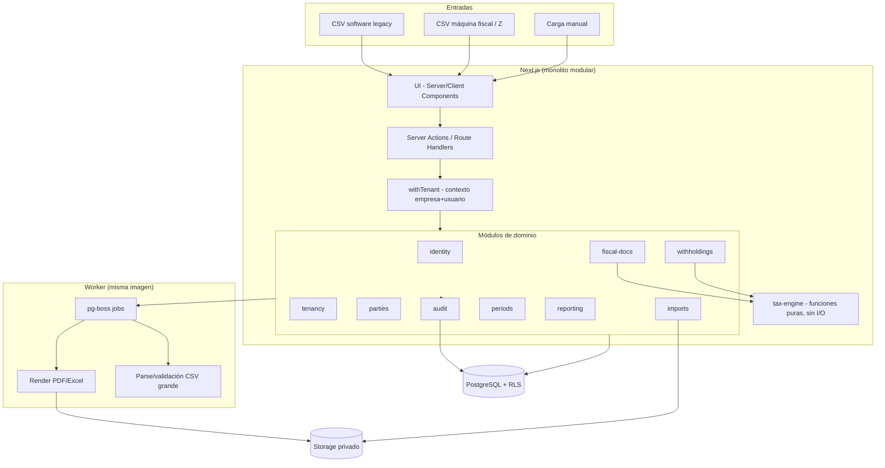

# ARCHITECTURE.md — ERP-TributarioLite

> Se llena en el Paso 02, junto con DOMAIN.md, DATABASE.md y CONVENTIONS.md. Describe el "cómo se conectan las piezas", no el detalle de cada endpoint (eso va en API.md).
> Estado: **v0.1 (propuesta)**. Las decisiones marcadas con ADR están pendientes de registrarse en `DECISIONS.md` al aceptarse. Lo marcado ⏳ depende de una respuesta del cliente/contador (ver `ROADMAP-ERP-TributarioLite.md`, §3 y §11).

## Principio rector

El sistema **registra hechos económicos y fiscales**; los libros, resúmenes y comprobantes son **salidas derivadas**, nunca fuentes de datos. CSV, software legacy y máquina fiscal son únicamente canales de entrada.

Cuatro propiedades que la arquitectura debe garantizar (en orden de prioridad ante un conflicto):

1. **Aislamiento multiempresa** — ningún dato cruza empresas sin pasar por el contexto de tenant.
2. **Inmutabilidad fiscal** — lo emitido o cerrado no se edita: se anula, sustituye o ajusta.
3. **Reproducibilidad** — cualquier reporte histórico puede regenerarse exactamente como se emitió.
4. **Trazabilidad** — desde cualquier total se llega al documento, a la fila del CSV y al archivo de origen.

## Stack tecnológico

| Capa | Tecnología | Motivo de la elección (ver DECISIONS.md si hubo alternativas) |
|---|---|---|
| Frontend | Next.js 16.x (App Router) + React 19.x + Tailwind CSS 4.x | Stack del equipo; Server Components reducen JS en cliente; un solo repo/lenguaje (ADR-001) |
| Backend / API | Next.js Server Actions (mutaciones de UI) + Route Handlers (descargas, uploads) | Monolito modular; sin API separada en v1 (ADR-001) |
| Base de datos | PostgreSQL ≥ 16 | `numeric` exacto, `daterange` + `EXCLUDE` para vigencias, RLS, transacciones robustas (ADR-002/003/004) |
| ORM / queries | Drizzle (+ SQL explícito donde haga falta) | Control de transacciones y `SET LOCAL` por request; `numeric` como string (ADR-012) |
| Auth | Auth.js o Better Auth, sesiones en DB *(elegir en F1)* | Sesiones revocables; autorización `rol × empresa` propia (ADR-010) |
| Jobs en segundo plano | `pg-boss` (cola sobre PostgreSQL) | Sin Redis; suficiente para 100–200 docs/mes (ADR-008) |
| Validación | Zod (cliente + **servidor**) | Esquemas compartidos; el servidor es la autoridad |
| Aritmética monetaria | `decimal.js` | Nunca `number`/`float` para dinero (ADR-003) |
| PDF | HTML/CSS → PDF server-side (Chromium headless en el worker) | Fidelidad a formatos del cliente; verificado en spike F1/F5 (ADR-026 cierra ADR-009) |
| Excel | `exceljs` rellenando la plantilla original | Conserva formato del cliente (ADR-009) |
| Almacenamiento de archivos | Sistema de archivos privado o S3-compatible ⏳ | CSV originales, soportes, PDFs/Excel emitidos; URLs firmadas |
| Hosting / Deploy | Sin Docker: Postgres gestionado (Neon) + app/worker como procesos directos (VPS o plataforma Node) | Decisión 2026-09-30 (ADR-015). Sin dependencia realtime externa v1 |
| Observabilidad | Logs estructurados (pino) + Sentry + healthchecks | Sin PII/secretos en logs |
| Testing | Vitest, fast-check, PostgreSQL real en Neon dev, Playwright | Ver §Calidad |

## Diagrama de componentes



## Módulos y fronteras

Monolito modular con dependencias impuestas por herramienta (`dependency-cruiser` / `eslint-plugin-boundaries`) en CI.

| Módulo | Responsabilidad | Puede depender de |
|---|---|---|
| `identity` | Usuarios, sesiones, recuperación de acceso | — |
| `tenancy` | Empresas, sucursales, membresías `company_user(role)`, `withTenant()` | `identity` |
| `parties` | Clientes/proveedores, perfiles fiscales con historial | `tenancy` |
| `fiscal-docs` | Compras, ventas, NC/ND, reportes Z, pagos, retenciones recibidas | `parties`, `periods`, `tax-engine` |
| `tax-engine` | **Funciones puras**: cálculo de IVA, retenciones IVA/ISLR, `explanation[]` | *(nada: sin DB, sin red, sin reloj)* |
| `imports` | Staging, mapeo, validación, lotes, idempotencia | `fiscal-docs`, `parties` |
| `withholdings` | Reglas, emisión, series, certificados, anulación/sustitución | `fiscal-docs`, `tax-engine`, `reporting` |
| `periods` | Máquina de estados, checklist, cierre, reapertura, ajustes | `fiscal-docs`, `reporting` |
| `reporting` | Libros, resumen IVA, PDF/Excel, versiones de reporte | `fiscal-docs`, `withholdings` (solo lectura) |
| `audit` | Eventos append-only | transversal (se invoca, no invoca) |

Reglas:
- Los módulos se comunican solo por su `index.ts` público.
- `tax-engine` no importa infraestructura; recibe todo por parámetros (incluida la fecha fiscal `asOf` y el conjunto de reglas ya filtrado por vigencia).
- **Todo acceso a DB pasa por `withTenant(ctx, fn)`**; una regla de lint prohíbe importar el cliente DB fuera de `modules/*/repo`.

## Componentes clave

### Frontend
- **Estructura de carpetas:** ver `CONVENTIONS.md`. Rutas bajo `app/(auth)` y `app/(app)/[companyId]/...`; la empresa activa viaja en la URL (evita operar sobre la empresa equivocada).
- **Manejo de estado:** servidor primero (Server Components + revalidación). Estado de cliente solo para UI local (filtros, asistentes de importación). Sin estado global de negocio en cliente.
- **Formularios / validación en cliente:** React Hook Form + Zod con los mismos esquemas que el servidor; el cálculo mostrado al usuario (base, IVA, retenciones, pago neto) se obtiene llamando al motor, no re-implementándolo en el cliente.
- **Contexto permanente en cabecera:** Empresa · Sucursal · Período · Rol · Estado del período.

### Auth (Autenticación y autorización)
- **Estrategia:** sesiones en base de datos (cookie `HttpOnly`, `Secure`, `SameSite=Lax`); expiración y revocación por usuario. MFA recomendado para roles Contador y Admin (⏳ decidir alcance v1).
- **Dónde vive la sesión:** tabla de sesiones en PostgreSQL.
- **Autorización:** `rol × empresa` (`company_user`), evaluada en **una sola capa** (`authorize(ctx, action, resource)`), más RLS como defensa en profundidad. Roles v1: Admin del sistema, Administrativo, Contador, Auditor. El rol Proveedor existe en el modelo pero **sin login** en v1.
- Ver matriz de roles y permisos completa en `SECURITY.md`.

### Multitenancy
- Esquema compartido; toda tabla operativa lleva `company_id` (y `branch_id` nullable, `fiscal_period_id` cuando aplique).
- `withTenant(ctx, fn)` abre una transacción, ejecuta `SET LOCAL app.company_id = …` y `SET LOCAL app.user_id = …`, y solo entonces corre `fn`. `SET LOCAL` (no `SET`) para ser seguro con *connection pooling*.
- RLS activa en todas las tablas operativas; el rol de la app **no es owner** ni tiene `BYPASSRLS`. Migraciones corren con un rol distinto.
- Suite automatizada de **fuga entre tenants** obligatoria en CI.

### API
- **Estilo:** Server Actions tipadas para mutaciones de UI; Route Handlers para subida de CSV, descarga de PDF/Excel y health. No hay API pública en v1.
- **Convención de rutas:** `/api/companies/[companyId]/...` para handlers; acciones agrupadas por módulo.
- **Contrato de errores:** `{ error: { code, message, details? } }`; códigos de dominio estables (p. ej. `PERIOD_CLOSED`, `DUPLICATE_DOCUMENT`, `SERIES_EXHAUSTED`).
- **Idempotencia:** importaciones por `sha256(archivo)` + clave natural; emisión de comprobantes con clave de idempotencia por solicitud.
- Detalle de endpoints → `API.md`.

### Database
- **Motor:** PostgreSQL ≥ 16 (extensiones: `btree_gist`, `pgcrypto`/`uuid`).
- **Convenciones:** UUID internos; numeraciones fiscales en columnas propias; dinero `numeric(18,2)`, tasas `numeric(18,6)`; fechas fiscales como `date`, instantes como `timestamptz` (UTC). Zona de negocio `America/Caracas` solo en presentación.
- **Integridad en la base, no solo en la app:** `UNIQUE` parcial para duplicados de documentos, `EXCLUDE USING gist` para no solapar vigencias de reglas, `CHECK` de estados, trigger que rechaza mutaciones sobre períodos cerrados, `REVOKE UPDATE, DELETE` sobre `audit_events`.
- **Migraciones:** versionadas en repo, hacia adelante; toda migración se prueba contra un dump anonimizado antes de producción.
- Esquema detallado → `DATABASE.md`.

### Motor tributario (`tax-engine`)
- Reglas = **datos con vigencia** (tablas) + **semántica en código** tipado. Sin DSL genérico (ADR-004).
- Cada resultado devuelve montos, `ruleVersionId`, `ruleSnapshot` y `explanation[]` (pasos legibles para el contador).
- Un cálculo reproducido con la misma entrada y las mismas reglas da el mismo resultado byte a byte (determinismo: sin `Date.now()`, sin aleatoriedad, redondeo explícito ⏳ ADR-014).

### Importación (pipeline en staging)
```
Archivo → source_files (bytes originales + sha256)
       → import_batches → import_rows (crudo JSONB + normalizado + errores)
       → validación (errores / advertencias / duplicados)
       → confirmación del usuario
       → documentos definitivos (TX atómica; trazabilidad source_file_id + row_number)
```
- Archivos pequeños: síncrono. Archivos grandes: job `pg-boss` con progreso.
- Las diferencias entre retención importada y recalculada se **marcan**, nunca se sobrescriben.

### Emisión de comprobantes
Una sola transacción de base de datos:
1. Bloqueo de la operación y verificación de estado/período.
2. Reserva del número: `UPDATE document_series … RETURNING` (consecutivo, sin huecos — ADR-005).
3. Snapshot completo de datos + regla aplicada.
4. Render PDF/Excel → `sha256` → almacenamiento.
5. Estado `issued`, evento de auditoría.

Si falla cualquier paso, **no se consume el número**. Un comprobante emitido nunca se edita: se anula (el número queda consumido) o se sustituye con `replaces_id`.

### Períodos y cierre
- Estados: `open → under_review → closed → reopened`.
- Cierre: checklist automatizado → congelamiento → versión de reportes → `closure_hash` (sobre ids + versiones de documentos).
- Post-cierre, las correcciones entran como `fiscal_adjustments` en un período abierto, referenciando el original. Reapertura: solicitud → autorización por rol → nueva versión, con motivo y responsable.

### Reportes
- Libros, Resumen IVA y comprobantes se **generan desde documentos**; `report_versions` guarda `data_snapshot`, `sha256`, usuario y fecha.
- Regenerar un reporte cerrado debe producir el mismo `data_snapshot`.
- Golden master: formatos `.xlsx` originales del cliente (comparación celda a celda en CI).

### Auditoría
- Eventos de dominio escritos **en la misma transacción** que el cambio (quién, cuándo, empresa, entidad, valores previos/nuevos, motivo, origen técnico).
- Append-only a nivel de permisos de DB; hash encadenado opcional (⏳ decidir en F6).

### UI/UX
- **Sistema de diseño / librería de componentes:** Tailwind + componentes propios/shadcn-ui (⏳ confirmar); tablas densas y filtrables como patrón principal.
- **Patrones obligatorios:** cabecera con Empresa/Período/Rol siempre visible; previsualización del cálculo antes de guardar; drill-down desde cada total al documento; errores de importación por fila.
- **Accesibilidad:** contraste AA, navegación por teclado en tablas y formularios, etiquetas y mensajes de error asociados a los campos.
- **Idioma/formato:** es-VE; importes con coma decimal en presentación y punto en almacenamiento/transporte.

## Flujo de datos típico

**Compra con retención (de punta a punta):**

1. El Administrativo sube un CSV del legacy → se guarda el archivo original y se crea el lote.
2. El parser normaliza (separador, decimales, fechas, RIF) → `import_rows`; la validación marca errores/duplicados.
3. El usuario confirma → se crean `purchase_documents` con trazabilidad al archivo y fila.
4. El módulo `fiscal-docs` invoca a `tax-engine.computeDocumentTaxes` y guarda el resultado con su regla aplicada.
5. `withholdings` calcula retención IVA/ISLR (`computeIvaWithholding` / `computeIslrWithholding`) y la deja en estado `calculated` con su `explanation[]`.
6. El Contador revisa y emite: transacción de emisión (número, snapshot, PDF, hash, auditoría).
7. Al cerrar el período, `reporting` congela Libro de Compras, Libro de Ventas y Resumen; `periods` calcula el `closure_hash`.
8. El Auditor consulta la línea de tiempo del documento: archivo/fila de origen → regla → comprobante → cierre.

## Entornos y variables de entorno

| Variable | Entorno | Descripción | ¿Sensible? |
|---|---|---|---|
| `NODE_ENV` | dev / staging / prod | Modo de ejecución | No |
| `APP_URL` | dev / staging / prod | URL base (enlaces, cookies) | No |
| `DATABASE_URL` | dev / staging / prod | Conexión del rol de la **app** (sin owner, sin BYPASSRLS) | Sí |
| `DATABASE_MIGRATION_URL` | staging / prod | Conexión del rol de migraciones | Sí |
| `AUTH_SECRET` | dev / staging / prod | Firma/cifrado de sesiones | Sí |
| `FILE_SIGNING_SECRET` | dev / staging / prod | Firma de URLs de descarga temporales | Sí |
| `STORAGE_DRIVER` | dev / staging / prod | `fs` o `s3` | No |
| `STORAGE_PATH` / `S3_*` | staging / prod | Ruta o credenciales del almacenamiento | Sí (S3_*) |
| `MAX_UPLOAD_MB` | dev / staging / prod | Límite de tamaño de archivos | No |
| `PGBOSS_SCHEMA` | dev / staging / prod | Esquema de la cola de jobs | No |
| `SENTRY_DSN` | staging / prod | Reporte de errores | Sí |
| `LOG_LEVEL` | dev / staging / prod | Nivel de log | No |
| `BACKUP_*` | prod | Destino y credenciales de backups fuera del servidor | Sí |

Reglas: `.env` fuera del repo; `.env.example` sin valores reales; claves distintas por entorno; rotación documentada en `SECURITY.md`.

## Despliegue y operación

```
Proxy (Caddy/Nginx, TLS) → app (Next.js) ┐
                           worker (pg-boss, PDF) ├→ PostgreSQL
                                                  └→ Storage privado
```
- Docker no se usa en desarrollo, CI, staging ni producción. App y worker se ejecutan como procesos directos desde el mismo repo (VPS o plataforma Node) → PostgreSQL gestionado + storage privado.
- Backups: `pg_dump` diario + WAL (PITR) y copia **fuera del servidor**, cifrada; **restore drill** periódico y documentado. Objetivo: RPO ≤ 24 h como mínimo, ideal ≤ 1 h; RTO a definir con el cliente.
- Entornos: `dev` local, `staging` reproducible, `prod`. Datos reales nunca en dev sin anonimizar.
- Observabilidad: healthcheck `/api/health`, alertas de jobs fallidos y de backup no ejecutado.

## Calidad como parte de la arquitectura

| Garantía | Mecanismo |
|---|---|
| Corrección fiscal | Escenarios dorados del contador como fixtures + property tests (fast-check) sobre el motor |
| Aislamiento multitenant | Suite de fuga en CI; RLS |
| Numeración | Test de concurrencia (50–100 emisiones paralelas: 0 duplicados, 0 huecos) |
| Reproducibilidad | Test que regenera un reporte cerrado y compara `sha256` |
| Fidelidad de reportes | Comparación celda a celda con golden master; snapshots PDF |
| Fronteras de módulos | `dependency-cruiser` en CI |

## Restricciones de infraestructura conocidas

- Escala pequeña (100–200 documentos/mes): no hay requisitos de alto rendimiento; la prioridad es **corrección y auditabilidad**.
- Contexto operativo venezolano: conectividad y suministro eléctrico pueden ser irregulares → backups fuera del servidor, restauración probada y una sola unidad desplegable simple. ⏳ Proveedor de hosting por definir.
- Dependencias externas en tiempo real: **ninguna** en v1 (sin APIs del legacy, máquina fiscal ni SENIAT).
- Fuera de alcance v1 (arquitectura preparada, no implementada): factura electrónica (`sales_documents.source_type`), portal de proveedores (rol reservado), correo (la cola ya existe), API en tiempo real (perfiles de importación → adaptadores), OCR (entraría por el mismo staging).

## Decisiones pendientes que afectan esta arquitectura

| Tema | Bloquea | Origen |
|---|---|---|
| Moneda extranjera y tipo de cambio | Cliente indica moneda base bolívares, referencia USD y tasa oficial BCV; faltan fecha/tipo de tasa y diferencias para cerrar campos FX/cálculo | Gap G4 / ADR-013 |
| Política de redondeo | Cliente indica “8 cifras decimales significativas”; faltan método, etapa y precisión monetaria final | Gap G8 / ADR-014 |
| Período mensual vs. quincenal | `fiscal_periods`, cierre, prefijo de numeración | Gap G1 |
| Momento de retención IVA/ISLR | Migraciones 0011/0012 aplicadas en Neon dev; `unset` compara ambos criterios y permite solo convergencia, pero falta validar asiento/fecha y cálculo por porción | Gap G2 / ADR-017/021 |
| Formato de numeración ISLR | Serie y emisión ISLR | Gap G9 |
| Motor de PDF (Chromium vs. alternativa) | Imagen del worker y fidelidad de formatos | ADR-009 (spike) |

---
Ver también: `README.md`, `PROJECT.md`, `DOMAIN.md` (idioma ubicuo), `DATABASE.md` (schema), `API.md` (contrato), `SECURITY.md`, `DECISIONS.md` (ADR-001–028), `TODO.md`, `CHANGELOG.md`.
