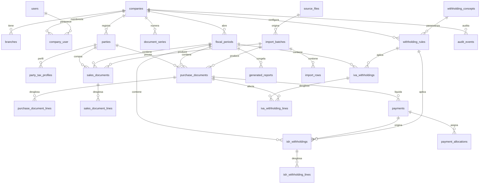

# DATABASE.md — ERP-TributarioLite

> Se llena en el Paso 02 (F1 → F2). Borrador en F1, refinado en F2 a medida que el motor tributario se construye. Todo cambio de esquema en producción se anota también como ADR en `DECISIONS.md`.
>
> **Regla de oro:** el esquema materializa los invariantes de `DOMAIN.md`. Si una constraint no puede expresarse en DB, se compensa con test de integración — pero la DB es la última línea de defensa, no la primera.

---

## Motor y convenciones

| Ítem | Decisión | ADR |
|---|---|---|
| Motor | **PostgreSQL 16+** | — |
| ORM / query builder | **Drizzle** (control cercano a SQL, `SET LOCAL` explícito, `numeric` como string) | ADR-012 |
| Multi-tenancy | **Esquema compartido + `company_id` + RLS** como defensa en profundidad | ADR-002 |
| Tipos de dinero | `numeric(18,2)`; tasas/alícuotas `numeric(18,6)`; **nunca `float`/`number`** | ADR-003 |
| Identificadores internos | `uuid` v7 (ordenable temporalmente) | — |
| Numeraciones fiscales | `text` (formato `AAAAMMSSSSSSSS` para IVA; ISLR pendiente G9) | ADR-005 |
| Nombres de tablas | `snake_case`, plural (`purchase_documents`) | — |
| Nombres de columnas | `snake_case` (`fecha_fiscal`, `company_id`) | — |
| Timestamps | `timestamptz` siempre; `created_at`, `updated_at` en toda tabla operativa | — |
| Soft delete | **No.** Se usa `status` + `voided_at`. Un documento anulado sigue existiendo. | ADR-006 |
| Migraciones | Drizzle Kit (`drizzle-kit generate` + `migrate`) versionadas en `/drizzle`; nombres `NNNN_descripcion.sql`; rollback documentado por migración | — |
| Extensiones requeridas | `btree_gist`, `pgcrypto`, `citext` (para RIF normalizado) | — |

### Regla de acceso a datos

Todo acceso a DB pasa por `withTenant(ctx, fn)`:

```ts
// modules/tenancy/with-tenant.ts
export async function withTenant<T>(
  ctx: TenantContext,
  fn: (tx: DrizzleTx) => Promise<T>
): Promise<T> {
  return db.transaction(async (tx) => {
    await tx.execute(sql`SET LOCAL app.company_id = ${ctx.companyId}`);
    await tx.execute(sql`SET LOCAL app.user_id = ${ctx.userId}`);
    return fn(tx);
  });
}
```

- `eslint-plugin-boundaries` prohíbe importar el cliente DB fuera de `modules/*/repo`.
- El rol de la app **no es owner** de las tablas y **no tiene `BYPASSRLS`**.
- `SET LOCAL` es por transacción, no por sesión (evita fugas por connection pool).

---

## Diagrama entidad-relación



---

## Esquema de tablas

Organizado por módulo según `ARCHITECTURE.md` §4.3. En **toda tabla operativa** se asumen las columnas transversales:

```sql
id          uuid PRIMARY KEY DEFAULT gen_random_uuid(),
company_id  uuid NOT NULL REFERENCES companies(id),
created_at  timestamptz NOT NULL DEFAULT now(),
updated_at  timestamptz NOT NULL DEFAULT now(),
created_by  uuid NOT NULL REFERENCES users(id),
updated_by  uuid NOT NULL REFERENCES users(id)
```

y el índice de tenant:

```sql
CREATE INDEX idx_<tabla>_company ON <tabla> (company_id);
```

---

### Módulo `identity`

#### `users`

| Columna | Tipo | Restricciones | Descripción |
|---|---|---|---|
| id | uuid | PK | |
| email | citext | UNIQUE NOT NULL | Login |
| password_hash | text | NOT NULL | Argon2id |
| name | text | NOT NULL | |
| status | text | NOT NULL, CHECK IN ('active','disabled') | |
| last_login_at | timestamptz | NULL | |
| created_at | timestamptz | NOT NULL DEFAULT now() | |
| updated_at | timestamptz | NOT NULL DEFAULT now() | |

**Índices:** `UNIQUE (email)`.

**Notas:** los usuarios son globales; su acceso a empresas vive en `company_user`.

#### `company_user`

| Columna | Tipo | Restricciones | Descripción |
|---|---|---|---|
| company_id | uuid | FK companies, PK compuesta | |
| user_id | uuid | FK users, PK compuesta | |
| role | text | NOT NULL, CHECK IN ('admin','administrativo','contador','auditor','supplier') | Matriz completa en SECURITY.md |
| status | text | NOT NULL DEFAULT 'active' | |
| created_at | timestamptz | NOT NULL DEFAULT now() | |

**Índices:** `PRIMARY KEY (company_id, user_id)`, `INDEX (user_id)`.

**Notas:** el rol `supplier` existe reservado para v2 (portal de proveedores), sin login en v1.

---

### Módulo `tenancy`

#### `companies`

| Columna | Tipo | Restricciones | Descripción |
|---|---|---|---|
| id | uuid | PK | |
| rif | citext | UNIQUE NOT NULL | Normalizado |
| rif_original | text | NOT NULL | Valor tal como se ingresó |
| razon_social | text | NOT NULL | |
| domicilio_fiscal | text | | |
| condicion_iva | text | NOT NULL, CHECK IN ('ordinario','especial','exento','no_contribuyente') | |
| contribuyente_especial_desde | date | NULL | |
| agente_retencion_iva | boolean | NOT NULL DEFAULT false | |
| agente_retencion_islr | boolean | NOT NULL DEFAULT false | |
| period_kind | text | NOT NULL, CHECK IN ('monthly','biweekly') | G1 |
| currency_functional | text | NOT NULL DEFAULT 'VES' | G4 |
| abono_criterion | text | NOT NULL DEFAULT 'unset', CHECK IN ('unset','payment_only','account_credit_or_payment') | G2; `unset` falla cerrado |
| status | text | NOT NULL DEFAULT 'active' | |

**Notas:**
- `period_kind` es por empresa (G1). No se mezclan mensuales y quincenales.
- `currency_functional` es la moneda en la que se reportan los libros (G4). Las operaciones en otra moneda se convierten a esta.
- `abono_criterion` guarda el criterio operativo G2 por empresa. La migración 0012 agrega el default conservador `unset`; el cambio explícito requiere motivo y auditoría. No representa aprobación fiscal firmada.
- El RIF se guarda dos veces: `rif` (normalizado, para unicidad y búsqueda) y `rif_original` (para preservar el valor ingresado, requisito del dominio).

#### `branches`

| Columna | Tipo | Restricciones | Descripción |
|---|---|---|---|
| id | uuid | PK | |
| company_id | uuid | FK companies | |
| codigo | text | NOT NULL | |
| nombre | text | NOT NULL | |
| direccion | text | | |
| status | text | NOT NULL DEFAULT 'active' | |

**Índices:** `UNIQUE (company_id, codigo)`.

---

### Módulo `parties`

#### `parties`

| Columna | Tipo | Restricciones | Descripción |
|---|---|---|---|
| id | uuid | PK | |
| company_id | uuid | FK companies | |
| rif | citext | NOT NULL | Normalizado |
| rif_original | text | NOT NULL | Valor ingresado |
| razon_social | text | NOT NULL | |
| direccion_fiscal | text | | |
| status | text | NOT NULL DEFAULT 'active' | |

**Índices:** `UNIQUE (company_id, rif) WHERE status = 'active'`.

**Notas:** un tercero puede ser cliente y proveedor; el rol se determina por la operación, no por el maestro.

#### `party_tax_profiles`

| Columna | Tipo | Restricciones | Descripción |
|---|---|---|---|
| id | uuid | PK | |
| company_id | uuid | FK companies | |
| party_id | uuid | FK parties | |
| tipo_persona | text | NOT NULL, CHECK IN ('natural','juridica') | |
| residente | boolean | NOT NULL DEFAULT true | |
| condicion_iva | text | | |
| sujeto_retencion_iva | boolean | NOT NULL DEFAULT false | |
| sujeto_retencion_islr | boolean | NOT NULL DEFAULT false | |
| effective_range | daterange | NOT NULL | Vigencia |
| created_at | timestamptz | NOT NULL DEFAULT now() | |

**Índices:**
- `INDEX (party_id)`
- `EXCLUDE USING gist (party_id WITH =, effective_range WITH &&)` — no solapamiento de vigencias.

**Notas:** los cambios de condición fiscal no se sobreescriben; se cierra la vigencia y se abre una nueva.

#### `withholding_concepts`

Catálogo de conceptos de ISLR (honorarios, comisiones, alquileres, publicidad, transporte, etc.).

| Columna | Tipo | Restricciones | Descripción |
|---|---|---|---|
| id | uuid | PK | |
| company_id | uuid | FK companies (NULL = global seed) | |
| codigo | text | NOT NULL | |
| nombre | text | NOT NULL | |
| base_formula_kind | text | NOT NULL | `total_con_iva` / `subtotal` / `monto_pagado` / ... |
| status | text | NOT NULL DEFAULT 'active' | |

**Índices:** `UNIQUE (company_id, codigo)`.

---

### Módulo `periods`

#### `fiscal_periods`

| Columna | Tipo | Restricciones | Descripción |
|---|---|---|---|
| id | uuid | PK | |
| company_id | uuid | FK companies | |
| kind | text | NOT NULL, CHECK IN ('monthly','biweekly') | G1 |
| range | daterange | NOT NULL | Rango explícito |
| status | text | NOT NULL DEFAULT 'open', CHECK IN ('open','under_review','closed','reopened') | |
| closed_by | uuid | FK users NULL | |
| closed_at | timestamptz | NULL | |
| closure_hash | text | NULL | Hash de ids + versiones |
| reopen_reason | text | NULL | |
| reopened_by | uuid | FK users NULL | |
| reopened_at | timestamptz | NULL | |

**Índices:**
- `UNIQUE (company_id, kind, range)` — evita períodos duplicados.
- `INDEX (company_id, status)`.

**Reglas en DB:**
```sql
-- Un período cerrado no admite mutaciones sobre documentos incluidos
CREATE OR REPLACE FUNCTION prevent_closed_period_mutation()
RETURNS trigger AS $$
BEGIN
  IF EXISTS (
    SELECT 1 FROM fiscal_periods
    WHERE id = COALESCE(NEW.fiscal_period_id, OLD.fiscal_period_id)
      AND status = 'closed'
  ) THEN
    RAISE EXCEPTION 'No se puede modificar un documento en período cerrado';
  END IF;
  RETURN COALESCE(NEW, OLD);
END;
$$ LANGUAGE plpgsql;

CREATE TRIGGER trg_purchase_docs_closed
  BEFORE UPDATE OR DELETE ON purchase_documents
  FOR EACH ROW EXECUTE FUNCTION prevent_closed_period_mutation();
-- (repetir en sales_documents, iva_withholdings, islr_withholdings)
```

---

### Módulo `fiscal-docs`

#### `purchase_documents`

| Columna | Tipo | Restricciones | Descripción |
|---|---|---|---|
| id | uuid | PK | |
| company_id | uuid | FK companies | |
| branch_id | uuid | FK branches NULL | |
| fiscal_period_id | uuid | FK fiscal_periods | |
| kind | text | NOT NULL, CHECK IN ('invoice','credit_note','debit_note','import','exempt','no_credit') | |
| party_id | uuid | FK parties | |
| doc_number | text | NOT NULL | N° factura |
| control_number | text | NOT NULL | N° control |
| affected_document_id | uuid | FK purchase_documents NULL | Obligatorio para NC/ND |
| fecha_documento | date | NOT NULL | |
| fecha_recepcion | date | | |
| fecha_fiscal | date | NOT NULL | Determina el período |
| base_imponible | numeric(18,2) | NOT NULL | |
| iva_causado | numeric(18,2) | NOT NULL DEFAULT 0 | |
| total | numeric(18,2) | NOT NULL | |
| currency | text | NOT NULL DEFAULT 'VES' | G4 |
| fx_rate | numeric(18,6) | NULL | G4 |
| fx_rate_date | date | NULL | G4 |
| status | text | NOT NULL DEFAULT 'draft', CHECK IN ('draft','imported','under_review','validated','included','voided') | |
| voided_at | timestamptz | NULL | |
| void_reason | text | NULL | |
| replaces_id | uuid | FK purchase_documents NULL | |
| source_file_id | uuid | FK source_files NULL | Trazabilidad |
| source_row_number | int | NULL | |
| import_batch_id | uuid | FK import_batches NULL | |
| attachments_count | int | NOT NULL DEFAULT 0 | Contador denormalizado |

**Índices:**
- `INDEX (company_id, fiscal_period_id, status)`
- `INDEX (company_id, party_id, fecha_fiscal)`
- `UNIQUE (company_id, party_id, kind, doc_number, control_number) WHERE status <> 'voided'`
- `INDEX (affected_document_id) WHERE affected_document_id IS NOT NULL`
- `INDEX (import_batch_id) WHERE import_batch_id IS NOT NULL`

**Constraints:**
```sql
-- Invariante 1: base + iva = total (con tolerancia definida por ADR de redondeo)
-- Se aplica como CHECK con tolerancia; el ADR-014 define el valor exacto
ALTER TABLE purchase_documents
  ADD CONSTRAINT chk_total_consistency
  CHECK (abs(base_imponible + iva_causado - total) <= 0.01);

-- Invariante 3: NC ≤ saldo del documento afectado
-- Se impone en app + trigger, porque requiere consulta
CREATE OR REPLACE FUNCTION check_credit_note_limit()
RETURNS trigger AS $$
DECLARE
  v_original_total numeric;
  v_sum_notes numeric;
BEGIN
  IF NEW.kind <> 'credit_note' THEN RETURN NEW; END IF;
  SELECT total INTO v_original_total
    FROM purchase_documents WHERE id = NEW.affected_document_id;
  SELECT COALESCE(SUM(total), 0) INTO v_sum_notes
    FROM purchase_documents
   WHERE affected_document_id = NEW.affected_document_id
     AND kind = 'credit_note' AND status <> 'voided'
     AND id <> COALESCE(NEW.id, '00000000-0000-0000-0000-000000000000'::uuid);
  IF (v_sum_notes + NEW.total) > v_original_total THEN
    RAISE EXCEPTION 'NC excede saldo del documento afectado';
  END IF;
  RETURN NEW;
END;
$$ LANGUAGE plpgsql;

CREATE TRIGGER trg_purchase_nc_limit
  BEFORE INSERT OR UPDATE ON purchase_documents
  FOR EACH ROW EXECUTE FUNCTION check_credit_note_limit();
```

**Notas:**
- `fecha_fiscal` **nunca** se sobrescribe por la fecha de registro.
- `currency`/`fx_rate`/`fx_rate_date` están presentes desde el inicio aunque G4 no esté resuelto (para no migrar después).

#### `purchase_document_lines`

| Columna | Tipo | Restricciones | Descripción |
|---|---|---|---|
| id | uuid | PK | |
| company_id | uuid | FK companies | |
| document_id | uuid | FK purchase_documents | |
| line_number | int | NOT NULL | |
| tax_category | text | NOT NULL | `general`/`reduced`/`additional`/`exempt`/`no_subject`/`no_credit` |
| tax_rate | numeric(18,6) | NULL | Alícuota aplicada |
| base | numeric(18,2) | NOT NULL | |
| iva | numeric(18,2) | NOT NULL DEFAULT 0 | |
| description | text | | |

**Índices:** `UNIQUE (document_id, line_number)`, `INDEX (company_id)`.

#### `sales_documents`

Análogo a `purchase_documents`, con diferencias:

| Columna | Tipo | Restricciones | Descripción |
|---|---|---|---|
| kind | text | CHECK IN ('invoice','z_summary','credit_note','debit_note','export','third_party') | G7 |
| range_from | text | NULL | Solo para `z_summary` |
| range_to | text | NULL | Solo para `z_summary` |
| source_type | text | NOT NULL DEFAULT 'manual', CHECK IN ('imported','manual','electronically_issued') | v2 reservado |
| machine_id | uuid | FK fiscal_machines NULL | |
| z_report_id | uuid | FK z_reports NULL | |

**Índices:**
- `UNIQUE (company_id, party_id, kind, doc_number, control_number) WHERE status <> 'voided' AND kind <> 'z_summary'`
- `INDEX (company_id, fiscal_period_id, source_type)`

**Notas:** para `z_summary`, `doc_number`/`control_number` pueden ser sintéticos (`Z-<fecha>-<machine_id>`); el `range_from`/`range_to` es la identidad fiscal real.

#### `sales_document_lines`

Análogo a `purchase_document_lines`.

#### `fiscal_machines`

| Columna | Tipo | Restricciones | Descripción |
|---|---|---|---|
| id | uuid | PK | |
| company_id | uuid | FK companies | |
| branch_id | uuid | FK branches NULL | |
| serial | text | NOT NULL | N° de máquina fiscal |
| status | text | NOT NULL DEFAULT 'active' | |

**Índices:** `UNIQUE (company_id, serial)`.

#### `z_reports`

| Columna | Tipo | Restricciones | Descripción |
|---|---|---|---|
| id | uuid | PK | |
| company_id | uuid | FK companies | |
| machine_id | uuid | FK fiscal_machines | |
| fiscal_period_id | uuid | FK fiscal_periods | |
| fecha | date | NOT NULL | |
| z_number | text | NOT NULL | |
| range_from | text | NOT NULL | |
| range_to | text | NOT NULL | |
| ventas_gravadas | numeric(18,2) | NOT NULL | |
| ventas_exentas | numeric(18,2) | NOT NULL DEFAULT 0 | |
| iva | numeric(18,2) | NOT NULL DEFAULT 0 | |
| total | numeric(18,2) | NOT NULL | |
| source_file_id | uuid | FK source_files NULL | |

**Índices:** `UNIQUE (company_id, machine_id, z_number)`, `INDEX (company_id, fiscal_period_id)`.

**Notas:** el modo de alimentación del Libro de Ventas (factura individual vs. Z) es por empresa/sucursal; el `EXCLUDE` de convivencia se valida en app (no puede haber facturas individuales y Z para la misma sucursal en el mismo período).

#### `payments` (eventos de liquidación)

| Columna | Tipo | Restricciones | Descripción |
|---|---|---|---|
| id | uuid | PK | |
| company_id | uuid | FK companies | |
| party_id | uuid | FK parties | |
| event_type | text | NOT NULL, `payment` / `account_credit` | Tipo de evento; filas previas a la migración quedan como `payment` |
| fecha_pago | date | NOT NULL | Fecha efectiva del evento; nombre físico legacy, propiedad de dominio `eventDate` |
| monto | numeric(18,2) | NOT NULL | Importe del evento |
| currency | text | NOT NULL DEFAULT 'VES' | |
| metodo | text | NULL | Método solo para `payment` |
| source_ref | text | NULL | Referencia de asiento/pago para trazabilidad |
| inferred | boolean | NOT NULL DEFAULT false | Marca dato inferido; no se infiere automáticamente |
| status | text | NOT NULL DEFAULT 'active', CHECK IN ('active','voided') | |
| voided_at | timestamptz | NULL | |
| void_reason | text | NULL | |

**Migraciones 0011–0012:** 0011 añade `event_type`, `source_ref` e `inferred` sin renombrar ni descartar datos existentes; 0012 agrega `companies.abono_criterion` con default `unset` y su CHECK. Los nombres físicos `payments`, `fecha_pago`, `monto` y `metodo` se conservan transitoriamente para una migración compatible. Ambas aplicadas en Neon dev el 2026-10-01.

**Índices:** `INDEX (company_id, party_id, fecha_pago)`. RLS activa por empresa. `event_type` tiene `CHECK`; los constraints de importes positivos fueron validados en Neon dev tras confirmar que no hay filas históricas inválidas. En otras bases se deben validar después de revisar sus datos existentes.

#### `payment_allocations`

| Columna | Tipo | Restricciones | Descripción |
|---|---|---|---|
| id | uuid | PK | |
| company_id | uuid | FK companies | |
| payment_id | uuid | FK payments | |
| purchase_document_id | uuid | FK purchase_documents | |
| monto_asignado | numeric(18,2) | NOT NULL | |

**Índices:** `UNIQUE (payment_id, purchase_document_id)`, `INDEX (purchase_document_id)`.

**Notas:** permite asignar pagos y abonos parciales. La app serializa asignaciones y valida suma ≤ monto del evento y suma por compra ≤ total; proveedor/beneficiario debe coincidir. RLS activa por empresa. La migración preserva asignaciones existentes.

**Pendiente G2:** el almacenamiento de eventos está implementado, pero aún no se generan retenciones desde estos eventos. Falta aprobación contable del significado del asiento de abono, casos parciales y regla de cálculo por porción; el cálculo IVA/ISLR y su periodización siguen bloqueados.

---

### Módulo `imports`

#### `source_files`

| Columna | Tipo | Restricciones | Descripción |
|---|---|---|---|
| id | uuid | PK | |
| company_id | uuid | FK companies | |
| sha256 | text | NOT NULL | Idempotencia |
| original_name | text | NOT NULL | |
| size_bytes | bigint | NOT NULL | |
| content | bytea | NOT NULL | Archivo original conservado |
| uploaded_by | uuid | FK users | |
| uploaded_at | timestamptz | NOT NULL DEFAULT now() | |

**Índices:** `UNIQUE (company_id, sha256)`.

#### `import_batches`

| Columna | Tipo | Restricciones | Descripción |
|---|---|---|---|
| id | uuid | PK | |
| company_id | uuid | FK companies | |
| source_file_id | uuid | FK source_files | |
| kind | text | NOT NULL, CHECK IN ('purchases','sales','iva_withholdings','islr_withholdings','z_reports') | |
| source_system | text | NOT NULL, CHECK IN ('legacy_accounting','fiscal_machine','manual') | |
| fiscal_period_id | uuid | FK fiscal_periods NULL | |
| mapping_profile | jsonb | | Mapeo de columnas guardado |
| status | text | NOT NULL DEFAULT 'uploaded', CHECK IN ('uploaded','mapping','validating','validated','partially_imported','completed','failed') | |
| total_rows | int | NOT NULL DEFAULT 0 | |
| valid_rows | int | NOT NULL DEFAULT 0 | |
| warning_rows | int | NOT NULL DEFAULT 0 | |
| rejected_rows | int | NOT NULL DEFAULT 0 | |
| created_by | uuid | FK users | |
| created_at | timestamptz | NOT NULL DEFAULT now() | |

#### `import_rows`

| Columna | Tipo | Restricciones | Descripción |
|---|---|---|---|
| id | uuid | PK | |
| company_id | uuid | FK companies | |
| batch_id | uuid | FK import_batches | |
| row_number | int | NOT NULL | |
| raw | jsonb | NOT NULL | Fila cruda |
| normalized | jsonb | NULL | Fila normalizada |
| errors | jsonb | NULL | Errores por campo |
| status | text | NOT NULL DEFAULT 'pending', CHECK IN ('pending','valid','warning','rejected','imported') | |

**Índices:** `UNIQUE (batch_id, row_number)`, `INDEX (batch_id, status)`.

---

### Módulo `withholdings`

#### `withholding_rules`

| Columna | Tipo | Restricciones | Descripción |
|---|---|---|---|
| id | uuid | PK | |
| company_scope_key | uuid | NOT NULL | company_id o un UUID de "global" |
| rule_kind | text | NOT NULL, CHECK IN ('iva','islr') | |
| concept_id | uuid | FK withholding_concepts NULL | Solo ISLR |
| effective_range | daterange | NOT NULL | Vigencia |
| porcentaje | numeric(18,6) | NOT NULL | |
| sustraendo | numeric(18,2) | NOT NULL DEFAULT 0 | |
| base_formula_kind | text | NOT NULL | |
| conditions | jsonb | | Condiciones adicionales |
| legal_reference | text | | Providencia/decreto/artículo |
| status | text | NOT NULL DEFAULT 'active' | |

**Constraints (crítico — ADR-004):**
```sql
CREATE EXTENSION IF NOT EXISTS btree_gist;

ALTER TABLE withholding_rules ADD CONSTRAINT no_overlap
  EXCLUDE USING gist (
    company_scope_key WITH =,
    rule_kind WITH =,
    concept_id WITH =,
    effective_range WITH &&
  );
```

**Notas:**
- El 75 % de IVA es un **seed**, no una constante.
- La semántica del cálculo vive en código TS; la regla solo aporta parámetros.
- `legal_reference` es obligatoria en la práctica (la matriz v1 la exige), pero nullable en schema para no bloquear seeds de desarrollo.

#### `document_series`

| Columna | Tipo | Restricciones | Descripción |
|---|---|---|---|
| id | uuid | PK | |
| company_id | uuid | FK companies | |
| branch_id | uuid | FK branches NULL | |
| kind | text | NOT NULL, CHECK IN ('iva_withholding','islr_withholding') | |
| period_key | text | NOT NULL | `YYYYMM` o `YYYYMM-Q1/Q2` |
| prefix | text | | |
| last_number | bigint | NOT NULL DEFAULT 0 | |
| status | text | NOT NULL DEFAULT 'active' | |

**Índices:** `UNIQUE (company_id, branch_id, kind, period_key)`.

**Emisión transaccional (ADR-005):**
```sql
-- Dentro de la TX de emisión del comprobante:
UPDATE document_series
   SET last_number = last_number + 1
 WHERE company_id = $1
   AND kind = 'iva_withholding'
   AND period_key = $2
RETURNING last_number;
-- El número resultante se formatea como AAAAMMSSSSSSSS
-- Si la TX falla, el UPDATE se revierte y el número no se consume.
```

#### `iva_withholdings`

| Columna | Tipo | Restricciones | Descripción |
|---|---|---|---|
| id | uuid | PK | |
| company_id | uuid | FK companies | |
| beneficiary_id | uuid | FK parties | Proveedor |
| fiscal_period_id | uuid | FK fiscal_periods | |
| certificate_number | text | UNIQUE NOT NULL | `AAAAMMSSSSSSSS` |
| status | text | NOT NULL DEFAULT 'draft', CHECK IN ('draft','calculated','approved','issued','delivered','voided') | |
| fecha_emision | date | | |
| fecha_entrega | date | | |
| rule_version_id | uuid | FK withholding_rules | Invariante 7 |
| rule_snapshot | jsonb | NOT NULL | Snapshot de parámetros |
| total_retained | numeric(18,2) | NOT NULL | |
| issued_by | uuid | FK users NULL | |
| issued_at | timestamptz | NULL | |
| voided_at | timestamptz | NULL | |
| void_reason | text | NULL | |
| replaces_id | uuid | FK iva_withholdings NULL | |
| pdf_sha256 | text | NULL | Integridad |
| data_snapshot | jsonb | NOT NULL | Snapshot completo al emitir |

**Índices:**
- `UNIQUE (company_id, certificate_number)`
- `INDEX (company_id, fiscal_period_id, status)`
- `INDEX (company_id, beneficiary_id)`

**Constraints:**
```sql
-- Invariante 2: iva_retenido ≤ iva_causado
-- Se aplica por línea en iva_withholding_lines
```

#### `iva_withholding_lines`

| Columna | Tipo | Restricciones | Descripción |
|---|---|---|---|
| id | uuid | PK | |
| company_id | uuid | FK companies | |
| withholding_id | uuid | FK iva_withholdings | |
| purchase_document_id | uuid | FK purchase_documents | |
| invoice_number | text | NOT NULL | Snapshot |
| control_number | text | NOT NULL | Snapshot |
| taxable_base | numeric(18,2) | NOT NULL | |
| vat_amount | numeric(18,2) | NOT NULL | |
| retention_rate | numeric(18,6) | NOT NULL | |
| retained_amount | numeric(18,2) | NOT NULL | |
| explanation | jsonb | NOT NULL | Pasos legibles |

**Constraints:**
```sql
ALTER TABLE iva_withholding_lines
  ADD CONSTRAINT chk_retained_le_vat
  CHECK (retained_amount <= vat_amount + 0.01);
  -- tolerancia definida por ADR de redondeo
```

#### `islr_withholdings` y `islr_withholding_lines`

Análogos, con:
- `concept_id` en `islr_withholdings` (referencia a `withholding_concepts`).
- `payment_id` en `islr_withholdings` (origen legacy; propiedad de dominio `settlementEventId`; admite `payment` siempre y `account_credit` solo bajo criterio explícito `account_credit_or_payment` según ADR-021, con asignación verificable).
- `base_sujeta`, `porcentaje`, `sustraendo`, `retained_amount` en líneas.
- Numeración `islr_withholding` con formato pendiente G9 (bloqueante para F4).

#### `fiscal_decisions` + `fiscal_decision_links` (ADR-034, migración 0023 aplicada)

Tablas propuestas (no crear migración hasta ADR-034 aceptado):
- `fiscal_decisions(id, company_id, codigo RDF-YYYY-####, gap, titulo, pregunta, alternativas jsonb, decision, fundamento_normativo, formula, redondeo_metodo/etapa/precision, momento_fiscal, ejemplo_numerico jsonb, resultado_esperado text, moneda default VES, rule_kind, concept_id, vigencia_desde, impacto_sistema, status, version, supersedes_id, motivo, firmante_nombre/doc, firmado_por/en, content_sha256, evidencia_adjunto_id, created_by/at, updated_at)`. `UNIQUE(company_id, codigo)`; RLS por `company_id`; trigger `rdf_immutable` rechaza mutación en `signed/applied/superseded` salvo `signed→applied` por sistema.
- `fiscal_decision_links(id, company_id, decision_id→fiscal_decisions RESTRICT, rule_id→withholding_rules RESTRICT, rol CHECK autoriza/aclara/deroga, nota, created_by/at)`. `UNIQUE(decision_id, rule_id, rol)`.
- Aditivo en `withholding_rules`: `source_decision_id uuid NULL → fiscal_decisions(id) RESTRICT`; inmutable desde `approved/active` (`DECISION_LOCKED`).
- Secuencia propia `rdf_series(company_id, year, last_number)` con `INSERT ... ON CONFLICT DO UPDATE ... RETURNING` en TX (patrón ADR-005, serie propia).

---

### Módulo `reporting`

#### `generated_reports`

| Columna | Tipo | Restricciones | Descripción |
|---|---|---|---|
| id | uuid | PK | |
| company_id | uuid | FK companies | |
| fiscal_period_id | uuid | FK fiscal_periods | |
| kind | text | NOT NULL, CHECK IN ('purchase_book','sales_book','iva_summary','iva_withholdings','islr_withholdings','conciliation') | |
| version | int | NOT NULL | |
| format | text | NOT NULL, CHECK IN ('pdf','xlsx','csv') | |
| data_snapshot | jsonb | NOT NULL | Datos congelados |
| sha256 | text | NOT NULL | |
| storage_path | text | NOT NULL | |
| generated_by | uuid | FK users | |
| generated_at | timestamptz | NOT NULL DEFAULT now() | |

**Índices:** `UNIQUE (company_id, fiscal_period_id, kind, version, format)`.

**Notas:** regenerar un reporte cerrado debe producir el mismo `sha256` de datos (test de reproducibilidad).

---

### Módulo `audit`

#### `audit_events`

| Columna | Tipo | Restricciones | Descripción |
|---|---|---|---|
| id | uuid | PK | |
| company_id | uuid | FK companies | |
| actor_user_id | uuid | FK users | |
| action | text | NOT NULL | `create`/`update`/`void`/`issue`/`close`/`reopen`/... |
| entity_type | text | NOT NULL | `purchase_document`/`iva_withholding`/... |
| entity_id | uuid | NOT NULL | |
| before | jsonb | NULL | |
| after | jsonb | NULL | |
| reason | text | NULL | |
| occurred_at | timestamptz | NOT NULL DEFAULT now() | |
| tx_id | text | NOT NULL | Para agrupar eventos de una misma TX |

**Índices:** `INDEX (company_id, entity_type, entity_id)`, `INDEX (company_id, occurred_at DESC)`.

**Reglas en DB (ADR-011):**
```sql
REVOKE UPDATE, DELETE ON audit_events FROM app_role;
GRANT INSERT, SELECT ON audit_events TO app_role;
```

---

### Módulo `attachments`

#### `attachments`

| Columna | Tipo | Restricciones | Descripción |
|---|---|---|---|
| id | uuid | PK | |
| company_id | uuid | FK companies | |
| entity_type | text | NOT NULL | `purchase_document`/`iva_withholding`/... |
| entity_id | uuid | NOT NULL | |
| original_name | text | NOT NULL | |
| mime_type | text | NOT NULL | |
| size_bytes | bigint | NOT NULL | |
| storage_path | text | NOT NULL | Clave del driver (`fs:<sha>` o clave UploadThing); el binario no vive en DB |
| uploaded_by | uuid | FK users | |
| uploaded_at | timestamptz | NOT NULL DEFAULT now() | |
| + `sha256` UNIQUE por empresa (dedup), `status` active/voided + `void_reason` (no se borra) | | | |

**Notas:** descarga por URL firmada HMAC (attachment+empresa+usuario, TTL ≤15 min); validación por magic bytes, no por extensión.

### Módulo `recovery` + `deadlines` + `received`

- `password_reset_tokens(user_id, token_hash UNIQUE, expires_at, used_at, created_by)`: solo hash, un solo uso.
- `fiscal_obligations(company_id, kind UNIQUE, fuente, artículo, vigencia, días hábiles)` + `fiscal_holidays(company_id, fecha UNIQUE)`: sin valores por defecto.
- `withholdings_received(..., status registrada/conciliada/aplicada/anulada)` + `received_links(received_id, purchase_document_id)`.

---

## Row Level Security (RLS)

**Todas las tablas operativas** tienen RLS habilitada:

```sql
ALTER TABLE purchase_documents ENABLE ROW LEVEL SECURITY;
CREATE POLICY tenant_isolation ON purchase_documents
  USING (company_id = current_setting('app.company_id')::uuid);
```

**Tablas con RLS:** `branches`, `parties`, `party_tax_profiles`, `fiscal_periods`, `purchase_documents`, `purchase_document_lines`, `sales_documents`, `sales_document_lines`, `fiscal_machines`, `z_reports`, `payments`, `payment_allocations`, `source_files`, `import_batches`, `import_rows`, `withholding_rules`, `document_series`, `iva_withholdings`, `iva_withholding_lines`, `islr_withholdings`, `islr_withholding_lines`, `generated_reports`, `audit_events`, `attachments`, `withholding_concepts`.

**Excepciones:** `companies`, `users`, `company_user` (acceso controlado por join a `company_user`).

**Rol de la app:**
```sql
-- El rol de la app NO es owner de las tablas
-- El rol de la app NO tiene BYPASSRLS
ALTER ROLE app_role NO BYPASSRLS;
```

**Suite de fuga en CI:** para cada endpoint, un usuario de empresa A intenta leer/escribir/exportar datos de empresa B. Debe fallar. Es obligatoria antes de cada release.

---

## Schemas de validación (Zod)

Los schemas Zod viven en `modules/*/schemas` y son la fuente de verdad de la validación de entrada. Ejemplos representativos:

```ts
// modules/fiscal-docs/schemas/purchase-document.ts
import { z } from 'zod';

const RifSchema = z.string()
  .regex(/^[VEJPG]-?\d{8,9}-?\d?$/i, 'RIF inválido')
  .transform((s) => s.toUpperCase().replace(/-/g, ''));

const MoneySchema = z.string()
  .regex(/^\d+(\.\d{1,2})?$/, 'Monto inválido')
  .describe('String decimal, no number — ADR-003');

export const PurchaseDocumentSchema = z.object({
  companyId: z.string().uuid(),
  branchId: z.string().uuid().nullable(),
  fiscalPeriodId: z.string().uuid(),
  kind: z.enum(['invoice', 'credit_note', 'debit_note', 'import', 'exempt', 'no_credit']),
  partyId: z.string().uuid(),
  docNumber: z.string().min(1).max(50),
  controlNumber: z.string().min(1).max(50),
  affectedDocumentId: z.string().uuid().nullable(),
  fechaDocumento: z.coerce.date(),
  fechaRecepcion: z.coerce.date().nullable(),
  fechaFiscal: z.coerce.date(),
  baseImponible: MoneySchema,
  ivaCausado: MoneySchema,
  total: MoneySchema,
  currency: z.string().length(3).default('VES'),
  fxRate: z.string().regex(/^\d+(\.\d{1,6})?$/).nullable(),
  fxRateDate: z.coerce.date().nullable(),
  lines: z.array(z.object({
    taxCategory: z.enum(['general', 'reduced', 'additional', 'exempt', 'no_subject', 'no_credit']),
    taxRate: z.string().nullable(),
    base: MoneySchema,
    iva: MoneySchema,
    description: z.string().max(500).optional(),
  })).min(1),
}).refine(
  (d) => d.kind !== 'credit_note' && d.kind !== 'debit_note' || d.affectedDocumentId !== null,
  { message: 'NC/ND requieren documento afectado', path: ['affectedDocumentId'] }
).refine(
  (d) => {
    const sum = d.lines.reduce(
      (acc, l) => acc.add(l.base).add(l.iva),
      new Decimal(0)
    );
    return sum.minus(d.total).abs().lte(0.01);
  },
  { message: 'Base + IVA debe igualar total (tolerancia 0.01)', path: ['total'] }
);
```

```ts
// modules/withholdings/schemas/iva-withholding.ts
export const IvaWithholdingLineSchema = z.object({
  purchaseDocumentId: z.string().uuid(),
  invoiceNumber: z.string(),
  controlNumber: z.string(),
  taxableBase: MoneySchema,
  vatAmount: MoneySchema,
  retentionRate: z.string(),
  retainedAmount: MoneySchema,
}).refine(
  (l) => new Decimal(l.retainedAmount).lte(new Decimal(l.vatAmount).plus(0.01)),
  { message: 'IVA retenido ≤ IVA causado (Invariante 2)' }
);
```

**Regla:** los schemas Zod se validan **en el servidor**. El cliente puede usarlos como conveniencia, pero nunca como única defensa.

---

## Estrategia de migraciones

- **Herramienta:** Drizzle Kit.
- **Ubicación:** `drizzle/migrations/NNNN_descripcion.sql`.
- **Convención de nombres:** `0001_init_companies.sql`, `0002_add_fiscal_periods.sql`, ...
- **Proceso:**
  1. `drizzle-kit generate` genera el SQL a partir del schema TS.
  2. El SQL se revisa a mano **siempre** (Drizzle no detecta `EXCLUDE`, triggers, RLS, `REVOKE`).
  3. Las migraciones custom (RLS, triggers, `EXCLUDE`) viven en `drizzle/migrations/custom/` y se aplican después del `generate`.
  4. `drizzle-kit migrate` aplica en orden.
- **Rollback:** cada migración documenta su rollback en un comentario al inicio. No se asume `drizzle-kit` reversible.
- **Migraciones destructivas:** requieren ADR + ventana de mantenimiento + backup verificado.

**Orden de aplicación:**
```
0000–0010                  -- esquema inicial y bloques F1–F6; orden exacto en meta/_journal.json
0011_settlement_event_fields.sql -- captura G2 aditiva: tipo de evento, referencia, inferred y RLS
0012_company_abono_criterion.sql -- criterio G2 por empresa, default unset y CHECK
```

---

## Datos sensibles y retención

| Columna / tabla | Tipo de dato sensible | Tratamiento | Retención |
|---|---|---|---|
| `users.password_hash` | Credencial | Argon2id; nunca en logs | Mientras la cuenta exista |
| `users.email` | PII | Enmascarado en logs | Mientras la cuenta exista |
| `parties.rif`, `parties.razon_social`, `parties.direccion_fiscal` | PII fiscal | Enmascarado en logs; acceso por RLS | Mientras la empresa exista + 10 años (fiscal) |
| `company_user` | Metadato de acceso | No en logs de negocio | Mientras la membresía exista |
| `source_files.content` | Evidencia documental | Almacenado cifrado en reposo (S3/volumen cifrado) | 10 años (fiscal) |
| `attachments` | Evidencia documental (PDFs, imágenes) | Storage cifrado, URL firmada | 10 años (fiscal) |
| `audit_events` | Trazabilidad | Append-only; sin PII innecesaria en `before`/`after` | Indefinido |
| `iva_withholdings.data_snapshot` | Snapshot fiscal | Inmutable tras emitir | 10 años |
| `generated_reports.data_snapshot` | Snapshot fiscal | Inmutable tras cerrar período | 10 años |

**Reglas transversales:**
- Los logs estructurados **no** incluyen RIF, direcciones, tokens ni contraseñas. Se enmascaran en el logger.
- Los backups están cifrados en reposo y en tránsito.
- El acceso a producción requiere MFA y mínimo privilegio.
- Las URLs de descarga de adjuntos son firmadas y de corta vida (≤ 15 min).
- La rotación de secretos está documentada en runbooks (F7).

---

## Pendientes y bloqueos de esquema

| # | Pendiente | Impacto | Bloquea | ADR | Estado tras cuestionario |
|---|---|---|---|---|---|
| 1 | **Formato de numeración ISLR** (G9) | `document_series.kind='islr_withholding'` sin formato definido. Cuestionario §3 vago. | F4 | ADR-005 ext. | Abierto, pedir muestra real |
| 2 | **Redondeo** (G8) | Tolerancia del `CHECK chk_total_consistency` y del redondeo en líneas. No mencionado en cuestionario. | F2 | ADR-014 | Bloqueante |
| 3 | **Moneda / FX** (G4) | Semántica de `fx_rate_date` (fecha de factura vs. pago) y regla de conversión. No mencionado en cuestionario. | F2 | ADR-013 | Bloqueante, campos reservados |
| 4 | **Modo de Libro de Ventas** (G7) | `companies.sales_mode` invoices/z + `fiscal_machines.branch_id` + control F8 convivencia. | F3 | — | Implementado; gate: mes real + conciliación legacy |
| 5 | **Prorrata / uso mixto** | Necesidad de `tax_category='mixed'` y cálculo asociado | F2/F5 | — | Abierto |
| 6 | **Retenciones recibidas** (G3) | `withholdings_received` + `received_links`, flujo registrada→conciliada→aplicada, línea en resumen sin neteo. | F2 | — | Implementada; gate: caso real + validación contador |
| 7 | **Campos exactos del comprobante ISLR** | Dependen de la tabla de retenciones Decreto 1.808 vigente | F4 | — | Pendiente matriz v1 |
| 8 | **Alcance cuentas / métodos de pago** (G11) | Solo catálogo + `fecha_pago/metodo`, sin tesorería ni conciliación. | F2 | — | Delimitar en doc, no implementar CxP |
| 9 | **Calendario fiscal** (G12) | `fiscal_obligations` + `fiscal_holidays`, fecha límite = enésimo hábil del período siguiente, tablero sin mutar estado. | F6 | — | Implementado; gate: norma/artículo/vigencia por tipo + caso real |
| 10 | **Abono en cuenta** (G2) | Pagos y abonos se capturan como eventos asignables; ISLR aplica el control configurable fail-closed de ADR-021. Aún falta validar el asiento que acredita el abono, la base por porción y el sustraendo. IVA aún no consume eventos. | F2/F4 | ADR-017/021 | Control técnico implementado; criterio y cálculo fiscal pendientes de aprobación del contador |

**Regla:** ningún pendiente bloqueante se resuelve "en código". Se resuelve con ADR + actualización de este documento, y luego se toca el schema.

---
Ver también: `README.md`, `PROJECT.md`, `DOMAIN.md` (invariantes), `ARCHITECTURE.md`, `API.md`, `TODO.md`, `CHANGELOG.md`.
