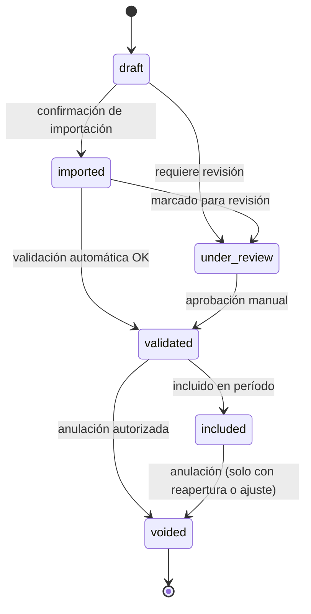
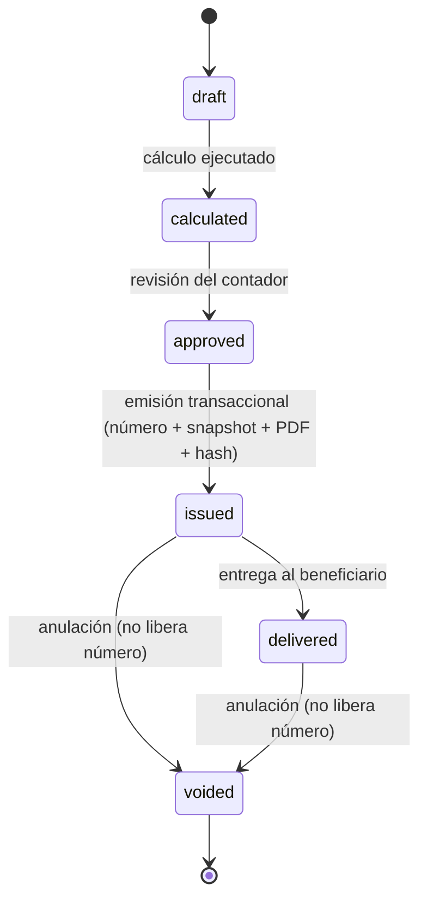
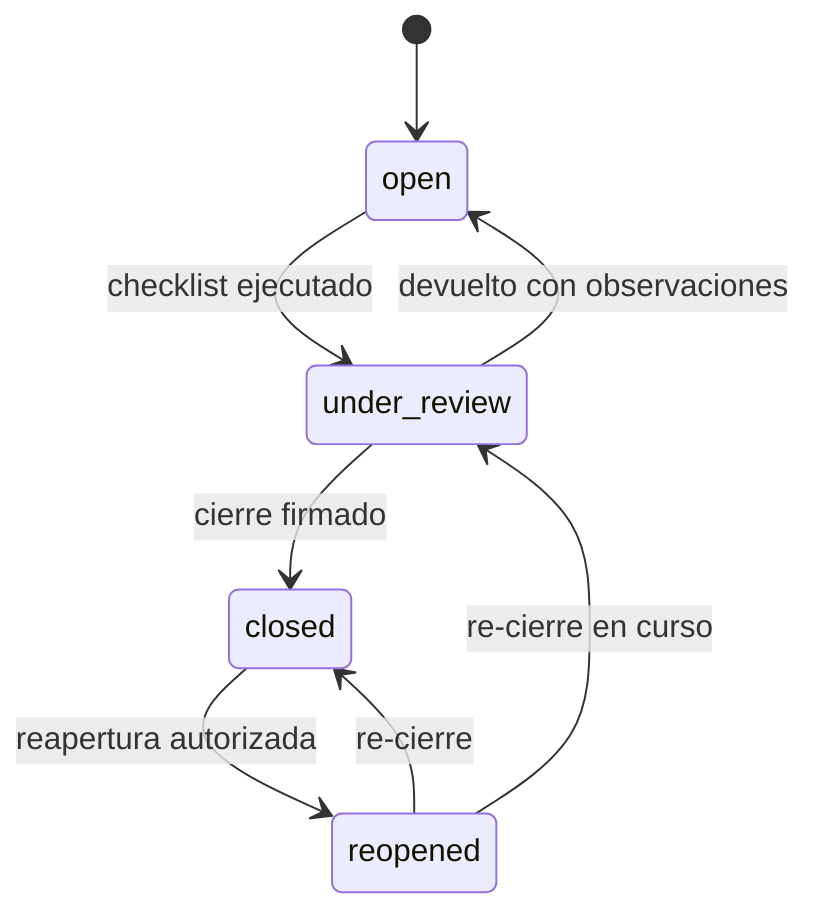
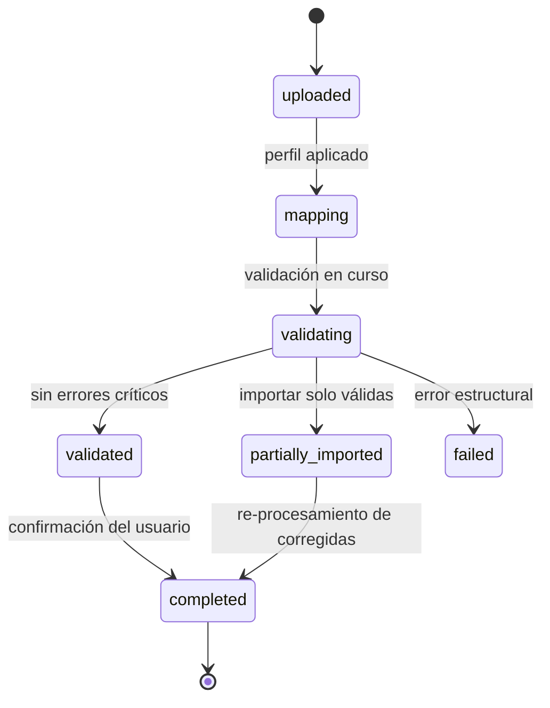

# DOMAIN.md — ERP-TributarioLite

> Se llena en el Paso 02 (F0 → F2 según el roadmap). Este es el **idioma ubicuo** del proyecto: los términos y reglas de negocio que todos —tú, el equipo, el contador del cliente y cualquier agente de IA— deben usar exactamente igual. Si un término no está aquí, no existe para efectos de diseño.
>
> **Fuente de verdad legal:** este documento describe el *modelo mental* del sistema, no la normativa. Toda regla fiscal citada (porcentajes, plazos, formatos de numeración, sustraendos) proviene de la Matriz de Reglas v1 firmada por el contador (F0) y debe vivir como dato versionado en `withholding_rules` / `tax_rules`, nunca como constante en código.

---

## Glosario de dominio

Términos ordenados por área. La columna "Sinónimos a evitar" es **vinculante**: si un desarrollador, un test o un prompt a la IA usa un sinónimo, se considera deuda de vocabulario.

### Sujetos y perfiles

| Término | Definición | Sinónimos a evitar |
|---|---|---|
| **Empresa** | Persona jurídica con RIF propio, condición fiscal propia y libros propios. Es la unidad de aislamiento de datos (tenant). | "compañía", "negocio", "cliente" (ambigua: `cliente` es un tercero, no la empresa) |
| **Sucursal / Establecimiento** | División operativa dentro de una empresa. Puede tener numeración, caja o máquina fiscal propias. Opcional en v1. | "sede", "local", "tienda" |
| **Tercero** | Persona natural o jurídica que se relaciona comercialmente con la empresa. Puede ser cliente, proveedor, o ambos. | "contacto", "entidad" |
| **Proveedor** | Tercero del cual la empresa compra bienes o servicios. | "suplidor" |
| **Cliente** | Tercero al cual la empresa vende bienes o servicios. | "comprador" |
| **Beneficiario** | Tercero a quien se le practica una retención. En IVA suele coincidir con el proveedor; en ISLR el término es más preciso porque la retención puede no originarse en una compra formal. | "retenido" |
| **Agente de retención** | Empresa legalmente obligada o designada para practicar retenciones de IVA o ISLR. Es una **condición** de la empresa, no un rol de usuario. | "retenedor" |
| **Contribuyente especial** | Condición fiscal de una empresa, con fecha de inicio. No confundir con agente de retención. | — |
| **Perfil fiscal** | Conjunto de condiciones tributarias de una empresa o tercero (contribuyente, agente, exento, residente/no residente, tipo de persona). Tiene historial: los cambios no sobreescriben, agregan vigencia. | "datos fiscales" |

### Impuestos y cálculos

| Término | Definición | Sinónimos a evitar |
|---|---|---|
| **IVA** | Impuesto al Valor Agregado. Se cobra en venta (débito) y se soporta en compra (crédito). | "VAT" (solo en código) |
| **ISLR** | Impuesto Sobre la Renta. En este sistema solo se maneja en su faceta de **retención** sobre pagos. No se calcula la renta neta del ejercicio. | "income tax", "renta" |
| **Alícuota** | Porcentaje de IVA aplicable a una base imponible. Varía por vigencia y tipo de operación. | "tasa", "rate" (en UI), "porcentaje" (ambigua con % de retención) |
| **Base imponible** | Monto sobre el cual se calcula un impuesto. En IVA suele ser el subtotal gravado; en ISLR depende del concepto. | "subtotal" (solo si es literal el subtotal del documento), "monto base" |
| **Débito fiscal** | IVA cobrado por la empresa en sus ventas. Se **origina** en ventas. | "IVA por pagar", "IVA trasladado" |
| **Crédito fiscal** | IVA soportado por la empresa en compras que dan derecho a crédito. Se **origina** en compras. | "IVA pagado", "IVA acreditable" |
| **IVA causado** | IVA generado por una operación específica, antes de cualquier retención. Es el punto de partida del cálculo de retención de IVA. | "IVA de la factura" |
| **IVA retenido** | Porción del IVA causado que el agente retiene al proveedor. Es un **evento tributario**, no una columna editable. | "IVA descontado" |
| **ISLR retenido** | Monto retenido sobre una base sujeta, aplicando un porcentaje y restando un sustraendo. | "ISLR descontado" |
| **Sustraendo** | Monto fijo que se resta de la base × porcentaje en ISLR. Puede ser cero. | "deducción", "rebaja" |
| **Concepto de pago** | Categoría que determina qué regla de ISLR aplica (honorarios, comisiones, alquileres, publicidad, transporte, etc.). Es una entidad con vigencia, no un enum. | "tipo de servicio", "categoría" |
| **Período fiscal** | Intervalo sobre el cual se consolidan libros y se determina el IVA. Puede ser mensual o quincenal (`kind`), y su rango es explícito. | "mes", "quincena" (como sinónimo de período) |
| **Excedente** | Crédito fiscal de un período anterior que no pudo aplicarse y se traslada. | "saldo a favor", "remanente" |

### Documentos fiscales

| Término | Definición | Sinónimos a evitar |
|---|---|---|
| **Documento fiscal** | Registro normalizado de una operación con relevancia tributaria. Tiene tipo, fecha fiscal, base, impuesto, total, y trazabilidad a su origen. Es el **hecho** desde el cual se derivan libros y comprobantes. | "transacción", "movimiento", "registro" (ambiguo con audit events) |
| **Factura** | Documento que soporta una compra o venta gravada. Tiene número de factura y número de control. | "invoice" (solo en código), "recibo" |
| **Número de control** | Identificador fiscal adicional de una factura venezolana. Se preserva el formato original aunque se normalice para búsqueda. | "control", "N° control" |
| **Nota de crédito (NC)** | Documento que **disminuye** el monto o revierte parcial/totalmente una factura previa. Requiere documento afectado. | "credit note", "devolución" (la devolución es física; la NC es documental) |
| **Nota de débito (ND)** | Documento que **incrementa** el monto de una operación previa. Requiere documento afectado. | "debit note", "cargo adicional" |
| **Reporte Z** | Resumen diario emitido por una máquina fiscal. Consolida un rango de facturas. No es una factura individual. | "cierre Z", "Z" (ambiguo con el reporte Z como objeto vs. su número) |
| **Documento afectado** | El documento original que una NC o ND modifica. Sin él, una NC/ND es inválida. | "factura original", "documento padre" |
| **Importación** | Régimen aduanero bajo el cual ingresan bienes. Tiene tratamiento fiscal propio (a veces gravado, a veces exento). | "compra internacional" |
| **Exportación** | Venta al exterior. Alícuota 0 % y tratamiento específico en el resumen. | "venta internacional" |
| **Venta por cuenta de terceros** | Operación donde la empresa actúa como intermediario y no como vendedor real. Se registra con clasificación propia. | "consignación" |

### Retenciones y comprobantes

| Término | Definición | Sinónimos a evitar |
|---|---|---|
| **Retención** | Evento tributario por el cual el agente descuenta un monto al beneficiario y lo entera al fisco. Tiene existencia propia, no es una columna de una factura. | "descuento" (el descuento es comercial; la retención es fiscal) |
| **Evento de liquidación** | Pago o abono en cuenta con fecha, monto y asignaciones a documentos; registrar el evento no implica por sí solo emitir una retención. | "movimiento" |
| **Comprobante de retención** | Documento fiscal emitido por el agente que prueba que se practicó una retención. Tiene numeración propia, snapshot inmutable y estado documental. | "certificado", "constancia" |
| **Comprobante de IVA** | Comprobante de retención de IVA. Numeración `AAAAMMSSSSSSSS`. | "retensión IVA" (informal) |
| **Comprobante de ISLR** | Comprobante de retención de ISLR. Numeración por definir con contador (G9). | "retensión ISLR" (informal) |
| **Snapshot** | Copia inmutable de los datos del comprobante al momento de emitirlo. Incluye regla aplicada, parámetros, partes, líneas, totales. | "copia", "respaldo" |
| **Rule version / rule_version_id** | Referencia a la versión específica de la regla tributaria aplicada en un cálculo. Todo cálculo guarda su `rule_version_id` y el snapshot de los parámetros usados. | "regla aplicada" (informal) |
| **Explanation** | Arreglo legible de pasos que muestran cómo se calculó un monto. Requisito de producto: el contador debe *ver* por qué se retuvo cada cifra. | "detalle", "log de cálculo" |

### Libros y reportes

| Término | Definición | Sinónimos a evitar |
|---|---|---|
| **Libro de Compras** | Reporte fiscal cronológico de las compras del período. Se **deriva** de los documentos de compra. No es una tabla. | "libro de compras IVA" (redundante) |
| **Libro de Ventas** | Reporte fiscal cronológico de las ventas del período. Se **deriva** de los documentos de venta y/o reportes Z, según el modo configurado por empresa. | "libro de ventas IVA" (redundante) |
| **Resumen de IVA** | Consolidación del período: débitos, créditos, exentas, exportaciones, ajustes, excedente anterior, retenciones aplicadas, cuota del período. | "declaración", "formulario 72" (es un *insumo* para la declaración, no la declaración) |
| **Conciliación** | Reporte que verifica que libros ↔ resumen ↔ comprobantes cuadren con tolerancia 0. | "cuadre", "reconciliación" |
| **Report version** | Versión congelada de un reporte emitido, con `data_snapshot`, `sha256`, usuario y fecha. Regenerable de forma reproducible. | "snapshot de reporte" |
| **Golden master** | Salida de referencia emitida por el cliente/contador (Excel original o PDF firmado) contra la cual se compara el sistema. | "muestra", "ejemplo" |

### Numeración y series

| Término | Definición | Sinónimos a evitar |
|---|---|---|
| **Serie** | Cauce de numeración independiente, identificado por `(company_id, kind, period_key)`. Ej: comprobantes IVA de la empresa A en septiembre 2026. | "talonario", "rango" |
| **Numeración sin huecos** | Propiedad de las series de comprobantes: los números emitidos son consecutivos y **ningún número se reutiliza**, ni siquiera tras anulación. | "numeración consecutiva" (es lo mismo, se prefiere la primera) |
| **Anulación** | Estado terminal de un documento que lo invalida sin liberar su número. | "cancelación" (ambigua con cancelación de pago) |
| **Sustitución** | Emisión de un nuevo comprobante que reemplaza a uno anulado, referenciándolo con `replaces_id`. | "reemisión" |

### Fechas (crítico: son distintas, no una)

| Término | Definición |
|---|---|
| **fecha_documento** | Fecha de emisión de la factura/NC/ND según el documento físico. |
| **fecha_recepcion** | Fecha en que la empresa recibió el documento (relevante para compras). |
| **fecha_pago** | Fecha efectiva en que se pagó el importe. No representa por sí sola un abono contable anterior. |
| **fecha_abono_en_cuenta** | Fecha en que el importe se acreditó en la contabilidad o registros del pagador. Requiere captura explícita si ocurre antes del pago. |
| **fecha_retencion** | Fecha en que nace el deber de retener conforme a la regla aplicable. Para IVA e ISLR, pago o abono en cuenta, lo que ocurra primero; puede ser distinta de la fecha de emisión/entrega del comprobante. |
| **fecha_emision_comprobante** | Fecha en que se emitió el comprobante de retención. |
| **fecha_entrega_comprobante** | Fecha en que se entregó el comprobante al beneficiario. |
| **fecha_fiscal** | La que determina el **período fiscal** al que pertenece la operación. No siempre coincide con la fecha_documento. |

**Regla de oro:** la fecha de registro en el sistema **nunca** sustituye a la fecha fiscal. Si un documento de agosto se registra en septiembre, su fecha fiscal sigue siendo agosto y así debe reportarse (ver caso límite "operaciones de períodos anteriores").

### Términos internos del sistema

| Término | Definición |
|---|---|
| **Tenant** | La empresa activa en el contexto de una request. El acceso a DB siempre pasa por `withTenant(ctx, fn)`. |
| **Staging** | Zona intermedia donde aterrizan las filas de un CSV antes de convertirse en documentos definitivos. |
| **Import batch** | Conjunto de filas cargadas en una sola operación de importación, con idempotencia por `sha256(file)` + clave natural. |
| **Source file** | Archivo original cargado, conservado íntegro como evidencia. |
| **Audit event** | Registro append-only de un hecho de dominio, escrito en la misma transacción que lo produjo. |
| **Fiscal adjustment** | Ajuste hacia un período abierto que corrige algo de un período cerrado, referenciando el original. |
| **Closure hash** | Hash calculado al cerrar un período sobre ids + versiones de los reportes, para detectar alteraciones posteriores. |

---

## Entidades principales

### Empresa (`companies`)

- **Descripción:** tenant del sistema. Unidad de aislamiento de datos y de configuración fiscal.
- **Atributos clave:** `id`, `rif`, `razon_social`, `domicilio_fiscal`, `condicion_iva`, `contribuyente_especial_desde`, `agente_retencion_iva`, `agente_retencion_islr`, `period_kind` (`monthly`/`biweekly`), `status`.
- **Reglas de negocio:**
  - Toda consulta operativa debe filtrar por `company_id`.
  - La condición de agente de retención es independiente por tipo de impuesto (IVA, ISLR).
  - El `period_kind` es por empresa (G1) y determina cómo se construyen sus `fiscal_periods`.
  - Los cambios de condición fiscal se registran con vigencia; no se sobreescriben.
- **Relaciones:** 1:N con `branches`, `fiscal_periods`, `document_series`, `withholding_rules`, `parties`, `purchase_documents`, `sales_documents`, `iva_withholdings`, `islr_withholdings`.

### Sucursal (`branches`)

- **Descripción:** división operativa opcional. Puede tener numeración o máquina fiscal propias.
- **Atributos clave:** `id`, `company_id`, `codigo`, `nombre`, `direccion`, `status`.
- **Reglas de negocio:**
  - Opcional en v1: una empresa puede operar sin sucursales explícitas.
  - Si existe, los documentos pueden referenciarla; la numeración puede ser por sucursal.
- **Relaciones:** N:1 con `companies`; 1:N con `document_series` (si aplica), `sales_documents` (vía máquina fiscal).

### Perfil fiscal de tercero (`party_tax_profiles`)

- **Descripción:** condiciones tributarias de un tercero, con historial de vigencia.
- **Atributos clave:** `party_id`, `tipo_persona` (natural/jurídica), `residente`, `condicion_iva`, `sujeto_retencion_iva`, `sujeto_retencion_islr`, `conceptos_islr_aplicables`, `vigencia`.
- **Reglas de negocio:**
  - Determina si una operación está sujeta a retención (IVA o ISLR).
  - Un mismo tercero puede ser cliente y proveedor; los perfiles son por rol.
  - El RIF se valida estructuralmente y se preserva el valor original además del normalizado.

### Período fiscal (`fiscal_periods`)

- **Descripción:** intervalo sobre el cual se consolidan libros y se determina el IVA.
- **Atributos clave:** `id`, `company_id`, `kind` (`monthly`/`biweekly`), `range` (`daterange`), `status` (`open`/`under_review`/`closed`/`reopened`), `closed_by`, `closed_at`, `closure_hash`, `reopen_reason`.
- **Reglas de negocio:**
  - El `kind` es por empresa; no se mezclan mensuales y quincenales en la misma empresa.
  - Un período `closed` **no admite** `UPDATE`/`DELETE` sobre documentos incluidos. Se impone en app **y** en DB (trigger/constraint).
  - La reapertura requiere autorización por rol y deja registro (responsable, fecha, motivo).
  - Al cerrar, se calcula `closure_hash` sobre ids + versiones de los reportes.
- **Relaciones:** N:1 con `companies`; 1:N con `purchase_documents`, `sales_documents`, `iva_withholdings`, `islr_withholdings`, `generated_reports`.

### Tercero (`parties`)

- **Descripción:** persona natural o jurídica que se relaciona comercialmente con la empresa.
- **Atributos clave:** `id`, `company_id`, `rif`, `rif_original`, `razon_social`, `direccion_fiscal`, `status`.
- **Reglas de negocio:**
  - El RIF se valida estructuralmente; se preserva el valor original (con guiones, mayúsculas) y se guarda un normalizado para búsqueda.
  - Un tercero puede ser cliente y proveedor simultáneamente; el rol se determina por la operación, no por el maestro.
  - Un tercero inactivo no puede asociarse a nuevos documentos.
- **Relaciones:** N:1 con `companies`; 1:N con `party_tax_profiles`, `purchase_documents`, `sales_documents`.

### Documento de compra (`purchase_documents`)

- **Descripción:** hecho fiscal de una compra. Incluye facturas, NC, ND, importaciones y compras exentas/sin derecho a crédito.
- **Atributos clave:** `id`, `company_id`, `branch_id` (nullable), `fiscal_period_id`, `kind` (`invoice`/`credit_note`/`debit_note`/`import`/`exempt`/...), `party_id`, `doc_number`, `control_number`, `fecha_documento`, `fecha_recepcion`, `fecha_fiscal`, `base_imponible`, `iva_causado`, `total`, `currency`, `fx_rate`, `fx_rate_date`, `status`, `voided_at`, `replaces_id`, `source_file_id`, `source_row_number`, `import_batch_id`.
- **Reglas de negocio:**
  - **Invariante 1:** `base_imponible + iva_causado + conceptos_permitidos = total` (tolerancia según ADR de redondeo).
  - **Invariante 3:** una NC no puede exceder el saldo disponible del documento afectado (salvo flujo autorizado de ajuste).
  - Unicidad (excluyendo anulados): `(company_id, party_id, doc_type, invoice_number, control_number)`.
  - Toda NC/ND requiere `documento_afectado_id` no nulo.
  - La `fecha_fiscal` determina el período; no se sobrescribe por la fecha de registro.
  - Si está en un período `closed`, no admite mutación.
  - Puede tener clasificación fiscal múltiple (gravada/exenta/no sujeta) por línea.
- **Relaciones:** N:1 con `companies`, `parties`, `fiscal_periods`; 1:N con `purchase_document_lines`, `payments`, `iva_withholdings`, `islr_withholdings`; N:1 con `source_files` (si importado).

### Documento de venta (`sales_documents`)

- **Descripción:** hecho fiscal de una venta. Incluye facturas, reportes Z (`kind=z_summary`), NC, ND, exportaciones, ventas por cuenta de terceros.
- **Atributos clave:** análogos a `purchase_documents` más `kind` (`invoice`/`z_summary`/`credit_note`/`debit_note`/`export`/`third_party`), `range_from`, `range_to` (para Z), `source_type` (`imported`/`manual`/`electronically_issued`), `machine_id`, `branch_id`.
- **Reglas de negocio:**
  - **Invariante 1** igual que en compras.
  - El modo de alimentación del Libro de Ventas (factura individual vs. Z) es **configurable por empresa/sucursal** (G7). No se mezclan ambos modos en el mismo período para la misma sucursal.
  - Un Z tiene `range_from`/`range_to`; las validaciones de saltos de numeración se aplican sobre el rango.
  - `source_type = electronically_issued` está reservado para v2; en v1 solo `imported` y `manual`.
- **Relaciones:** N:1 con `companies`, `parties`, `fiscal_periods`, `branches`; 1:N con `sales_document_lines`, `withholdings_received`; N:1 con `z_reports` (si aplica).

### Evento de liquidación (`payments`, nombre físico legacy)

- **Descripción:** evento de liquidación registrado como pago (`payment`) o abono en cuenta (`account_credit`). No es tesorería ni conciliación bancaria. La tabla física mantiene temporalmente el nombre histórico `payments` para preservar datos y emitir una migración aditiva.
- **Atributos clave:** `id`, `company_id`, `party_id`, `event_type`, fecha del evento, monto, moneda, método (solo pago), referencia de origen, indicador `inferred`, `status`; las asignaciones viven en `payment_allocations`.
- **Reglas de negocio:**
  - Para la retención de IVA e ISLR, el momento es el pago o abono en cuenta, lo que ocurra primero (Providencia SNAT/2025/000054, art. 13; Decreto 1.808, art. 1). `fecha_pago` sola no basta si el abono contable ocurrió antes.
  - El usuario registra el evento y lo asigna a una o varias compras; no se infiere automáticamente un abono desde una factura/CSV ni se genera retención por guardar/asignar.
  - La suma asignada no puede exceder el evento ni el total ya asignado a la compra. El beneficiario del evento debe coincidir con el proveedor.
  - `companies.abono_criterion` controla la operación: `unset` es el default; mientras siga así, solo se emite un pago si la comparación de ambos criterios converge estrictamente. Los casos divergentes y abonos sin asignación verificable se bloquean. Un criterio explícito requiere motivo/auditoría y no equivale a aprobación legal.
  - La previsualización compara fecha/período, regla/sustraendo, base y monto. No determina por sí sola atribución de base por porción ni resuelve el sustraendo en pagos parciales. IVA aún no consume eventos y la emisión fiscal continúa incompleta hasta validación F0.
  - Para no alterar retroactivamente el disparador de un comprobante ISLR vigente, no se registra ni asigna un evento para ese beneficiario con fecha igual/anterior a una retención emitida, salvo que se anule primero y se revise el caso.
  - No se elimina un evento con retenciones emitidas asociadas; se anula con trazabilidad.
- **Relaciones:** N:1 con `companies`, `parties`; 1:N con `payment_allocations`; 1:N con `islr_withholdings` para eventos de pago.

### Retención de IVA (`iva_withholdings`)

- **Descripción:** evento tributario de retención de IVA sobre una o varias facturas de compra.
- **Atributos clave:** `id`, `company_id`, `beneficiary_id` (proveedor), `fiscal_period_id`, `status` (`draft`/`calculated`/`approved`/`issued`/`delivered`/`voided`), `certificate_number` (`AAAAMMSSSSSSSS`), `fecha_emision`, `fecha_entrega`, `rule_version_id`, `rule_snapshot`, `total_retained`, `issued_by`, `voided_at`, `void_reason`, `replaces_id`, `pdf_sha256`.
- **Reglas de negocio:**
  - **Invariante 2:** `iva_retenido ≤ iva_causado` salvo regla explícita que lo autorice.
  - **Invariante 4:** una vez `issued`, no es modificable. Se anula o sustituye.
  - **Invariante 5:** numeración por `(company_id, kind='iva_withholding', period_key)` consecutiva y sin huecos, bajo concurrencia.
  - **Invariante 7:** todo cálculo guarda `rule_version_id` y snapshot de parámetros.
  - Un comprobante puede incluir **N líneas** (N facturas).
  - Un fallo durante la emisión no consume número (transaccionalidad).
- **Relaciones:** N:1 con `companies`, `parties` (beneficiario), `fiscal_periods`, `withholding_rules` (vía `rule_version_id`); 1:N con `iva_withholding_lines`; N:M con `purchase_documents` vía líneas.

### Retención de ISLR (`islr_withholdings`)

- **Descripción:** evento tributario de retención de ISLR sobre uno o varios pagos, con concepto de pago.
- **Atributos clave:** análogos a `iva_withholdings` más `concepto_id`, `base_sujeta`, `porcentaje`, `sustraendo`, `payment_id`.
- **Reglas de negocio:**
  - El cálculo depende del concepto de pago, tipo de beneficiario y vigencia.
  - La fecha de retención es la del pago o abono en cuenta, lo que ocurra primero; el esquema debe conservar el evento disparador y su fecha efectiva.
  - Numeración por definir con contador (G9); serie independiente por empresa.
  - Aplica **Invariante 4** (inmutabilidad al emitir) y **Invariante 7** (rule_version_id + snapshot).
- **Relaciones:** N:1 con `companies`, `parties`, `fiscal_periods`, `payments`, `withholding_concepts`; 1:N con `islr_withholding_lines`.

### Regla de retención (`withholding_rules`)

- **Descripción:** parámetro versionado por vigencia. Puede ser de IVA o ISLR.
- **Atributos clave:** `id`, `company_scope_key`, `rule_kind` (`iva`/`islr`), `concept_id` (nullable para IVA), `effective_range` (`daterange`), `porcentaje`, `sustraendo`, `base_formula_kind`, `conditions` (JSONB), `status`.
- **Reglas de negocio:**
  - **No solapamiento** de vigencias por `(company_scope_key, rule_kind, concept_id, effective_range)` vía `EXCLUDE USING gist`.
  - La semántica del cálculo vive en código TS; la regla solo aporta parámetros.
  - El 75 % de IVA es un **seed**, no una constante.
  - Un tipo nuevo de regla requiere código y tests; no es un DSL genérico.
- **Relaciones:** 1:N con `iva_withholdings` / `islr_withholdings` vía `rule_version_id`.

### Serie documental (`document_series`)

- **Descripción:** cauce de numeración por `(company_id, kind, period_key)`.
- **Atributos clave:** `company_id`, `kind`, `period_key`, `last_number`, `prefix`, `status`.
- **Reglas de negocio:**
  - **Invariante 5:** numeración sin huecos, emitida con `UPDATE … SET last = last + 1 … RETURNING` dentro de la misma transacción que crea el comprobante.
  - Prohibido `MAX()+1` o secuencias PG (tienen huecos).
  - Un número emitido **nunca** se reutiliza, ni tras anulación.
- **Relaciones:** N:1 con `companies`.

### Evento de auditoría (`audit_events`)

- **Descripción:** registro append-only de un hecho de dominio, escrito en la misma transacción que lo produjo.
- **Atributos clave:** `id`, `company_id`, `actor_user_id`, `action`, `entity_type`, `entity_id`, `before` (JSONB), `after` (JSONB), `reason`, `occurred_at`, `tx_id`.
- **Reglas de negocio:**
  - `REVOKE UPDATE, DELETE` al rol de la app.
  - Un evento sin contexto de negocio es ruido; no se capturan triggers genéricos.
  - Opcional: hash encadenado para detección de manipulación.
- **Relaciones:** N:1 con `companies`, `users`.

### Reporte generado (`generated_reports` + `report_versions`)

- **Descripción:** salida emitida (Libro de Compras, Libro de Ventas, Resumen, etc.) con versión congelada.
- **Atributos clave:** `id`, `company_id`, `fiscal_period_id`, `kind`, `version`, `data_snapshot`, `sha256`, `generated_by`, `generated_at`, `format` (`pdf`/`xlsx`).
- **Reglas de negocio:**
  - **Invariante 8:** la suma del resumen = suma verificable de documentos (conciliación automática, tolerancia 0).
  - **Reproducibilidad:** regenerar un reporte cerrado debe producir el mismo `sha256` de datos.
  - Un reporte emitido en período cerrado no se edita; se regenera como nueva versión si hubo reapertura.
- **Relaciones:** N:1 con `companies`, `fiscal_periods`.

---

## Reglas de negocio globales

Estas reglas aplican transversalmente. Varias se convierten en **tests de propiedades** (ver §7 del roadmap).

1. **Tenant único por request.** Ninguna consulta cruza `company_id` sin pasar por `withTenant(ctx, fn)`. El cliente DB no se importa fuera de `modules/*/repo`. Se impone con lint.
2. **Dinero con `numeric(18,2)`; tasas y alícuotas con `numeric(18,6)`; nunca `float`.** En TS se usa `decimal.js`; los `numeric` llegan como string desde el driver.
3. **Reglas tributarias son datos con vigencia + semántica en código.** Cada cálculo guarda `rule_version_id` y snapshot de parámetros.
4. **Inmutabilidad fiscal.** Lo emitido o cerrado no se edita: se anula, sustituye o ajusta.
5. **Numeración sin huecos bajo concurrencia.** El número se reserva en la misma transacción que crea el comprobante; un fallo no consume número.
6. **Reproducibilidad.** Cualquier reporte histórico se regenera exactamente como se emitió.
7. **Trazabilidad.** Desde cualquier total se baja al documento, a la fila del CSV y al archivo de origen.
8. **Aislamiento multiempresa.** Una fuga de datos entre empresas es un incidente de severidad máxima. RLS + `withTenant` + suite de fuga en CI.
9. **La fecha de registro nunca sustituye a la fecha fiscal.**
10. **Toda decisión con alternativas reales se registra como ADR** en `DECISIONS.md` en el momento, no después de memoria.
11. **Toda regla fiscal citada proviene de la Matriz de Reglas v1 firmada por el contador.** Este documento no re-verifica normativa.

---

## Estados y transiciones

### Documento fiscal

**Regla:** `included` en período `closed` es terminal salvo reapertura autorizada o `fiscal_adjustment` hacia período abierto.

### Retención (IVA / ISLR)

**Regla:** `issued` es inmutable. Cambios posteriores ⇒ anulación + sustitución (`replaces_id`).

### Período fiscal

**Regla:** `closed` bloquea mutaciones en app **y** en DB. `reopened` requiere motivo y responsable.

### Importación

---

## Casos límite conocidos

Estos son escenarios que el negocio ya sabe que ocurren y que el modelo debe contemplar explícitamente. Cada uno debe tener al menos un test.

### Documentos y fechas

| Caso | Tratamiento |
|---|---|
| Documento de agosto registrado en septiembre | La `fecha_fiscal` sigue siendo agosto. Se reporta en el período de agosto; se registra el retraso en audit. |
| Factura recibida después del cierre | Entra al período abierto con `fiscal_adjustment` hacia el período original si es necesario, referenciando el original. |
| NC que excede el saldo de la factura original | Se rechaza, salvo flujo autorizado de ajuste que genera una nueva versión del documento afectado con trazabilidad. |
| NC parcial aplicada a factura con IVA y exenta | La NC debe declarar a qué línea afecta y con qué clasificación fiscal. |
| Dos facturas con mismo número y control, mismo proveedor | Se detecta por índice único; se marca para revisión; no se sobrescribe automáticamente. |
| Reporte Z con salto de numeración | Se importa con advertencia; queda marcado para revisión del contador; no se bloquea el resto del lote. |
| Factura en moneda extranjera (G4) | Cliente informa moneda base en bolívares, USD como referencia y tasa oficial del BCV. Requiere `currency`, `fx_rate`, `fx_rate_date`; falta validar fecha/tipo de tasa y tratamiento de diferencias. El cálculo en moneda funcional permanece bloqueado por G4. |

### Retenciones

| Caso | Tratamiento |
|---|---|
| IVA retenido > IVA causado | Rechazado por invariante 2, salvo regla explícita que lo autorice (documentar como ADR si aplica). |
| Pago parcial de una factura con retención de ISLR | El pago tiene su propia retención; el saldo pendiente se retiene al pagarse. |
| Factura con partidas gravadas y exentas | La retención de IVA se calcula solo sobre el IVA causado de la parte gravada. |
| Un comprobante cubre N facturas | Modelo multi-línea; el snapshot incluye todas las líneas y sus reglas. |
| Anulación de comprobante ya entregado | Se anula sin liberar número; se emite sustituto con `replaces_id`; se registra motivo. |
| Retención importada difiere del cálculo del sistema | Se **marca para revisión**, nunca se sobrescribe. El contador decide cuál prevalece. |
| ISLR con sustraendo mayor a base × % | Resultado es 0 (no negativo), según fórmula `max(0, base × % − sustraendo)`. |

### Períodos y cierres

| Caso | Tratamiento |
|---|---|
| Edición de documento en período cerrado | Rechazada en app y en DB. Requiere reapertura autorizada o ajuste hacia período abierto. |
| Reapertura de período ya cerrado y con reportes emitidos | Se versionan los reportes; el `closure_hash` anterior se conserva; la nueva versión tiene su propio hash. |
| Dos usuarios emitiendo comprobantes simultáneamente en el mismo período | El lock transaccional de la serie garantiza 0 duplicados y 0 huecos (test de concurrencia). |
| Cierre de período con filas de importación pendientes | El checklist lo detecta y bloquea el cierre hasta resolver. |
| Cierre de período con retenciones emitidas no conciliadas con compras | El checklist lo detecta; el contador decide si es bloqueante o requiere justificación escrita. |

### Multiempresa y seguridad

| Caso | Tratamiento |
|---|---|
| Usuario de empresa A intenta leer/escribir/exportar datos de empresa B | Rechazado por RLS + `withTenant`. Suite de fuga en CI cubre cada endpoint. |
| Contador con acceso a N empresas cambia de empresa activa | El contexto se reconstruye; no hay caché de sesión que cruce tenants. |
| Sucursal con máquina fiscal propia | La numeración de comprobantes puede ser por sucursal; se modela como serie con `branch_id`. |
| Empresa sin sucursales | `branch_id` es nullable; la operación funciona igual. |

### Redondeo (G8 — bloqueante)

| Caso | Tratamiento |
|---|---|
| Redondeo por línea vs. por documento vs. por período | Pendiente de ADR con contador (ADR-014). Hasta entonces, F2 no cierra. |
| Diferencia de centavos entre sistema y Excel legacy | Se reporta en la conciliación con tolerancia definida por ADR de redondeo; no se "ajusta" silenciosamente. |

---

## Anexo: invariantes → tests

| Invariante | Test |
|---|---|
| 1. `base + iva + conceptos = total` | Unitario del motor + property test |
| 2. `iva_retenido ≤ iva_causado` | Unitario + property test |
| 3. NC ≤ saldo del documento afectado | Unitario + integración DB |
| 4. Comprobante emitido inmutable | Integración DB (constraint) + test de endpoint |
| 5. Numeración sin huecos bajo concurrencia | Test con 50–100 workers paralelos |
| 6. Período cerrado inmutable | Integración DB (trigger) + endpoint |
| 7. Todo cálculo referencia `rule_version_id` | Unitario del motor + schema constraint |
| 8. Resumen = suma de documentos (tolerancia 0) | Integración + test de regresión |
| 9. Ninguna consulta cruza `company_id` sin `withTenant` | Lint + suite de fuga en CI |

---
> Idioma ubicuo vinculante: si un término no está aquí, no existe para diseño. Ver también: `README.md`, `PROJECT.md`, `ARCHITECTURE.md`, `DATABASE.md`, `API.md`, `TODO.md`, `CHANGELOG.md`.
