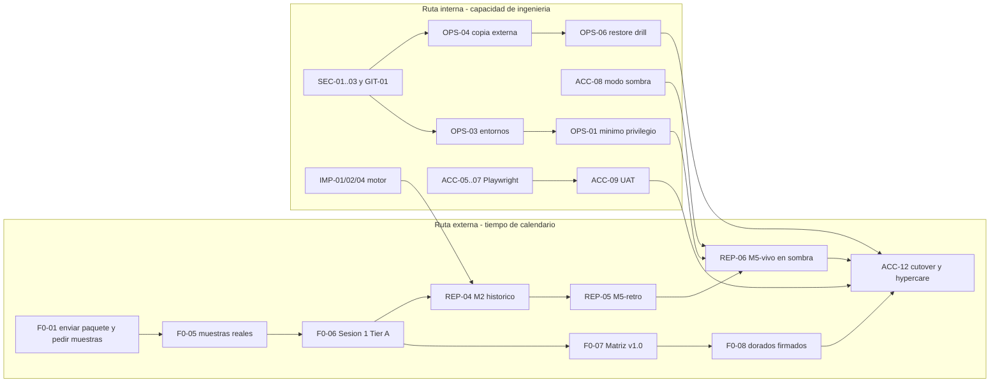

# ROADMAP MAESTRO — Implementación de los pendientes (TERCERA_REV)

> **Estado:** propuesta v1.0 · **Fecha:** 2026-10-02 (viernes) · **Dueño:** equipo + contador cliente + responsable del cliente
> **Fuentes:** `pendientes-implementacion-2026-10-02.md`, `consolidado-docs-2026-10-02.md`, y los roadmaps 01–05 (F0, funcionalidad condicionada, reportes, aceptación, operación).
> **Qué es:** el plan único que ordena **todos** los pendientes por hito, con dependencias, esfuerzo, ruta crítica y criterios de salida. Los roadmaps 01–05 siguen siendo el detalle de diseño; este documento los integra y añade lo que la tercera revisión descubrió.
> **Qué no es:** una aprobación fiscal. Ninguna decisión del contador se adelanta aquí.

---

## 1. Diagnóstico de la tercera revisión

### 1.1 Lo que cambió desde la segunda revisión

Se construyó mucho: branding por empresa, compras manual multilínea con preview Inv.1, catálogo de proveedores, ledger de emisiones + `series:reconcile`, render IVA fuera de la TX (ADR-027), comparador 2.A, y las herramientas de preparación de F0 (`g8:calibrate`, `g2:divergence`, `goldens:check`, `golden:compare`, `import:autodetect`, `catalog:*`). Estado medido: **72 de 73 tests verdes**, typecheck verde, lint sin errores, Chromium resuelto en el host.

**Consecuencia:** la preparación de ingeniería para F0 está **hecha**. Lo que sigue bloqueando es externo (contador, muestras reales, infraestructura de producción) y un conjunto acotado de ingeniería real que no depende de nadie.

### 1.2 Hallazgos nuevos que cambian prioridades

| # | Hallazgo | Severidad | Acción |
|---|---|---|---|
| **H-1** | **Clave privada SSH (`serverc`) en la raíz del repo**, sin `.gitignore` y sin rotar, sigue presente | **Crítica** | SEC-01 (primero de todo) |
| H-2 | **Todo el trabajo de la sesión sigue sin commitear** (front, backend, branding, seeder). Un `git add -A` accidental subiría la clave al historial; un fallo de disco perdería días de trabajo | Alta | SEC-02 → GIT-01 (en ese orden, con orden explícita del dueño) |
| H-3 | `seed:company-rules` carga valores fiscales como activos: **contradice** "no cargar valores sin matriz firmada" | Alta | GIT-02 (guardia) |
| H-4 | ADR-008 documenta `pg-boss`, pero no está instalado: no hay cola real y el render pendiente solo se reintenta **por acción manual** | Media | FUN-06 (decidir y cerrar) |
| H-5 | ADR-024 fija UploadThing para almacenamiento: **no verifiqué** sus garantías de retención, versionado o exportación; un restore de BD no cubre los archivos | Media-Alta | OPS-04 |
| H-6 | El ledger de emisiones existe, pero **si vive solo en la misma base**, una restauración a un instante T lo pierde junto con las emisiones posteriores (riesgo de numeración duplicada) | Alta | OPS-05 |
| H-7 | El render cubre **IVA**; no consta lo mismo para comprobante ISLR, libros, resumen y Excel sobre plantilla | Media | REP-01 (verificar y completar) |
| H-8 | ADR-001…012 siguen "Propuesta" aunque están implementados; la elección de auth ("Auth.js o Better Auth") nunca se formalizó y la realidad es auth propio | Media | DOC-05 |
| H-9 | Único test rojo (`least-privilege`) es de configuración de entorno, pero un rojo tolerado normaliza los rojos | Media | TST-01 |
| H-10 | `.env`/secretos: el resto de secretos del workspace siguen sin rotar | Alta | SEC-03 |

### 1.3 Composición del backlog (62 ítems)

| Categoría | Significado | Ítems | Esfuerzo (días-persona) |
|---|---|---|---|
| **A** | Ejecutable ya, sin depender de nadie | 32 | 52–79 |
| **B** | Requiere decisión/firma del contador (o del dueño) | 14 | 24–46 |
| **C** | Requiere datos reales, cliente o infraestructura externa | 16 | 41–76 |
| **Total** | | **62** | **118–201** |

---

## 2. Principios de ejecución

1. **Seguridad antes que funcionalidad:** ningún dato real entra al sistema hasta cerrar SEC-01…03, OPS-03 y OPS-04.
2. **No se adelantan decisiones fiscales en código.** Se parametriza lo barato y reversible; lo demás espera la firma (fail-closed).
3. **Nada se commitea sin orden explícita del dueño**, pero **nada se commitea sin escáner de secretos limpio**.
4. **Cada ítem tiene "hecho" medible y evidencia enlazada** (test, informe, RDF, runbook). Sin evidencia no se marca ✅.
5. **El reporte nunca promedia lo fácil:** denominadores visibles (firmados ÷ requeridos).
6. **Una decisión, un registro:** ADR (técnica) o RDF (fiscal); no se editan, se reemplazan.
7. **Lo externo se pide primero:** lo que más tarda en llegar (muestras, firma, calendario) se solicita en la primera semana, no cuando haga falta.
8. **Estimar, medir, recalibrar:** al cierre de H0 se compara estimado vs. real y se ajustan las proyecciones.

---

## 3. Hitos de salida

| Hito | Nombre | Criterio de salida (resumen) | Roadmap de detalle |
|---|---|---|---|
| **H0** | Estabilización | Clave SSH y secretos rotados; escáner activo; trabajo respaldado en commits; 0 tests rojos; docs coherentes; arrancó la ruta externa (paquete y muestras solicitados) | ROADMAP-05 §2 |
| **H1** | Listo para datos reales, M2 y sombra | Tier A de F0 firmado; matriz v1.0 activa; G8/G2/G9 implementados; `app_runtime` activo; copia externa y restore base probados; `company.mode = shadow`; M2 aprobado | ROADMAP-01, 03, 05 |
| **H2** | Listo para cutover y go-live | ≥ 30 dorados firmados verdes; E2E P0 por rol; UAT y capacitación firmados; M5 firmado; restore drill D1–D5; ORR; checklist 100 % con evidencia | ROADMAP-03, 04, 05 |
| **H3** | Después del go-live | `fiscal_adjustments` (si procede), empresas 2–3, y backlog v2 | ROADMAP-04 §5 |

---

## 4. Inventario maestro de pendientes

> **Cat.:** A = ejecutable ya · B = decisión/firma · C = datos/cliente/infra. El esfuerzo de B y C es el **trabajo de ingeniería una vez desbloqueado**, no la espera. Todas las cifras son hipótesis a recalibrar (principio 8).

### H0 — Estabilización (esta semana)

| ID | Pendiente | Cat. | Esfuerzo (días) | Bloqueador |
|---|---|---|---|---|
| SEC-01 | Rotar/eliminar la clave SSH `serverc`/`serverc.pub` y revocar su acceso en el servidor | A | 0.5–1 | — |
| SEC-02 | `.gitignore` (claves, `.env*`, `*.pem`, `serverc*`) + escáner de secretos en pre-commit y CI | A | 0.5–1 | — |
| SEC-03 | Inventario y rotación del resto de secretos (BD owner/`app_runtime`, `AUTH_SECRET`, `FILE_SIGNING_SECRET`, token de almacenamiento, contraseñas de seed) | A | 1–1.5 | Runbook listo |
| GIT-01 | Plan de commits por rebanadas + etiqueta de respaldo (**solo con orden explícita**) tras SEC-01/02 | A | 0.5–1 | Orden del dueño |
| GIT-02 | Guardia de `seed:company-rules` (sintético por defecto, prohibido en prod, matriz firmada por hash) | A | 0.5–1 | — |
| TST-01 | Corregir el único test rojo (`least-privilege`): configuración explícita de `app_runtime` y mensaje claro | A | 0.5 | — |
| DOC-01 | Corregir `TODO.md` F4 ("Falta ISLR") y refrescar estados | A | 0.25 | — |
| DOC-02 | `CONVENTIONS.md`: módulos reales y ubicación real de los tests | A | 0.25–0.5 | — |
| DOC-03 | `DECISIONS.md` en orden numérico y rango de ADR en `README.md` | A | 0.25–0.5 | — |
| DOC-04 | Convención de "snapshot con fecha" para cifras de tests en `CHANGELOG.md` | A | 0.1 | — |
| DOC-05 | ADR de ratificación de ADR-001…012 y de la decisión de **auth propio** con sesiones en BD | A | 0.5–1 | — |
| F0-01 | Enviar al contador el paquete F0 + pedido de muestras + preguntas de formato (arranca la ruta crítica) | A | 0.5 | — |

**Subtotal H0:** 5.35–8.85 días-persona (12 ítems).

### H1 — Listo para datos reales, M2 y ciclo en sombra

| ID | Pendiente | Cat. | Esfuerzo (días) | Bloqueador |
|---|---|---|---|---|
| F0-02 | Cotejo de la normativa citada contra la Gaceta Oficial | A | 1–2 | — |
| F0-03 | Normalizar los 17 candidatos y corregir ISLR-09 (requiere el contrato de unidades del motor) | A | 1–1.5 | Contrato del motor |
| F0-04 | Hoja de la Sesión 1 con salidas reales de `g8:calibrate` y `g2:divergence` | C | 1–2 | Muestras reales |
| F0-05 | Muestras reales anonimizadas (mes legacy, Z por marca, libros del contador) + XLSX validado | C | 1–2 | Cliente |
| F0-06 | Sesión 1 — decisiones Tier A (G8, G2 a/b/c, base ISLR, UT, mínimos PJD, G9, G1) y RDF | B | 0.5–1 | Contador |
| F0-07 | Matriz v1.0 (lotes IVA e ISLR habilitados) firmada y activada por el workflow | B | 1–2 | Contador |
| IMP-01 | G8: elegir combinación de redondeo, cerrar ADR-014, retirar `round2` provisional, re-ejecutar dorados | B | 1–2 | F0-06 |
| IMP-02 | G2: base por porción, sustraendo parcial y anticipos | B | 3–5 | F0-06 |
| IMP-04 | G9: series configurables (`reset_policy`), formato ISLR y siembra de serie inicial | B | 1–2 | F0-06 + ejemplo real |
| FUN-01 | Cargar catálogos reales por lotes (vía workflow ADR-022, no por seeder) | B | 1–2 | F0-07 |
| FUN-03 | Modo Z validado con mes real por sucursal | C | 2–4 | Muestras Z |
| FUN-05 | Perfiles de importación: correr `import:autodetect` sobre lo real y aplicar el gatillo | C | 0.5–5 | Muestras (5 d solo si se dispara) |
| FUN-06 | Cola: ADR + ejecutor mínimo de reintentos de render (o `pg-boss` si el gatillo lo exige) | A | 2–4 | Decisión del dueño |
| REP-01 | Verificar y completar el alcance de render (comprobante ISLR, libros, resumen, Excel sobre plantilla) | A | 3–6 | — |
| REP-02 | Fijar versión de Chrome en CI y registrarla en los baselines (ADR-026) | A | 1–1.5 | Host de CI |
| REP-03 | Comparador contra golden real (mapa de celdas, tolerancias, informe) | C | 3–5 | XLSX + mes real |
| REP-04 | M2 histórico: libros del mes real = libros del contador | C | 3–5 | G8 firmado |
| ACC-01 | Reporte con denominadores y `acceptance:gate` por perfil (ci/release/golive) | A | 2–3 | — |
| ACC-02 | Firma de dorados ligada al hash del contenido | A | 1 | — |
| ACC-03 | Gate de activación de reglas (ejecuta dorados antes de activar) | A | 2 | — |
| ACC-05 | Playwright: instalar, arnés, fixtures por rol/empresa, reloj controlado | A | 2–3 | — |
| ACC-08 | `company.mode = shadow` (serie de ensayo, marca de agua, sin entrega, número externo) | A | 3–4 | Aprobación del dueño |
| OPS-01 | Activar `DB_LEAST_PRIVILEGE` en staging/prod + invariante de catálogo + arranque defensivo | A | 1–2 | OPS-03 |
| OPS-03 | Provisionar/verificar staging y prod (hosting, TLS, BD separada, almacenamiento, gestor de secretos, app+worker) | C | 3–5 | Cliente/hosting |
| OPS-04 | Copia externa cifrada de BD + retención PITR + copia de blobs y plan de salida del almacenamiento | A | 2–4 | Decisión de costo |
| OPS-09 | Migración histórica por empresa con reporte de reconciliación | C | 2–4 | Muestras |

**Subtotal H1:** 44–80 días-persona (26 ítems).

### H2 — Listo para cutover y go-live

| ID | Pendiente | Cat. | Esfuerzo (días) | Bloqueador |
|---|---|---|---|---|
| F0-08 | Dorados 30–50 firmados (protocolo a ciegas, por lotes de 10) | B | 4–6 | Contador |
| F0-09 | Tier B: G4, G7, G11, G12, roles y ajustes post-cierre — cerrar o diferir formalmente | B | 1–1.5 | Contador/cliente |
| IMP-03 | G2-e: IVA consume eventos de pago/abono | B | 2–3 | F0-06 |
| IMP-05 | G4: moneda extranjera operativa (solo si entra al alcance del piloto) | B | 3–5 | F0-09 |
| IMP-06 | Roles y cuatro ojos (ADR-020) con excepción monousuario auditada | B | 3–4 | Matriz de roles |
| FUN-02 | Plazos: tipos relativo/calendario, feriados, carga del calendario oficial, caso real | B | 3–5 | Matriz + calendario |
| FUN-04 | G3: caso real, saldo acumulado y no-neteo en resumen | C | 2–3 | Caso real |
| REP-05 | M5-retro: ciclo completo sobre un mes reciente | C | 3–5 | REP-04 |
| REP-06 | M5-vivo: ciclo en paralelo con diferencias D1–D5 aprobadas | C | 2–3 | Calendario |
| ACC-04 | Cobertura reglas × dorados + prueba de mutación | A | 2 | — |
| ACC-06 | Playwright: recorridos P0 por rol + negativos + seguridad | A | 7–10 | ACC-05 |
| ACC-07 | Playwright: humo Firefox/WebKit, accesibilidad, rendimiento y CI | A | 3–4 | ACC-06 |
| ACC-09 | UAT por rol + corrección de defectos | C | 4–7 | Usuarios + E2E P0 |
| ACC-10 | Capacitación y evaluación práctica por rol | C | 3–5 | Usuarios |
| ACC-11 | Piloto empresa 1: alta, migración y ciclo en sombra | C | 5–8 | H1 completo |
| ACC-12 | Cutover controlado + hypercare | C | 3–5 | ACC-11 |
| OPS-02 | Migrar seeds y tests a `withTenant`; integración completa con `app_runtime` | A | 5–7 | — |
| OPS-05 | Ledger de emisiones: confirmar copia fuera de la BD y reconciliación post-restore | A | 1–2 | — |
| OPS-06 | Restore drill D1–D5 con RPO/RTO medidos y runbook con tiempos reales | A | 5–6 | OPS-04 |
| OPS-07 | Monitoreo, alertas y revisión de preparación operativa (ORR) | A | 2–3 | OPS-03 |
| OPS-08 | Exportación completa de datos (derecho de salida) probada | A | 1–2 | — |
| OPS-10 | Go/No-Go, congelación, siembra de series y firma del acta | B | 1–2 | Todo H2 |

**Subtotal H2:** 65–98.5 días-persona (22 ítems).

### H3 — Después del go-live (condicional)

| ID | Pendiente | Cat. | Esfuerzo (días) | Bloqueador |
|---|---|---|---|---|
| IMP-07 | `fiscal_adjustments` (solo si el contador descarta la reapertura) | B | 0–6 | F0-09 |
| ACC-13 | Empresas 2 y 3 (repite el alta; segundo modo de ventas y condición de contribuyente) | C | 4–8 | ACC-12 |

**Subtotal H3:** 4–14 días-persona (2 ítems).

---

## 5. Ruta crítica, capacidad y cronograma

### 5.1 Dos rutas en paralelo

**Regla:** `go-live ≥ máx(ruta externa, ruta interna)`. La interna se puede acortar con más manos o menos alcance; la externa solo se acorta **pidiendo antes** y **reduciendo el costo de cada decisión**.

### 5.2 Capacidad (hipótesis explícitas)

- 1 persona, 5 días-persona efectivos por semana, inicio **lunes 2026-10-05**.
- **Construcción (cat. A)** rinde ~2× la estimación gracias a agentes (el ritmo observado de la segunda revisión lo sugiere; **validar al cierre de H0**). B y C **no** se aceleran.

| Alcance | Sin aceleración (k=1) | Con agentes (k=2) |
|---|---|---|
| **Completo** (62 ítems, incluye H3) | 24–40 semanas → mar–jul 2027 | 18–32 semanas → feb–may 2027 |
| **Completo sin H3** | 23–38 semanas → mar–jun 2027 | 18–30 semanas → feb–abr 2027 |
| **MVP de go-live** (§5.3) | 21–35 semanas → mar–jun 2027 | **16–27 semanas → fin ene–abr 2027** |
| MVP con **segunda persona** que absorbe lo cat. C (UAT, capacitación, migración, soporte) | — | **≈ 9–14 semanas de ingeniería → ~4 dic 2026 – ~10 ene 2027** |

**Lectura honesta:** el cuello de botella no es solo el contador; **una sola persona** sumando construcción, validación, migración, capacitación y soporte alarga el go-live a 2027. Las mayores palancas son (1) **reducir alcance** y (2) **sacar del camino del desarrollador lo que no es desarrollo**.

### 5.3 Palancas para comprimir (ordenadas por impacto/riesgo)

| Palanca | Ahorro | Riesgo | Decisión de |
|---|---|---|---|
| **MVP de go-live:** excluir IMP-05 (FX), IMP-06 (cuatro ojos), IMP-07 (`fiscal_adjustments`), ACC-07 (cross-browser/a11y/rendimiento), ACC-13 (empresas 2–3) | ≈ 13–32 días | Bajo si el piloto no usa USD, tiene un solo contador y la reapertura basta | Contador + cliente |
| **Segunda persona** (no necesariamente desarrollador) para UAT, capacitación, migración, soporte y seguimiento con el contador | ≈ 37–68 días fuera del camino del dev | Coordinación | Dueño |
| **Piloto sin Z** si la empresa 1 factura de forma individual (difiere FUN-03) | 2–4 días | Z se valida en la empresa 2 | Cliente |
| **Diferir `pg-boss`** con ejecutor mínimo (FUN-06) | 1–2 días | Bajo con 100–200 docs/mes | Dueño |
| Playwright solo **P0 de contador y administrativo** antes del cutover; el resto en hypercare | 3–5 días | Medio | Dueño |

### 5.4 Cronograma por hitos (fechas = cotas, no promesas)

| Semana | Fechas | Foco | Hito |
|---|---|---|---|
| **S1** | 5–9 oct | SEC-01…03, GIT-01, TST-01, GIT-02, DOC-01…04, **F0-01** | H0 |
| **S2** | 12–16 oct | DOC-05, FUN-06, REP-02, ACC-01/02, F0-02/03, arranque OPS-03/04 | H0 → H1 |
| **S3** | 19–23 oct | ACC-03, ACC-05, ACC-08 (sombra), OPS-01, OPS-04; **meta: Sesión 1 si llegaron muestras** | H1 |
| **S4** | 26–30 oct | ACC-08, REP-01, OPS-05, IMP-01/04, FUN-01 | H1 |
| **S5–S8** | 2 nov – 27 nov | IMP-02, REP-03/04 (**M2**), OPS-09, FUN-03/05; matriz y primeros lotes de dorados | H1 |
| **S9–S12** | 30 nov – 25 dic | E2E P0, UAT, capacitación, OPS-02/06/07/08; REP-05 (**M5-retro**) | H2 (parcial) |
| **Ciclo sombra** | **Primer mes completo posible tras H1** (dic 2026 o ene 2027) | REP-06 (**M5-vivo**), ACC-11 | H2 |
| **Cutover** | Período siguiente al de sombra | ACC-12 + hypercare | Go-live |

> **Regla del ciclo en sombra:** debe ser un **mes calendario completo**. Si H1 se alcanza después del 30-nov, la sombra pasa a enero. Diciembre trae feriados y cierre de año: **confirmar la disponibilidad del contador antes de fijarlo**.

### 5.5 Fechas límite de insumos externos (propuestas para acordar)

| Insumo | Dueño | Necesario antes de | Fecha objetivo |
|---|---|---|---|
| Paquete F0 + muestras + preguntas de formato **enviados** | Equipo | — | **vie 2-oct / lun 5-oct** |
| Muestras reales anonimizables (mes legacy, Z de cada marca, libros del contador, XLSX) | Cliente | Sesión 1, M2 | **16-oct** |
| Sesión 1 (decisiones Tier A) | Contador | IMP-01/02/04, matriz | **23-oct** |
| Matriz v1.0 lotes 1–2 | Contador | FUN-01, dorados | **6-nov** |
| Dorados: lotes de 10 | Contador | Gate go-live | **semanal desde 9-nov** |
| Elección de empresa piloto + línea base | Cliente | ACC-11 | **30-oct** |
| Usuarios y fechas de UAT/capacitación | Cliente | ACC-09/10 | **20-nov** |

---

## 6. Diseño de los ítems nuevos de esta revisión

### 6.1 SEC-01 — Clave SSH `serverc` (hacerlo primero, hoy)

1. **Alcance:** identificar **qué servidor(es)** y **qué usuario/privilegios** abre; si la clave tiene frase de contraseña.
2. **Asumir compromiso.** Estuvo en un workspace con agentes, copias y posible sincronización: no basta con borrarla.
3. **Revisar exposición:** historial de git y *reflog*/stash/otras ramas (`git log --all -- serverc*`), artefactos de CI, carpetas sincronizadas en la nube, historial de la shell.
4. **Rotar sin perder acceso:** generar un par nuevo **fuera del repo** (con frase de contraseña) → instalarlo en el servidor → probar el acceso desde una segunda sesión → **quitar la clave vieja** de todos los `authorized_keys` (todos los usuarios, incluidos los de despliegue) → comprobar que la vieja es rechazada.
5. **Revisar el servidor:** registros de autenticación con la huella de la clave vieja desde su fecha de creación; usuarios nuevos, tareas programadas y cambios en `authorized_keys`. **Indicio de uso ajeno ⇒ incidente:** reconstruir el servidor y rotar todo lo que él contenga.
6. **Si el servidor guarda variables de entorno de producción**, rotarlas (SEC-03).
7. **Cierre:** eliminar los archivos del workspace, registrar evidencia (fecha, huella, resultado; **sin** el secreto) en el runbook.

**Hecho cuando:** la clave vieja no autentica en ningún host; los registros revisados y firmados; archivos fuera del workspace.

### 6.2 SEC-02 / GIT-01 — Higiene del repo y respaldo del trabajo

| Paso | Detalle |
|---|---|
| `.gitignore` | `serverc*`, `*.pem`, `*.key`, `id_*`, `.env*` (excepto `.env.example`), volcados y carpetas de datos reales |
| Escáner | Pre-commit + CI (falla ante un secreto nuevo); escaneo de todo el workspace y del historial |
| Respaldo inmediato | Copia cifrada del árbol de trabajo (sin secretos) fuera de la máquina, **antes** de commitear |
| **Rebanadas de commit** (con la orden del dueño) | 1) seguridad e ignorados · 2) backend (`createPeriod`, `updateFiscalProfile`, plantilla de importación) · 3) UI por módulo (períodos, terceros, importaciones, reglas, configuración, plazos) · 4) branding + migración 0020 · 5) seeder con guardia · 6) ledger de emisiones y runbooks · 7) comparador/evidencias · 8) docs |
| Etiqueta | Etiqueta de respaldo previa al primer commit y tras el último |

### 6.3 GIT-02 — Guardia de `seed:company-rules`

| Condición | Comportamiento |
|---|---|
| Por defecto | Marca las reglas con `origin = synthetic`; solo carga en entornos de **desarrollo/prueba** |
| `NODE_ENV=production` o BD de prod | **Se niega** |
| Carga de valores reales | Solo con `--matrix-hash=<hash de la matriz firmada>` verificado contra `matriz-reglas-v1` y entra **como borrador** (el contador activa por el workflow) |
| Reglas `synthetic` | No activables en prod (guardia de ROADMAP-02 §3) |

### 6.4 FUN-06 — Cola: decidir y cerrar

**Recomendación (ADR nuevo): diferir `pg-boss`** y entregar un **ejecutor mínimo**:

- Comando `render:retry` ejecutado por el planificador del host cada pocos minutos, **idempotente**, que reintenta `listPendingRenders`.
- Alerta si un render queda `pending` más de N minutos.
- **Gatillos para instalar `pg-boss`:** importación > ~5.000 filas, solicitud > ~10 s, o > 5 renders pendientes simultáneos de forma recurrente.
- Limpieza documental: ADR-008 pasa a "Diferida", se retira `PGBOSS_SCHEMA` o se documenta como reservada.

### 6.5 OPS-04 — Almacenamiento de archivos y copias externas

| Tema | Acción |
|---|---|
| Verificar con el proveedor (UploadThing, ADR-024) | Retención, borrado, versionado, exportación masiva, ubicación de datos, límites; **no los verifiqué** |
| Copia externa de blobs | Sincronización periódica a un segundo destino, direccionada por `sha256` y cifrada |
| Copia externa de BD | Volcado lógico cifrado fuera del proveedor de la base + retención de PITR acorde al plazo de detección de errores |
| Plan de salida | Procedimiento para migrar a otro almacenamiento sin perder URLs firmadas ni hashes |
| Prueba | Restore conjunto BD + blobs con verificación de `sha256` (parte de OPS-06) |

### 6.6 OPS-05 — Ledger de emisiones fuera de la base

Confirmar **dónde vive** el ledger. Si está en la misma BD, enviar cada emisión (empresa, tipo, número, `sha256`, fecha) a un destino **append-only externo** (logs estructurados enviados fuera, o archivo en el almacenamiento externo). Procedimiento tras restaurar: bloquear emisión → comparar máximo emitido (ledger externo + comprobantes entregados) contra `document_series` → **resembrar** → desbloquear. `series:reconcile` ya cubre la comparación; falta la fuente externa.

### 6.7 REP-01 — Matriz de alcance de render (verificar y completar)

| Documento | PDF | Excel (plantilla) | Estado a verificar |
|---|---|---|---|
| Comprobante IVA | ✔ (ADR-027) | — | Verificar paridad con art. 16 |
| Comprobante ISLR | ? | — | Verificar/implementar |
| Libro de Compras | ? | ? | Verificar/implementar |
| Libro de Ventas (factura y Z) | ? | ? | Verificar/implementar |
| Resumen IVA | ? | ? | Verificar/implementar |

Completar las celdas vacías, con las 5 preguntas de formato del ROADMAP-03 §3.7 ya enviadas (F0-01).

### 6.8 DOC-05 — Ratificación de ADR

Un ADR consolidado que **ratifica** los técnicos ya implementados (001, 002, 004, 006, 007, 010, 011, 012; 003 y 005 parcialmente, con sus partes fiscales pendientes) y registra la decisión de **auth propio con sesiones en BD** (cierra la ambigüedad "Auth.js o Better Auth"). Los ADR 013, 014, 018, 019 y 020 siguen abiertos por su dependencia fiscal. Cumple la regla "no se edita": es una entrada nueva.

---

## 7. Mapa de los ítems a los roadmaps de detalle

| Ítems | Detalle en |
|---|---|
| F0-*, IMP-*, FUN-01 | ROADMAP-01 (protocolo de dorados a ciegas, calibración G8, tabla de decisiones, RDF, diferimientos) |
| FUN-02…05 | ROADMAP-02 (plazos relativos/calendario, G3 y art. 7, gatillo de perfiles de importación) |
| REP-* | ROADMAP-03 (escalera de reproducibilidad, snapshots solo en CI, comparador con diferencias aprobadas, M2/M5) |
| ACC-* | ROADMAP-04 (gate por perfiles, firma ligada, gate de activación, matriz E2E por rol, `shadow`, piloto) |
| SEC-*, OPS-* | ROADMAP-05 (rotación, mínimo privilegio, seeds con `withTenant`, restore drill D1–D5, UAT/firmas, Go/No-Go, cutover) |

---

## 8. Plan detallado de las primeras cuatro semanas

| Semana | Entregables | Evidencia |
|---|---|---|
| **S1** (5–9 oct) | SEC-01…03 completos; escáner activo; respaldo y plan de commits (cuando el dueño ordene); TST-01 verde (73/73); guardia del seeder; DOC-01…04; **F0-01 enviado** | Runbook con evidencia; CI con escáner; `acceptance:evidence` 73/73 |
| **S2** (12–16 oct) | DOC-05; FUN-06 (ADR + `render:retry`); REP-02 (versión de Chrome fijada); ACC-01 (reporte con denominadores) y ACC-02; F0-02 (cotejo en Gaceta); F0-03 (candidatos normalizados); revisión de OPS-03 (¿existen staging/prod?) | ADRs nuevos; reporte con secciones TÉCNICO/FISCAL/OPERATIVO |
| **S3** (19–23 oct) | ACC-03 (gate de activación); ACC-05 (Playwright instalado, arnés); ACC-08 (arranque de `shadow`); OPS-04 (copia externa) y OPS-01 (mínimo privilegio en staging); F0-04 si llegaron muestras → **Sesión 1** | `acceptance:gate --profile=release` operativo; rol verificado en staging |
| **S4** (26–30 oct) | ACC-08 completo; REP-01 (matriz de render); OPS-05 (ledger externo); IMP-01/04 según RDF; FUN-01 (lote 1 como borrador) | Matriz de render completa; RDF firmados |

**Cierre de H0 (fin S2):** comparar estimado vs. real de los ítems H0 y recalibrar la tabla de §5.2.

---

## 9. Gobernanza del avance

| Elemento | Regla |
|---|---|
| Fuente de verdad | `docs/TODO.md` (estado) y este inventario (plan); toda actualización pasa por `CHANGELOG.md` con fecha |
| Cadencia | Revisión semanal de 30 min: ítems cerrados, bloqueos externos, decisiones pendientes, desvíos de estimación |
| **Definición de "hecho"** | Código + pruebas + documento actualizado (`API/DATABASE/SECURITY`) + ADR/RDF si cambia rumbo + evidencia enlazada + entrada en `CHANGELOG` |
| Control de cambios | Congelación de reglas y código no crítico en **T−14**; excepciones con motivo |
| Tablero | Burn-up de los 62 ítems por categoría; decisiones fiscales firmadas ÷ requeridas; dorados firmados ÷ umbral; cobertura de reglas; incidentes S1/S2 abiertos |
| Estimación | Registrar estimado vs. real por ítem; recalibrar tras H0 y H1 |

---

## 10. RAID

### Riesgos principales

| # | Riesgo | Prob. | Impacto | Mitigación |
|---|---|---|---|---|
| R-1 | Clave SSH comprometida ya usada | Media | Crítico | SEC-01 con revisión de registros del servidor |
| R-2 | Pérdida del trabajo sin commitear / commit accidental de secretos | Media | Alto | Respaldo cifrado, escáner, rebanadas, orden explícita |
| R-3 | Contador como cuello de botella único | Alta | Alto | Sesiones con hojas cerradas, datos reales, ruta corta, diferimientos formales |
| R-4 | Una sola persona hace todo (construcción, validación, soporte) | Alta | Alto | Segunda persona, MVP, recalibración |
| R-5 | Valores fiscales sintéticos tomados por firmados | Media | Crítico | Guardia del seeder, `origin=synthetic`, gate de activación |
| R-6 | Restore no probado / numeración duplicada tras restaurar | Media | Crítico | OPS-04/05/06, ledger externo |
| R-7 | Dependencia de un proveedor de archivos sin copia externa | Media | Alto | OPS-04 (verificación, copia, plan de salida) |
| R-8 | Muestras reales tardan o llegan incompletas | Alta | Alto | Pedirlas hoy; corpus sintético marcado mientras tanto |
| R-9 | Falsa confianza por métricas verdes sobre muestras mínimas | Alta | Crítico | ACC-01 (denominadores) y gate `golive` |
| R-10 | Ciclo en sombra cae en diciembre (feriados) | Media | Medio | Confirmar disponibilidad; mover a enero |
| R-11 | Estimaciones optimistas por supuesto de aceleración con agentes | Media | Medio | Recalibrar tras H0; reportar k observado |
| R-12 | Cambio normativo durante el proyecto | Media | Medio | Fecha de corte y revalidación acotada |

### Supuestos

1. Un desarrollador a tiempo completo, con agentes de IA para construcción.
2. El contador está disponible al menos una sesión semanal.
3. Existe (o se puede crear) un entorno de staging/producción separado (**a verificar en OPS-03**).
4. El piloto inicial es una sola empresa en bolívares con IVA mensual (precisiones recibidas el 01-oct).

### Dependencias externas

Contador (firmas), cliente (muestras, usuarios, empresa piloto, soporte), proveedores de hosting/base/almacenamiento, normativa publicada (calendario y UT).

---

## 11. Decisiones que necesito del dueño (ordenadas por urgencia)

| # | Decisión | Recomendación | Cuándo |
|---|---|---|---|
| 1 | **Autorizar SEC-01** y el orden de commits por rebanadas (GIT-01) | Rotar hoy; commitear tras el escáner | Hoy |
| 2 | **Contrato de unidades del motor** (porcentajes: ¿fracción o puntos?, ¿`base` vs `base_gravable`?) para normalizar los 17 candidatos | Compartir el tipo de entrada del motor ISLR | S1 |
| 3 | `pg-boss`: diferir con ejecutor mínimo | Diferir (FUN-06) | S2 |
| 4 | **`company.mode = shadow`** (serie de ensayo, marca de agua, sin entrega) | Aprobar: evita duplicados de numeración | S2 |
| 5 | Almacenamiento y copia externa (UploadThing + copia propia) y presupuesto | Verificar proveedor y añadir copia externa | S2 |
| 6 | ¿Existen staging y producción separados? Hosting, TLS y gestor de secretos | Confirmar o aprovisionar | S2 |
| 7 | **Alcance del go-live:** MVP (§5.3) vs. completo | MVP | S3 |
| 8 | **Segunda persona** para UAT, capacitación, migración y soporte | Sí, parcial | S3 |
| 9 | Alertas de plazos: ¿solo tablero en la app en v1? (recuperación de contraseña ya es solo asistida, ADR-025) | Tablero en v1 | S4 |

### Para el contador/cliente (lo que se envía en F0-01)

Paquete F0 + pedido de muestras (§5.5) + las 18 preguntas del cuestionario consolidado (asesoría F0 §9) + las 5 de formato de reportes (ROADMAP-03 §3.7) + la pregunta de ajustes post-cierre + elección de empresa piloto y línea base de tiempos.

---

## 12. Próximos pasos (72 horas)

1. **Hoy:** SEC-01 (clave SSH) y SEC-02 (`.gitignore` + escáner).
2. **Hoy:** respaldo cifrado del árbol de trabajo y, con tu orden, plan de commits por rebanadas.
3. **Hoy/lunes:** enviar F0-01 al contador y al cliente (es lo que más tarda).
4. **Lunes:** SEC-03 (rotación del resto de secretos) y TST-01 (73/73).
5. **Martes:** guardia del seeder, DOC-01…04, y responder las decisiones 1–2 de §11.

**Definición de éxito de la primera semana:** 0 secretos válidos expuestos, trabajo respaldado y commiteable sin riesgo, 73/73 tests, y el contador y el cliente con su pedido en mano.
